## Kubernetes

Kubernetes 是一个开源的容器编排系统，用于自动化应用容器的部署、扩展和管理。它将应用从单机解耦，统一调度到集群中运行。

Kubernetes 的优势:

- 自带服务发现和负载均衡
- 存储编排 (添加任何本地或云服务器)
- 自动部署和回滚
- 自动分配 CPU/内存资源,弹性伸缩 (达到阈值自动扩展节点)
- 自我修复 (容器宕机时启动新容器)
- 安全 (Secret) 信息和配置管理

### 架构

#### 概述

Kubernetes 集群由一个控制平面 (Control Plane) 和工作节点组成，每个集群至少需要一个节点来运行 Pod（控制面节点也可以运行 Pod，除非被污点 taint 标记）。我们把 k8s 集群中的每个机器称为节点。

一个 Kubernetes 集群包含两种类型的资源：

- **控制面节点（Control plane node）** 调度整个集群
- **工作节点（Work nodes）** 负责运行应用

节点是一个虚拟机或物理机，它在 Kubernetes 集群中充当工作机器的角色。

> 生产级流量的 Kubernetes 集群至少应具有三个节点，因为如果只有一个节点，出现故障时其对应的 [etcd](https://kubernetes.io/zh-cn/docs/concepts/architecture/#etcd) 成员和控制面实例都会丢失， 并且冗余会受到影响。你可以通过添加更多控制面节点来降低这种风险。

下面部分概述了构建一个完整且可运行的 Kubernetes 集群所需的各种组件。

#### 架构图


#### 高可用要求

但为了实现高可用，etcd 集群需要>=3 个节点，这是由于 Etcd 使用 RAFT 选举算法，需要奇数个节点才能正常工作，k8s 官方推荐的数量为 2n+1(3,5,7...)。

> Master/node 是旧版本的常用说法，指代一台控制平面机器
> 新版本的 k8s 社区逐渐使用 Control Plane 来代替 Master，控制平面不局限在单机，可以分布在多台机器上实现高可用

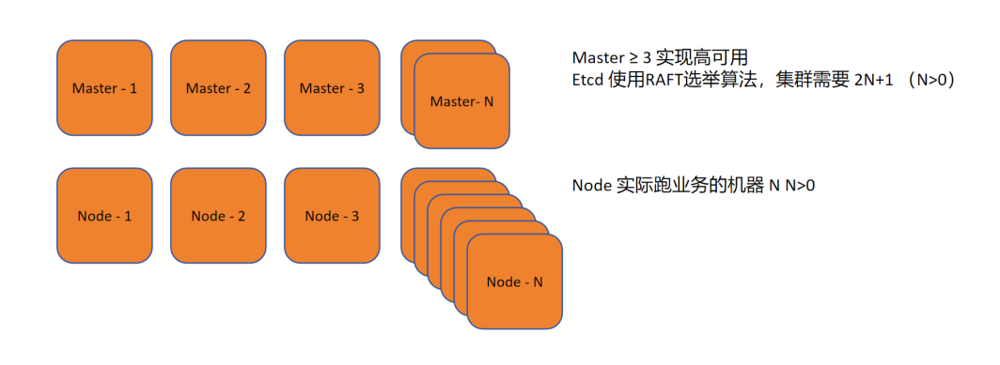

k8s 的微观架构:

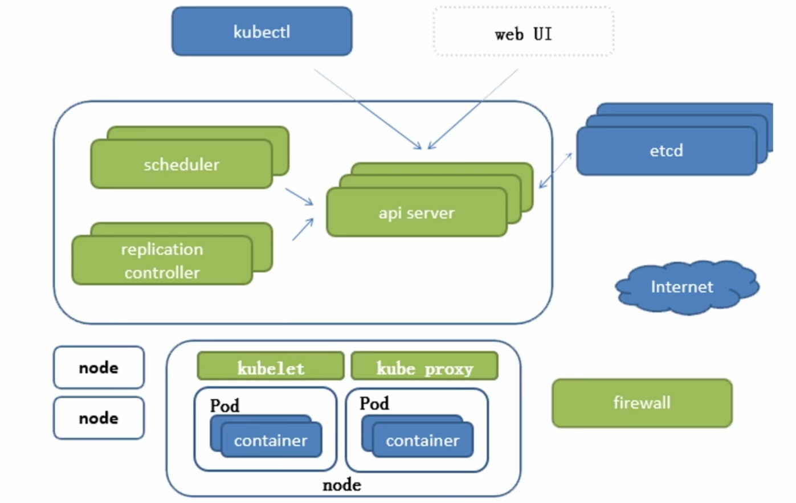

#### kubectl

kubectl 是 Kubernetes 集群的命令行工具，用于与 API Server 进行通信，从而操作集群资源。

#### Control Plane 组件

- **API Server**：API Server 是 Kubernetes 集群的统一入口，负责处理所有外部请求，包括认证、鉴权、准入控制，并将集群状态持久化到 etcd。同时，它也是控制面各组件之间通信的中心枢纽。
- **etcd**：etcd 是一个一致且高可用的键值对数据库，采用 Raft 共识算法选举 leader，用于存储 Kubernetes 集群所有状态数据。3 个 etcd 节点可组成集群，具备单节点故障容错能力。
- **Scheduler**：Scheduler 是 Kubernetes 的调度器，负责监视新创建的、未分配节点的 Pods，并为它们选择合适的运行节点。
- **Controller Manager(replication controller)**：Controller Manager 运行各种控制器进程，确保集群实际状态向期望状态收敛，包括副本管理、端点同步等，异常终止的容器会被重新调度。

#### Node 组件

- **kubelet**：kubelet 是运行在每个节点上的代理，通过 watch API Server 获取 Pod 规格，使用 CRI 接口管理容器，并向 API Server 报告节点和 Pod 状态。
- **kube-proxy**：kube-proxy 运行在每个节点上，作为网络代理维护网络规则，实现 Service 的服务发现和负载均衡。

#### 扩展组件

扩展组件组成 k8s 的核心功能，除此之外还有核心扩展和可选扩展。

**核心扩展**

- **容器运行时 (Container runtime)**：负责管理 Kubernetes 集群内容器的执行和生命周期
- **CoreDNS**：提供私有的域名解析服务，网络内部除了 IP 还可以使用域名访问
- **Ingress Controller**：提供七层（应用层）的负载均衡

**可选扩展**

- **Prometheus**：监控资源
- **Dashboard (Web)**：通过 web 界面进行集群管理
- **Federation**：提供多 k8s 集群的管理能力

### 概念

#### Pod

##### 基本定义

Pod 是 Kubernetes 中**最小的可调度单位**。它并不是一个物理实质，而是对一个或多个容器的**逻辑分组**。在 Kubernetes 集群中运行的任何任务，最终都需要部署在 Pod 内部运行。

> **注：** 一个 Pod 中的所有容器通常构成**一个紧密耦合的应用服务实体**，它们为了完成同一个业务目标而协同工作。

##### 命名空间共享机制

同一个 Pod 中的容器天生共享以下四大 Linux 命名空间（Namespaces），从而实现高效的内部通信和资源共享：

- **Network (网络)**：共享网络设备、IP 地址、端口和路由表。
    - *特点*：Pod 内的多个容器就像运行在同一台机器上一样，相互之间可以直接通过 `localhost:port` 进行访问。
- **PID (进程 ID)**：实现进程 ID 的隔离与管理。
    - *特点*：通过底层的 Pause 容器作为 PID 1（相当于系统的 init 进程），统一管理和回收 Pod 内的孤儿进程和僵尸进程。
- **IPC (进程间通信)**：共享信号量、共享内存和消息队列。
    - *特点*：容器之间可以直接使用标准的 IPC 机制进行高效的数据交换。
- **UTS (主机名与域名)**：共享 Hostname 和域名。
    - *特点*：在 Pod 内的不同容器中执行 `hostname` 命令会返回相同的值，但各个容器内部运行的进程名（如 Nginx、MySQL）依然保持独立。

##### Pause 容器

每个 Pod 都会内置一个隐藏的、基础的 **Pause 容器**。它是 Pod 的 " 基础设施 "，具有以下关键作用：

- **启动顺序**：是 Pod 内部**第一个**启动的容器。
- **网络初始化**：负责初始化 Pod 的网络栈（为其分配 IP、设置网络命名空间等）。
- **存储挂载**：负责挂载 Pod 级别声明的存储卷（Volumes），供其他业务容器共享使用。
- **进程管理**：充当 PID 1 进程，负责回收孤儿进程和僵尸进程。

##### 4. 单独使用 Pause 容器的好处

- **提供稳定的共享环境**：Pause 容器的代码逻辑极简（基本上就是执行一个休眠的 pause 循环），几乎没有任何性能开销或崩溃的风险。用它来持有网络、PID、IPC 等命名空间，可以为其他经常重启或更新的业务容器提供一个绝对**稳定的底层环境**。
- **完善的进程生命周期管理**：当业务容器内的进程异常退出产生僵尸进程时，Pause 容器可以凭借其 PID 1 的身份，接管孤儿进程并清理僵尸进程，防止系统资源泄漏。


### 网络

Kubernetes 的网络模型假定了所有 Pod 都在一个**可以直接连通的扁平的网络空间**中,在裸机或私有云搭建 k8s 集群,必须 CNI 插件 (如 calico,flannel) 来实现这个假设.

在 k8s 中,每个 pod 都拥有一个集群内全局唯一的 IP 地址,Pod 内部的所有容器共享这个网络命名空间 (Network Namespace)

直接连通的扁平网络空间,意味着:

- Pod 和 Pod 互通: 集群内任意节点上的 pod,都可以通过对方 pod 的 ip 直接通信
- Node 和 Pod 互通: 节点上的本地程序 (如 kubulet),必须能与同节点上的任意 Pod 直接通信
- IP 一致性: Pod 内部看到的自己的 IP 地址必须和其他 Pod 看到的 IP 地址相同.

虽然扁平化网络保证了 Pod 间的连通性,但是由于 Pod 的 IP 是动态变化的,为了实现业务解耦,k8s 在扁平网络上构建了 Service 机制:

- Cluster IP: Service 提供一个固定的虚拟 IP 作为后端 Pod 的统一入口
- 通信过程：当 Pod 访问 Service IP 时，节点底层的 `kube-proxy` 会拦截该请求 (通过 iptables 或 ipvs，执行 DNAT（目标地址转换），将其转换为真实的后端 Pod IP，随后包再次进入扁平网络进行路由。返回时同样会经过 SNAT 转换.
- 对应用透明: Nat 转换对 Pod 内的应用程序完全不可见.

> 虽然 Cluster IP 做了一层 NAT 转换,但是对于后端 Pod 而言,其看到的源 IP 仍然是真实的客户端 Pod IP

#### CNI

借助 CNI 标准，Kubernetes 可以解决容器网络问题。通过插件化的方式来集成各种网络插件，实现集群内部网络相互通信，只要实现 CNI 标准中定义的核心接口操作（ADD，将容器添加到网络；DEL，从网络中删除一个容器；CHECK，检查容器的网络是否符合预期等）。**CNI 插件通常聚焦在容器到容器的网络通信**。

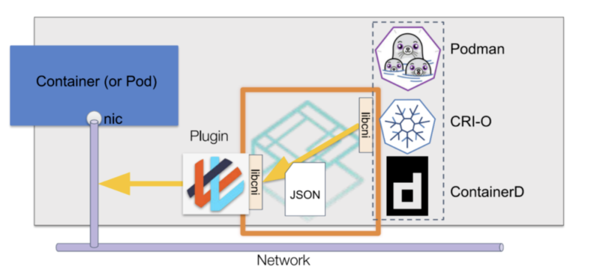

> CNI 的接口不是 HTTP,gRPC 这种接口,而是一种规范,CNI 的实现是一些二进制程序,这样 kubenetes 就不需要重启就能更换网络实现 (直接更新二进制文件)

#### 网络插件

通过 CNI,容器使用不需要解决网络通信问题.

CNI 通过 JSON 格式的配置文件来描述网络配置，当需要设置容器网络时，由容器运行时 (CRI) 负责执行 CNI 插件，并通过 CNI 插件的标准输入（stdin）来传递配置文件信息，通过标准输出（stdout）接收插件的执行结果。从网络插件功能可以分为五类：

- Main 插件，创建具体网络设备（bridge：网桥设备，连接 container 和 host；ipvlan：为容器增加 ipvlan 网卡；loopback：IO 设备；macvlan：为容器创建一个 MAC 地址；ptp：创建一对 Veth Pair；vlan：分配一个 vlan 设备；host-device：将已存在的设备移入容器内）
- IPAM 插件：负责分配 IP 地址（dhcp：容器向 DHCP 服务器发起请求，给 Pod 发放或回收 IP 地址；host-local：使用预先配置的 IP 地址段来进行分配；static：为容器分配一个静态 IPv4/IPv6 地址，主要用于 debug）
- META 插件：其他功能的插件（tuning：通过 sysctl 调整网络设备参数；portmap：通过 iptables 配置端口映射；bandwidth：使用 Token Bucket Filter 来限流；sbr：为网卡设置 source based routing；firewall：通过 iptables 给容器网络的进出流量进行限制）
- Windows 插件：专门用于 Windows 平台的 CNI 插件（win-bridge 与 win-overlay 网络插件）
- 第三方网络插件：第三方开源的网络插件众多，每个组件都有各自的优点及适应的场景，难以形成统一的标准组件，常用有 Flannel、Calico、Cilium、OVN 网络插件

第三方的网络插件可以解决直接连通的扁平网络空间的需求

##### Pod 的分配流程中组件的调度

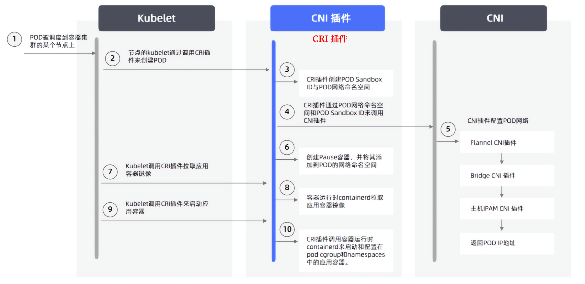

1. 调度器监听未绑定的 pod,将其调度到一台工作节点上
1. kubelet 监听 api server 开始创建 pod
1. kubelet 调用 CRI(容器运行时),创建 Pod Sandbox(Pause 容器)
1. CRI 启动 pause 容器,在此过程中内核为其分配全新的网络 Namespace
1. CRI 调用 CNI 插件执行网络配置操作，如创建虚拟网卡,分配 IP,加入网络空间等,并将配置好的网络环境结果返回 CRI,CRI 将 Sandbox 的就绪状态返回 kubelet
1. kubelet 通过 CRI 拉取其他镜像并创建启动其他容器,同时加入 Pause 的 Namespace 中
1. kubelet 将 Pod 状态上报给 API Server.

##### 第三方网络插件

第三方网络插件常见的有: flannel,Calico,Cilium

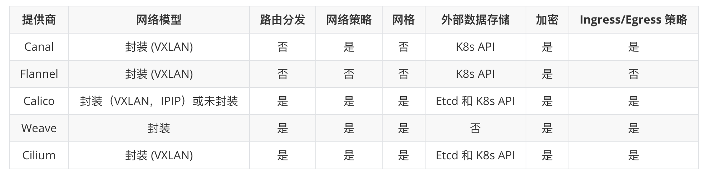

- 网络模型：封装或未封装。
- 路由分发：一种外部网关协议，用于在互联网上交换路由和可达性信息。BGP 可以帮助进行跨集群 pod 之间的网络。此功能对于未封装的 CNI 网络插件是必须的，并且通常由 BGP 完成。如果你想构建跨网段拆分的集群，路由分发是一个很好的功能。
- 网络策略：Kubernetes 提供了强制执行规则的功能，这些规则决定了哪些 service 可以使用网络策略进行相互通信。这是从 Kubernetes 1.7 起稳定的功能，可以与某些网络插件一起使用。
- 网格：允许在不同的 Kubernetes 集群间进行 service 之间的网络通信。
- 外部数据存储：具有此功能的 CNI 网络插件需要一个外部数据存储来存储数据。
  一般使用 k8s apiserver 的自定义资源间接保存到 etcd,允许直接使用 etcd 会更加灵活
- 加密：允许加密和安全的网络控制和数据平面。
- Ingress/Egress 策略：允许你管理 Kubernetes 和非 Kubernetes 通信的路由控制。

###### 封装网络与非封装网络

封装网络是在 Pod 流量外添加一层隧道封装 (VxLAN,IPIP,Geneve),它对网络环境要求低 (二层可达或三层可达),但拥有额外的性能开销 (额外的请求头),适合底层网络不能直连时使用.支持的插件有:Flannel（VXLAN）、Calico（VXLAN 模式）、Cilium（VXLAN/Geneve)

非封装网络直接使用底层路由 (直连或 PGP 模式),性能更高,但对网络环境要求高,适合对性能敏感的网络可控的生产环境,支持的插件有:Calico(BGP 模式),Cilium(直接路由模式)

封装网络:

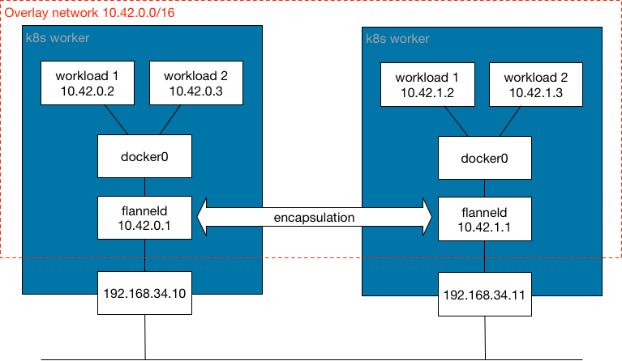

非封装网络:

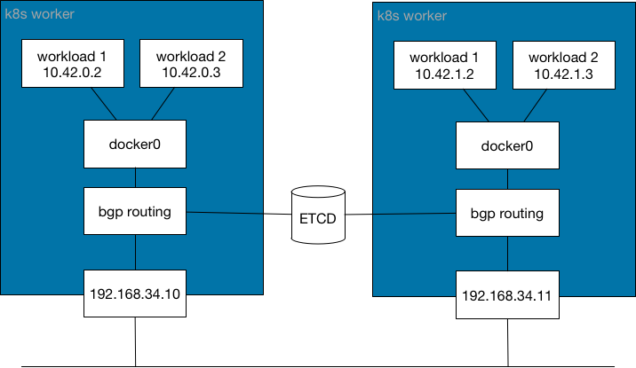

##### calico

calico 是一个纯三层的虚拟网络,他没有复用 docker 的 docker0 网桥,而是自己实现的,calico 网络不对数据包进行额外封装,不需要 NAT 和端口映射

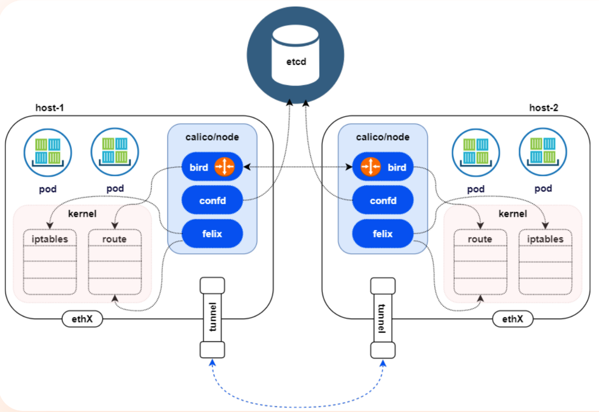

Felix

负责管理网络接口,编写路由,编写 ACL(访问控制列表),报告状态

bird(BGP Client)

BGP Client 将 BGP 协议广播告诉剩余 calico 节点,从而实现网络互通

图中 bird 互相连接表示 BGP 协议的互相收发同步,非覆盖网络通过 BGP 协议信息将 Pod IP 规划为路由进一步实现路由跨域

confd

通过监听 etcd 以了解 BGP 配置和全局默认值的更改。Confd 根据 ETCD 中数据的更新，动态生成 BIRD 配置文件。当配置文件更改时 confd 会触发 BIRD 重新加载新文件

图中的虚线的意思是: 默认情况下,confd 通过 api server 的服务间接访问 etcd 存储数据,它还支持直接向 etcd 中存储数据

###### 网络模式

calico 有三个网络模式:

- VXLAN 隧道
- IPIP 隧道
- BGP 直连

###### VXLAN

VXLAN(Virtual Extensible LAN 虚拟可扩展局域网),是 linux 本身支持的一种网络虚拟化技术.VXLAN 可以完全在**内核态**实现封装和解封装工作,从而通过 " 隧道 " 机制构建出覆盖网络

calico 的 VXLAN 模式是基于三层的 " 二层 " 通信,vxlan 包封装在 udp 数据包中,要求 udp 在 k8s 节点间三层可达; 二层即 vxlan 封包的源 mac 地址和目标 mac 地址是自己的 vxlan 设备 mac 和对端 vxlan 设备 mac 实现通讯

> 三层可达的要求比二层可达的要求要低,因为可以跨广播域

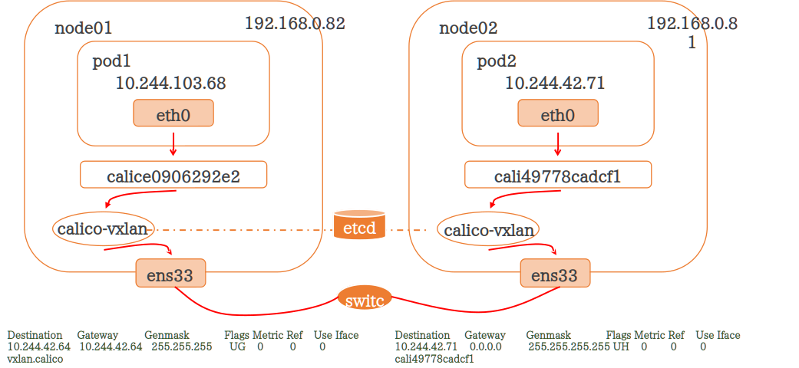

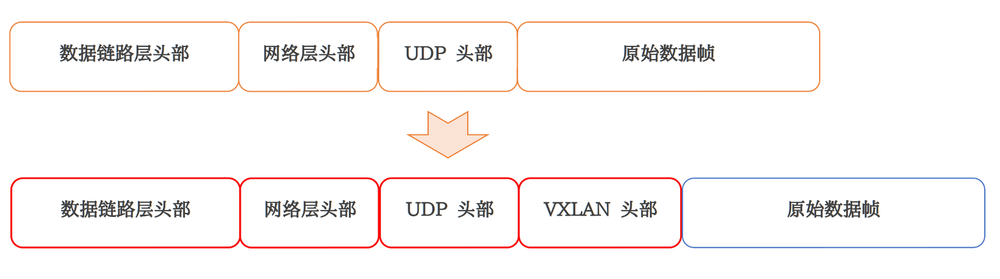

vxlan 设备上收到 pod 发来的数据包后封装: VxLAN 头 (VNI 标识号,用于解包后标识对应的 VTEP 设备,转发到正确的 pod 中),UDP 头,外层 IP 头,外层 Mac 头.

`[外层 MAC | 外层 IP | UDP 头 | VxLAN 头 | 内层 MAC | 内层 IP | Data]`

> 内层 mac 地址指源主机和目标主机上的 vxlan.calico 的 mac 地址

优势：网络要求低,只需要保证三层可达,并放行 UDP 端口即可,不需要中间的路由器支持 BGP 协议,也不会因为协议号为 4 被拦截 (IPIP 模式)

缺点：需要进行 vxlan 的数据包封包和解包,会存在一定的性能损耗

###### IPIP

IPIP 指 linux 内核原生支持的一种隧道模式

IPIP 隧道的工作原理是将源主机的 IP 数据包封装在一个新的 IP 数据包中，新的 IP 数据包的目的地址是隧道的另一端。在隧道的另一端，接收方将解封装原始 IP 数据包，并将其传递到目标主机。

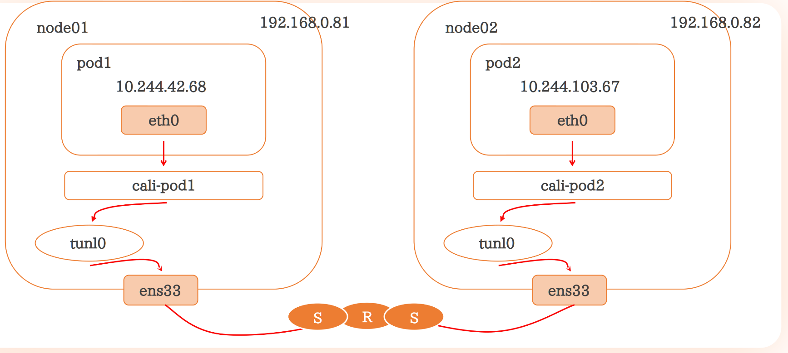

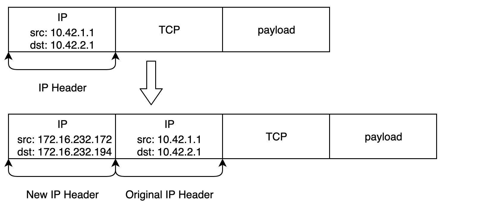

数据包封包：在 tunl0 设备上将 pod 发来的数据包的 mac 地址去掉，将剩余的 IP 数据库再次封包,添加上目的 IP 地址等信息

优点：只需要节点间三层互通即可跨网段通信,没有复制的二层机制,封包开销较小 (仅增加 20 字节的外层 IP 头).。

缺点：同样存在性能损耗,可能因为 IP 协议号为 4 被拦截

###### BGP

BGP 是一个去中心化的动态路由协议。在 Calico 中,BGP 模式摒弃了所有隧道和封包技术,追求极致的网络性能.

calico 会在每个节点上运行一个 BIRD 的路由守护进程,它通过 BIRD 广播把当前节点上分配的 Pod 网段 (CIDR) 广播给集群内的其他节点.其他节点收到广播后将其写入操作系统的路由表,数据包直接通过路由表到达目标节点上,不需要经过任何封装.

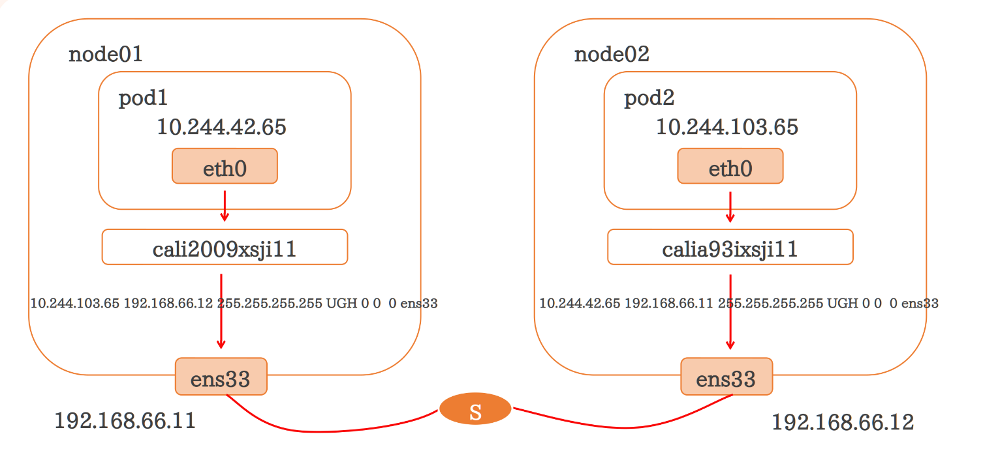

优点：没有任何封包解包开销,性能最高

## 安装(CentOS)

### 安装

k8s 的安装通常有两种方式:

- 使用 `kubeadm` 安装,它会将组件通过容器化方式运行
  - 优势: 简单,可以自愈
  - 缺点: 掩盖一些启动细节
- 使用二进制文件安装,组件以系统进程的方式运行
  - 优势: 能够更灵活的安装集群,可以具有更大规模 (将 apiserver scheduler 等组件单独安装在一台机器中)
  - 缺点: 配置比较复杂

#### 使用 Kubeadm 搭建一个一主两从的集群

基础网络结构

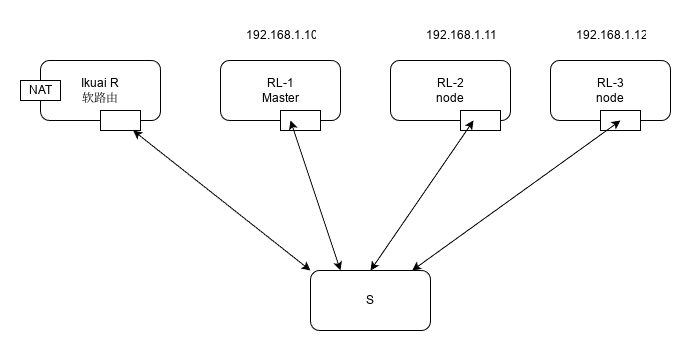

性能要求:

- 主节点:
  - CPU>=2
  - MEM>=4GB
  - NIC(网卡)>=1
  - DISK=100GB(需要大量镜像)
- 从节点:
  - CPU>=1
  - MEM>=1GB
  - NIC(网卡)>=1
  - DISK=100GB

##### 前提条件

关闭交换分区

```
sed -i "s:/dev/mapper/rl_vbox-swap:#/dev/mapper/rl_vbox-swap:g" /etc/fstab
```

修改主机名

```
hostnamectl set-hostname k8s-master01
```

| IP           | 主机名          |
| ------------ | ------------ |
| 192.168.1.10 | k8s-master01 |
| 192.168.1.11 | k8s-node01   |
| 192.168.1.12 | k8s-node02   |

修改 hosts 文件

```
vim /etc/hosts

127.0.0.1   localhost localhost.localdomain localhost4 localhost4.localdomain4
::1         localhost localhost.localdomain localhost6 localhost6.localdomain6

# IP地址 完整主机名 简短别名
192.168.1.10 k8s-master01 m1
192.168.1.11 k8s-node01 n1
192.168.1.12 k8s-node02 n2
192.168.1.13 harbor
```

> harbor 是将来可能用到的镜像服务器

修改后将文件发送给其他两个服务器:

```
scp /etc/hosts root@n1:/etc/hosts
scp /etc/hosts root@n2:/etc/hosts
```

关闭防火墙(ubuntu2204):
```
sudo ufw disable
```

安装docker环境

```
# 加载 bridge
yum install -y epel-release
yum install -y bridge-utils
modprobe br_netfilter
echo 'br_netfilter' >> /etc/modules-load.d/bridge.conf
echo 'net.bridge.bridge-nf-call-iptables=1' >> /etc/sysctl.conf
echo 'net.bridge.bridge-nf-call-ip6tables=1' >> /etc/sysctl.conf
echo 'net.ipv4.ip_forward=1' >> /etc/sysctl.conf
sysctl -p

# 添加 docker-ce yum 源
# 中科大(ustc)
sudo dnf config-manager --add-repo https://mirrors.ustc.edu.cn/docker-
ce/linux/centos/docker-ce.repo
cd /etc/yum.repos.d
# 切换中科大源
sed -e 's|download.docker.com|mirrors.ustc.edu.cn/docker-ce|g' docker-ce.repo
# 安装 docker-ce
yum -y install docker-ce
# 配置 daemon.
cat > /etc/docker/daemon.json <<EOF
{
  "default-ipc-mode": "shareable",
  "data-root": "/data/docker",
  "exec-opts": ["native.cgroupdriver=systemd"],
  "log-driver": "json-file",
  "log-opts": {
    "max-size": "100m",
    "max-file": "100"
  }
  "registry-mirrors": [
  "https://reg-mirror.qiniu.com/",
  "https://docker.mirrors.ustc.edu.cn/",
  "https://hub-mirror.c.163.com/",
  "https://docker.1ms.run",
  "https://hub.mirrorify.net",
  "https://young-sky.nooa.tech/"
  ]
}

EOF
mkdir -p /etc/systemd/system/docker.service.d
# 重启docker服务
systemctl daemon-reload && systemctl restart docker && systemctl enable docker
```

安装 `cri-docker`

docker 使用 `OCRI` 接口,而其他容器运行时使用 `CRI` 接口,早期的 k8s 使用一个垫片将 `CRI` 转换为 `OCRI`,现在 k8s 已不在维护,而是由 `cri-docker` 项目维护

```
wget https://github.com/Mirantis/cri-dockerd/releases/download/v0.3.17/cri-dockerd-0.3.17.amd64.tgz

tar -zxf cri-dockerd-0.3.17.amd64.tgz

mv cri-dockerd/cri-dockerd /usr/bin/

chmod a+x /usr/bin/cri-dockerd
```

编写 systemd 文件

```
cat <<"EOF" > /usr/lib/systemd/system/cri-docker.service
[Unit]
Description=CRI Interface for Docker Application Container Engine
Documentation=https://docs.mirantis.com
After=network-online.target firewalld.service docker.service
Wants=network-online.target
Requires=cri-docker.socket
[Service]
Type=notify
ExecStart=/usr/bin/cri-dockerd --network-plugin=cni --pod-infra-container-image=registry.aliyuncs.com/google_containers/pause:3.8
ExecReload=/bin/kill -s HUP $MAINPID
TimeoutSec=0
RestartSec=2
Restart=always
StartLimitBurst=3
StartLimitInterval=60s
LimitNOFILE=infinity
LimitNPROC=infinity
LimitCORE=infinity
TasksMax=infinity
Delegate=yes
KillMode=process
[Install]
WantedBy=multi-user.target
EOF

# 添加cri-docker套接字
cat <<"EOF" > /usr/lib/systemd/system/cri-docker.socket
[Unit]
Description=CRI Docker Socket for the API
PartOf=cri-docker.service
[Socket]
ListenStream=%t/cri-dockerd.sock
SocketMode=0660
SocketUser=root
SocketGroup=docker
[Install]
WantedBy=sockets.target
EOF

systemctl daemon-reload && systemctl enable --now cri-docker
```

随后重启一下虚拟机

##### 安装 ikuai

[ikuai](https://www.ikuai8.com/component/download) 下载 iso 后新建一个虚拟机并安装

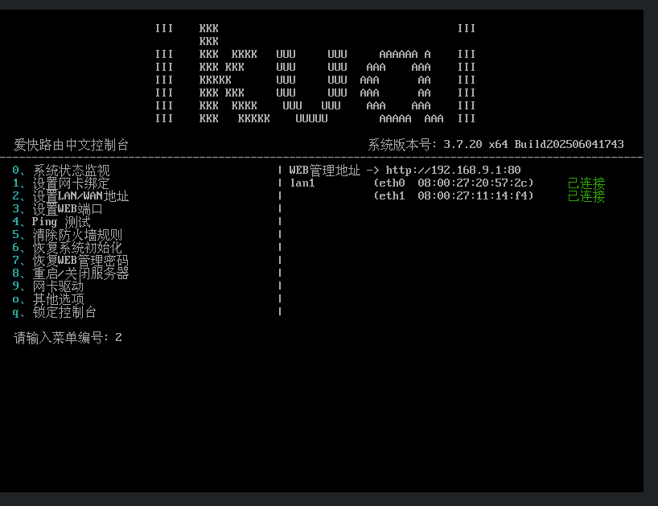

设置 lan 地址:

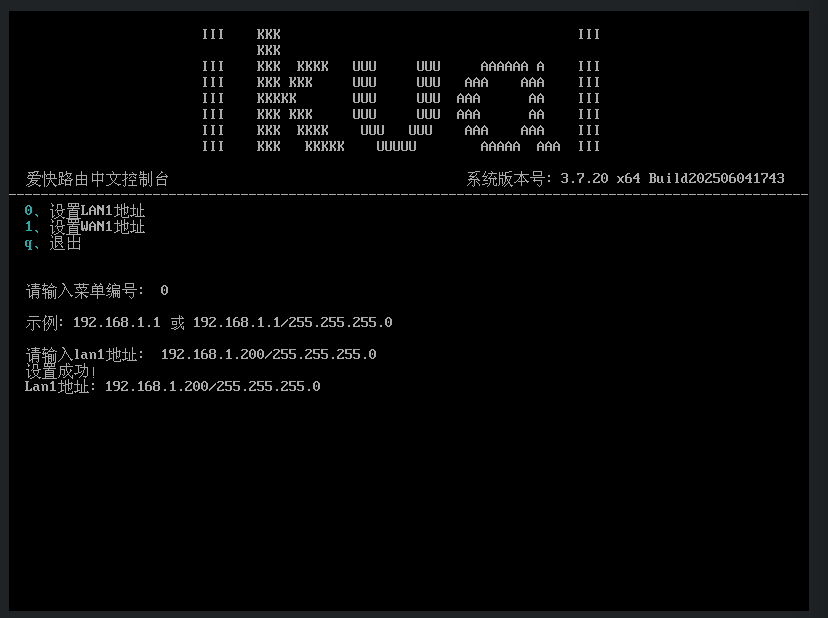

配置后按 q 锁定,然后访问 `192.168.1.200`

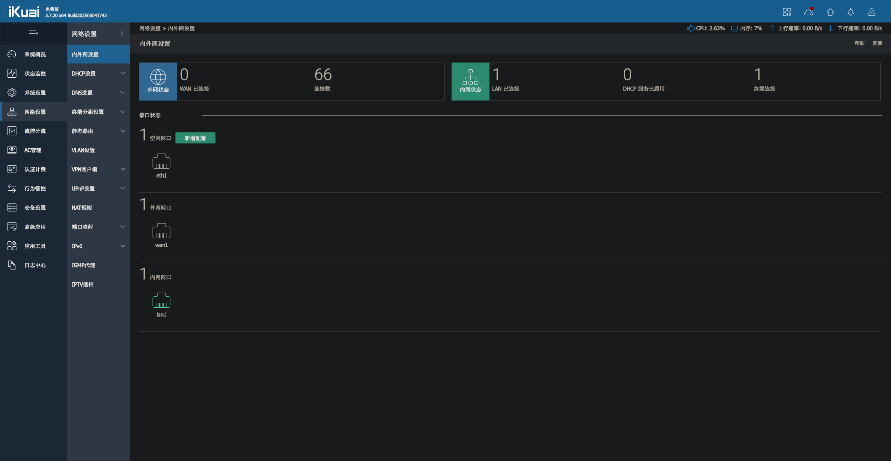登录 (admin/admin) 后在网络设置 - 内外网设置中点击 wan1 修改外网地址

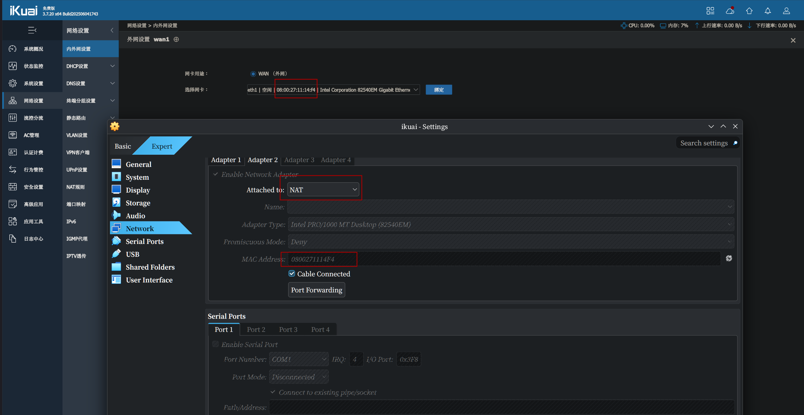

选择 NAT 网卡绑定即可

##### 配置 k8s 机器使用软路由

此时的虚拟机中有两张网卡:

```
[root@vbox ~]# ip addr show
1: lo: <LOOPBACK,UP,LOWER_UP> mtu 65536 qdisc noqueue state UNKNOWN group default qlen 1000
    link/loopback 00:00:00:00:00:00 brd 00:00:00:00:00:00
    inet 127.0.0.1/8 scope host lo
       valid_lft forever preferred_lft forever
    inet6 ::1/128 scope host 
       valid_lft forever preferred_lft forever
2: enp0s3: <BROADCAST,MULTICAST,UP,LOWER_UP> mtu 1500 qdisc fq_codel state UP group default qlen 1000
    link/ether 08:00:27:fa:a9:7a brd ff:ff:ff:ff:ff:ff
    inet 192.168.1.10/24 brd 192.168.1.255 scope global noprefixroute enp0s3
       valid_lft forever preferred_lft forever
    inet6 fe80::a00:27ff:fefa:a97a/64 scope link noprefixroute 
       valid_lft forever preferred_lft forever
3: enp0s8: <BROADCAST,MULTICAST,UP,LOWER_UP> mtu 1500 qdisc fq_codel state UP group default qlen 1000
    link/ether 08:00:27:5d:55:cc brd ff:ff:ff:ff:ff:ff
    inet 10.0.3.15/24 brd 10.0.3.255 scope global dynamic noprefixroute enp0s8
       valid_lft 86241sec preferred_lft 86241sec
    inet6 fd17:625c:f037:3:a00:27ff:fe5d:55cc/64 scope global dynamic noprefixroute 
       valid_lft 86245sec preferred_lft 14245sec
    inet6 fe80::a00:27ff:fe5d:55cc/64 scope link noprefixroute 
       valid_lft forever preferred_lft forever
```

我们先将 enp0s8(NAT 网络) 网卡禁用掉,防止出现节点中从一个机器的一个网卡到另一个的不在同一网段的网卡请求的乌龙事件

```
vim /etc/NetworkManager/system-connections/enp0s8.nmconnection

[connection]
id=enp0s8
uuid=a852fe6e-1b80-3d2a-856c-523098ed69a0
type=ethernet
# 添加禁用网卡自启
autoconnect=false
autoconnect-priority=-999
interface-name=enp0s8
timestamp=1755897461
```

然后将 enp0s3(host-only 网络) 网卡的默认网关设置为 ikuai 虚拟机,并设置 dns 服务器:

```
vim /etc/NetworkManager/system-connections/enp0s3.nmconnection

[ipv4]
method=manual
# 逗号后跟网关
address1=192.168.1.12/24,192.168.1.200
# dns服务器以分号间隔
dns=114.114.114.114;8.8.8.8
```

随后在 ikuai 的 web 页面中的 状态监控 - 终端监控 -IPv4 中可以看到

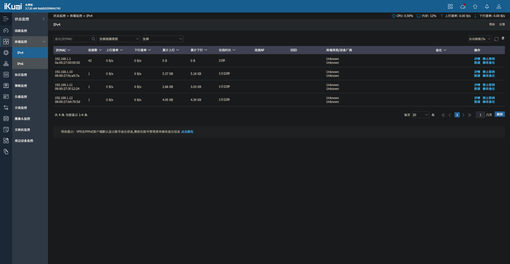

##### 安装 kubenetes

以下命令对于所有机器：

配置源

```
cat <<EOF | sudo tee /etc/yum.repos.d/kubernetes.repo
[kubernetes]
name=Kubernetes
baseurl=https://pkgs.k8s.io/core:/stable:/v1.29/rpm/
enabled=1
gpgcheck=1
gpgkey=https://pkgs.k8s.io/core:/stable:/v1.29/rpm/repodata/repomd.xml.key
EOF
```

由于没有网络，此处使用本地的软件包进行安装，安装列表：

```
ls
conntrack-tools-1.4.7-2.el9.x86_64.rpm
cri-tools-1.29.0-150500.1.1.x86_64.rpm
kubeadm-1.29.2-150500.1.1.x86_64.rpm
kubectl-1.29.2-150500.1.1.x86_64.rpm
kubelet-1.29.2-150500.1.1.x86_64.rpm
kubernetes-cni-1.3.0-150500.1.1.x86_64.rpm
libnetfilter_cthelper-1.0.0-22.el9.x86_64.rpm
libnetfilter_cttimeout-1.0.0-19.el9.x86_64.rpm
libnetfilter_queue-1.0.5-1.el9.x86_64.rpm
socat-1.7.4.1-5.el9.x86_64.rpm
```

安装：

```
# 关闭仓库安装本地文件
dnf install -y ./* --disablerepo="*"
```

配置 kubelet 开机自启

```
systemctl enable kubelet
```

> kubelet 是维护 Pod 生命周期和节点状态的关键组件，因此它是以守护进程的方式安装并开机自启的
>
> linux > docker > cri-docker > kubelet > Api Server > Controller manager / Scheduler / etcd

进行主节点的初始化

```
# 配置了apiserver地址,service 网络范围, pod网络范围,跳过前置的错误检测,指定cri的接口地址
kubeadm init \
  --apiserver-advertise-address=192.168.1.10 \
  --kubernetes-version 1.29.2 \
  --service-cidr=10.10.0.0/12 \
  --pod-network-cidr=10.244.0.0/16 \
  --cri-socket unix:///var/run/cri-dockerd.sock
```

```
# 复制配置
mkdir -p $HOME/.kube
sudo cp -i /etc/kubernetes/admin.conf $HOME/.kube/config
sudo chown $(id -u):$(id -g) $HOME/.kube/config
```

可以在子节点中使用下面的命令来加入集群:

```
# token和ca-cert-hash是在运行上面的初始化命令后提示的
kubeadm join 192.168.1.10:6443 --token iwszwi.471dirm0fr4aj5qi \
        --discovery-token-ca-cert-hash sha256:0a34459764a301b9f7809a6dc84443cbc3d0923f6ea502af1b38ff8bda320c47 --cri-socket unix:///var/run/cri-dockerd.sock
```

在主节点可以看到所有 node:

```
kubectl get nodes
NAME           STATUS     ROLES           AGE     VERSION
k8s-master01   NotReady   control-plane   5m23s   v1.29.2
k8s-node01     NotReady   <none>          17s     v1.29.2
k8s-node02     NotReady   <none>          11s     v1.29.2
```

##### 安装 calico

由于现在 k8s 的所有容器没有工作在一个扁平的网络空间中,因此还需要部署网络插件,程可以参考这篇 [文章](https://docs.tigera.io/calico/latest/getting-started/kubernetes/self-managed-onprem/onpremises#install-calico-with-kubernetes-api-datastore-more-than-50-nodes)

calico 有两种安装方法,Operator 和 Manifest

Manifest 直接使用官方提供的一份或多份 **YAML 清单文件 (Kubernetes manifest)**，里面包含了 Calico 所需的所有资源（Deployment、DaemonSet、ConfigMap、CRD 等）。可以直接使用 `kubectl apply -f calico.yaml` 安装,但修改参数需要手动编辑 YAML 文件

Operator 使用一个控制器 (Calico Operator) 来管理 Calico 的安装和生命周期

> 对于 Manifest 安装方法,如果使用 *Kubernetes API datastore* 且 **超过 50 个节点**，则需要通过 Typha daemon 来实现扩展。

```
curl https://raw.githubusercontent.com/projectcalico/calico/v3.26.3/manifests/calico-typha.yaml -o calico.yaml

# 修改配置文件
vim calico.yaml 
# 修改为 BGP 模式
# Enable IPIP
- name: CALICO_IPV4POOL_IPIP
  value: "Always"  #改成Off
# 修改为与初始化时的pod-network-cidr参数一致
- name: CALICO_IPV4POOL_CIDR
  value: "10.244.0.0/16"
# 指定网卡
- name: IP_AUTODETECTION_METHOD
  value: "interface=enp0s3"

# 使用该配置文件
kubectl apply -f calico.yaml
```

等待几分钟后查看 pod 状态：

```
kubectl get pod -A
NAMESPACE     NAME                                       READY   STATUS    RESTARTS      AGE
kube-system   calico-kube-controllers-558d465845-2rm2r   1/1     Running   0             2m3s
kube-system   calico-node-4f6xb                          1/1     Running   0             2m3s
kube-system   calico-node-65vpx                          1/1     Running   0             2m3s
kube-system   calico-node-sld8x                          1/1     Running   0             2m3s
kube-system   calico-typha-5b56944f9b-tvsx8              1/1     Running   0             2m3s
kube-system   coredns-76f75df574-dmp2g                   1/1     Running   3 (28m ago)   176m
kube-system   coredns-76f75df574-llcrd                   1/1     Running   3 (28m ago)   176m
kube-system   etcd-k8s-master01                          1/1     Running   3 (28m ago)   177m
kube-system   kube-apiserver-k8s-master01                1/1     Running   3 (28m ago)   177m
kube-system   kube-controller-manager-k8s-master01       1/1     Running   3 (28m ago)   177m
kube-system   kube-proxy-8c7s4                           1/1     Running   0             171m
kube-system   kube-proxy-kv2cv                           1/1     Running   0             171m
kube-system   kube-proxy-pcgr8                           1/1     Running   3 (28m ago)   176m
kube-system   kube-scheduler-k8s-master01                1/1     Running   3 (28m ago)   177m
```

> 此处由于 pause:3.8 镜像源遇到问题导致卡了很久，最后使用 docker 的镜像站手动安装才成功：
> docker pull **.xuanyuan.run/pause:3.8

## 安装(Ubuntu2204)
此部分除了使用的是ubuntu2204系统,还有部分内容和上一部分不同,例如直接禁用了ufw,没有使用ikuai(而是直接使用kvm的默认网络,一外一内),使用`Containerd`而不是`Docker`作为CRI.

关闭ufw:
```
sudo ufw disable 
Firewall stopped and disabled on system startup
```
配置dns解析:
```
$ cat /etc/hosts

10.0.0.11 k8s-master1 m1
10.0.0.21 k8s-node1 n1
10.0.0.22 k8s-node2 n2
10.0.0.23 k8s-node3 n3
```
> 这里是一主三从,ip是内网ip

禁用自动检查更新:
```
sudo systemctl disable --now unattended-upgrades
```

安装containerd:
```
sudo apt update
sudo apt install -y containerd conntrack
```
生成默认配置文件:
```
sudo mkdir -p /etc/containerd && containerd config default | sudo tee /etc/containerd/config.toml >/dev/null
```
配置`crictl`使用`containerd.sock`:
```
cat <<EOF | sudo tee /etc/crictl.yaml
runtime-endpoint: unix:///run/containerd/containerd.sock
image-endpoint: unix:///run/containerd/containerd.sock
timeout: 10
debug: false
EOF
```

开启内核参数:
```
cat <<EOF | sudo tee /etc/modules-load.d/k8s.conf
overlay
br_netfilter
EOF
overlay
br_netfilter
```
设置sysctl,开启网络包转发:
```
cat <<EOF | sudo tee /etc/sysctl.d/k8s.conf
net.bridge.bridge-nf-call-iptables  = 1
net.bridge.bridge-nf-call-ip6tables = 1
net.ipv4.ip_forward                 = 1
EOF

# 让配置立刻生效
sudo sysctl --system
```
开启system cgroup驱动
```
sudo sed -i 's/SystemdCgroup = false/SystemdCgroup = true/g' /etc/containerd/config.toml
```
安装kubeadm:
```
curl -fsSL https://pkgs.k8s.io/core:/stable:/v1.31/deb/Release.key | sudo gpg --dearmor -o /etc/apt/keyrings/kubernetes-apt-keyring.gpg && echo 'deb [signed-by=/etc/apt/keyrings/kubernetes-apt-keyring.gpg] https://pkgs.k8s.io/core:/stable:/v1.31/deb/ /' | sudo tee /etc/apt/sources.list.d/kubernetes.list
sudo apt-get update && sudo apt-get install -y kubelet kubeadm kubectl && sudo apt-mark hold kubelet kubeadm kubectl
```

在所有节点(包括control plane节点)上启用kubelet:
```
kubelet
```
> control plane首先是一个node,它也需要向集群报告自己的CPU,内存和健康状态.
> control plane上部署的镜像(api server,etcd,scheduler等)是以静态Pod的方式运行在control plane的,它们的启动也需要使用kubelet.
启动集群:
```
sudo kubeadm init \
  --apiserver-advertise-address=10.0.0.11 \
  --image-repository registry.aliyuncs.com/google_containers \
  --pod-network-cidr=10.244.0.0/16 \
  --service-cidr=10.96.0.0/12 \
  --cri-socket unix:///run/containerd/containerd.sock
```
> 网络从上到下分别是: 集群节点地址,Pod网段,service网段
> 这里有一行日志是`[etcd] Creating static Pod manifest for local etcd in "/etc/kubernetes/manifests"`代表control plane节点上的关键组件是以静态pod的方式运行的.
安装calico网络插件:
主要参考[官方文档](https://docs.tigera.io/calico/latest/getting-started/kubernetes/self-managed-onprem/onpremises),我使用的是`Tigera Operator`+`iptables`
> 注意下载`custom-resources.yaml`文件后要手动修改其中的cidr项为上面`kuberadm init`时设置的`pod-network-cidr`

随后获取node状态:
```
kubectl get nodes
```
## 部署

上面的安装过程使用的kubeadm部署,除此之外还有:
- 二进制部署
- kk(KubeKey)部署

## 操作
### 管理容器和镜像
使用docker作为CRI时可以直接使用`docker`命令管理
使用containerd时可以使用:
- `ctr`: containerd自带的管理命令,比较繁琐,会显示pause等底层容器
- `crictl`: kubeadm安装的管理CRI的命令,比较高级,默认只显示业务容器
### 进入Pod内部
#### 使用容器运行时
- 运行`crictl exec -it <容器ID> /bin/bash`
- 运行`sudo ctr -n k8s.io tasks exec --exec-id <执行id(自定义)> --tty <容器ID> /bin/bash`
#### 使用kubeadm
```
kubectl exec -it <pod命令> -c <容器名称> -- /bin/bash

# 示例
kubectl exec -it pod-demo -c myapp-1 -- /bin/bash
```
> 容器命令可以查看资源清单的`containers`的`name`字段
### 筛选pod
可以根据资源清单中的`metadata`-`labels`字段设置的标签分类:
对于
```
apiVersion: v1
kind: Pod
metadata:
  name: pod-demo
  namespace: default
  labels:
    app: myapp
```
可以使用:
```
kubectl get pod -A -l app
NAMESPACE   NAME       READY   STATUS    RESTARTS   AGE
default     pod-demo   2/2     Running   0          41m
kubectl get pod -A -l app=myapp
NAMESPACE   NAME       READY   STATUS    RESTARTS   AGE
default     pod-demo   2/2     Running   0          41m
```
### 查看日志
`kubectl logs <pod-nam> -c <containerd-name>`
```
$ kubectl logs pod-demo myapp-1
10.0.0.11 - - [17/Apr/2026:12:42:21 +0800] "GET / HTTP/1.1" 200 48 "-" "curl/7.81.0"
10.0.0.11 - - [17/Apr/2026:12:42:22 +0800] "GET / HTTP/1.1" 200 48 "-" "curl/7.81.0"
10.0.0.11 - - [17/Apr/2026:12:42:23 +0800] "GET / HTTP/1.1" 200 48 "-" "curl/7.81.0"
```
## 资源清单

k8s 中所有内容都抽象为资源,资源实例化之后就叫作对象

#### 类别

资源清单有三种类别

名称空间级别

- 工作负载型资源： Pod、ReplicaSet、Deployment ...
- 服务发现及负载均衡型资源: Service、Ingress...
- 配置与存储型资源：Volume、CSI ...
- 特殊类型的存储卷：ConfigMap、Secre ...

集群级资源

Namespace、Node、ClusterRole、ClusterRoleBinding

元数据型资源

HPA、PodTemplate、LimitRange

#### 编写

资源清单的结构包括

- apiVersion
- kind
- metadata
- spec
- status

`apiVersion` 的值是 `group/apiversion`

```
# 查看所有apiVersion
kubectl api-versions

admissionregistration.k8s.io/v1
apiextensions.k8s.io/v1
apiregistration.k8s.io/v1
apps/v1
authentication.k8s.io/v1
authorization.k8s.io/v1
autoscaling/v1
autoscaling/v2
batch/v1
certificates.k8s.io/v1
coordination.k8s.io/v1
crd.projectcalico.org/v1
discovery.k8s.io/v1
events.k8s.io/v1
flowcontrol.apiserver.k8s.io/v1
flowcontrol.apiserver.k8s.io/v1beta3
networking.k8s.io/v1
node.k8s.io/v1
policy/v1
rbac.authorization.k8s.io/v1
scheduling.k8s.io/v1
storage.k8s.io/v1
v1    # 实际上是core/v1
```

- kind指资源的类别

- metadata指资源的元数据,例如`name`,`namespace`,`labels`

- spec是资源的**期望**,指最终想要资源达到的状态

- status是资源的状态,通常由k8s管理,不需要手动指定

查看资源对象的属性可以使用`kubectl explain 资源名称`

```
kubectl explain deployment
GROUP:      apps
KIND:       Deployment
VERSION:    v1

DESCRIPTION:
    Deployment enables declarative updates for Pods and ReplicaSets.

FIELDS:
  apiVersion    <string>
    APIVersion defines the versioned schema of this representation of an object.
    Servers should convert recognized schemas to the latest internal value, and
    may reject unrecognized values. More info:
    https://git.k8s.io/community/contributors/devel/sig-architecture/api-conventions.md#resources

  kind  <string>
    Kind is a string value representing the REST resource this object
    represents. Servers may infer this from the endpoint the client submits
    requests to. Cannot be updated. In CamelCase. More info:
    https://git.k8s.io/community/contributors/devel/sig-architecture/api-conventions.md#types-kinds
.
```

#### 模板

如果不知道如何编写,可以通过 `kubectl create` 来创建一个模板

```
# 查看帮助如何创建
[root@k8s-master01 ~]# kubectl create deployment --help
Examples:
  # Create a deployment named my-dep that runs the busybox image
  kubectl create deployment my-dep --image=busybox
  
  # Create a deployment with a command
  kubectl create deployment my-dep --image=busybox -- date
  
  # Create a deployment named my-dep that runs the nginx image with 3 replicas
  kubectl create deployment my-dep --image=nginx --replicas=3
  
  # Create a deployment named my-dep that runs the busybox image and expose port
5701
  kubectl create deployment my-dep --image=busybox --port=5701
  
# 试运行并输出为yaml格式
[root@k8s-master01 ~]# kubectl create deployment my-dem --image=wangyanglinux/myapp:v1.0 --dry-run -o yaml
apiVersion: apps/v1
kind: Deployment
metadata:
  creationTimestamp: null
  labels:
    app: my-dem
  name: my-dem
spec:
  replicas: 1
  selector:
    matchLabels:
      app: my-dem
  strategy: {}
  template:
    metadata:
      creationTimestamp: null
      labels:
        app: my-dem
    spec:
      containers:
      - image: wangyanglinux/myapp:v1.0
        name: myapp
        resources: {}
status: {}

# 直接保存为文件
[root@k8s-master01 ~]# kubectl create deployment my-dem --image=wangyanglinux/myapp:v1.0 --dry-run -o yaml > deployment.yaml.tmp
W0921 02:26:17.473372    9011 helpers.go:704] --dry-run is deprecated and can be replaced with --dry-run=client.
[root@k8s-master01 ~]# cat deployment.yaml.tmp 
apiVersion: apps/v1
kind: Deployment
metadata:
  creationTimestamp: null
  labels:
    app: my-dem
  name: my-dem
spec:
  replicas: 1
  selector:
    matchLabels:
      app: my-dem
  strategy: {}
  template:
    metadata:
      creationTimestamp: null
      labels:
        app: my-dem
    spec:
      containers:
      - image: wangyanglinux/myapp:v1.0
        name: myapp
        resources: {}
status: {}
```

#### 示例

一个pod的资源清单示例:

```
# pod1.yaml
apiVersion: v1
kind: Pod
metadata:
  name: pod-demo
  namespace: default
  labels:
    app: myapp
spec:
  containers:
  - name: myapp-1
    image: swr.cn-north-4.myhuaweicloud.com/ddn-k8s/docker.io/wangyanglinux/myapp:v1.0
  - name: busybox-1
    image: swr.cn-north-4.myhuaweicloud.com/ddn-k8s/docker.io/wangyanglinux/tools:errweb1.0
    command:
    - "/bin/sh"
    - "-c"
    - "sleep 3600"
```

运行 `kubectl create -f yamlfile` 来实例化资源

```
kubectl create -f pod1.yaml

kubectl get pod -n default -o wide
NAME       READY   STATUS    RESTARTS   AGE     IP              NODE         NOMINATED NODE   READINESS GATES
pod-demo   2/2     Running   0          2m19s   10.244.58.195   k8s-node02   <none>           <none>
```

在 k8s-node02 中查看:

```
docker ps

CONTAINER ID   IMAGE                                                                    COMMAND                  CREATED         STATUS         PORTS     NAMES
# pod-demo
ebd1898f0acd   swr.cn-north-4.myhuaweicloud.com/ddn-k8s/docker.io/wangyanglinux/tools   "/bin/sh -c 'sleep 3…"   8 minutes ago   Up 8 minutes             k8s_busybox-1_pod-demo_default_c511da29-5c93-452f-b249-9f80cf18627a_0
1fd744a657ee   79fbe47c0ab9                                                             "/bin/sh -c 'hostnam…"   8 minutes ago   Up 8 minutes             k8s_myapp-1_pod-demo_default_c511da29-5c93-452f-b249-9f80cf18627a_0
971d4de7f2d0   registry.aliyuncs.com/google_containers/pause:3.8                        "/pause"                 8 minutes ago   Up 8 minutes             k8s_POD_pod-demo_default_c511da29-5c93-452f-b249-9f80cf18627a_0

# calico-node
16aa5f9dc2d2   17e960f4e39c                                                             "start_runit"            2 hours ago     Up 2 hours               k8s_calico-node_calico-node-sld8x_kube-system_3e01a1ff-1281-4e96-b055-22cecd813249_1
f34a49b5c777   registry.aliyuncs.com/google_containers/pause:3.8                        "/pause"                 2 hours ago     Up 2 hours               k8s_POD_calico-node-sld8x_kube-system_3e01a1ff-1281-4e96-b055-22cecd813249_1

4745d252400a   registry.aliyuncs.com/google_containers/pause:3.8                        "/pause"                 2 hours ago     Up 2 hours               k8s_POD_kube-proxy-8c7s4_kube-system_5cb1da22-8f5f-4600-ba0a-1126ae1056b7_1
ee2f2e8c5151   9344fce2372f                                                             "/usr/local/bin/kube…"   2 hours ago     Up 2 hours               k8s_kube-proxy_kube-proxy-8c7s4_kube-system_5cb1da22-8f5f-4600-ba0a-1126ae1056b7_1

# calico-typha
11d49bc3617e   registry.aliyuncs.com/google_containers/pause:3.8                        "/pause"                 2 hours ago     Up 2 hours               k8s_POD_calico-typha-5b56944f9b-tvsx8_kube-system_9be5c2e4-459a-4748-9931-ba4cd92f0404_1
539976764de5   5993c7d25ac5                                                             "/sbin/tini -- calic…"   2 hours ago     Up 2 hours               k8s_calico-typha_calico-typha-5b56944f9b-tvsx8_kube-system_9be5c2e4-459a-4748-9931-ba4cd92f0404_1
```

> 可以看到 node2 中存在多个 pod,由多个容器组成,每个 pod 都有一个 pause 容器

如果创建pod失败,可以通过`kubectl describe`查看k8s级别的日志然后通过`kubectl logs`查看容器b

### Pod
Pod的最佳实践:
1. **preStop**：处理依赖检查和初始化任务
2. **合理使用 Init 容器**：确保应用健康状态可监控
3. **配置适当的探针**：使用 preStop 钩子确保数据一致性
4. **实现优雅终止**：防止资源耗尽影响节点稳定性
5. **设置资源限制**：合理配置 initialDelaySeconds 避免误报
#### Pod的生命周期

Pod 的生命周期包含多个阶段，从容器的初始化到主容器的运行和终止。Pod 中的容器分为**Init 容器（InitC）**和**主容器（MainC）**ER}主容器（MainC）**，它们各自承担不同的职责。

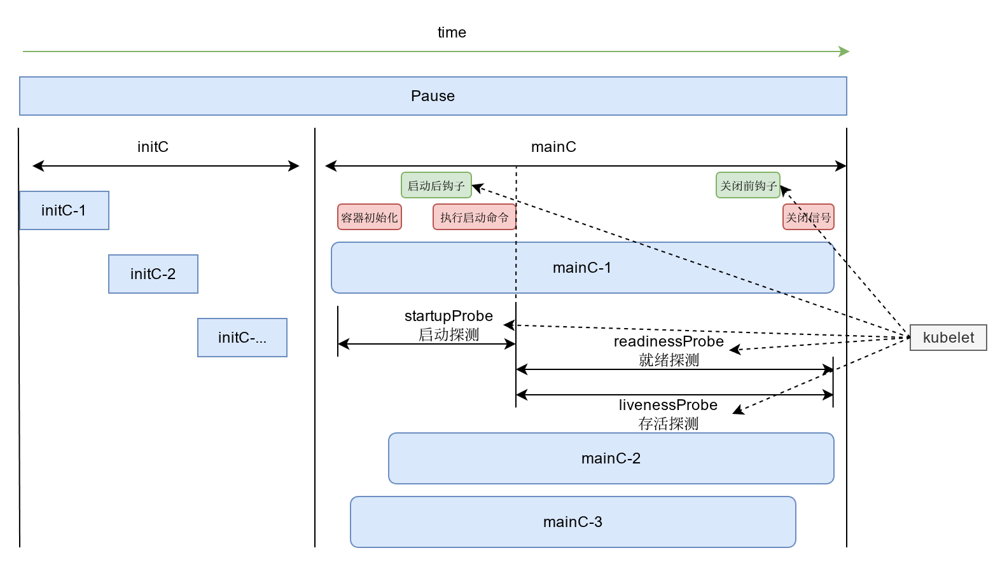


##### init 容器 (InitC)

InitC会运行一些初始化的进程,或控制容器启动顺序

Init容器总是运行到成功完成为止,

- 由于initC运行时间短,可以执行一些危险操作
- initC类似于脚本,只能按顺序执行.
- 只有当上一个initC被创建并且成功完成(返回码是`0`)之后,第二个initC才会被创建
- 如果一个initC运行失败(返回码不为0),kubelet会重头运行整个initC流程(原子性)
- initC天然具有阻塞的特性,可以进行一些判断,例如控制容器启动流程
- 如果Pod的init容器失败,K8s会不断重复重启该Pod,直到init容器成功为止,如果Pod对应的restartPolicy为Never(默认是Always)则不会重启


示例: 域名解析检查

```
apiVersion: v1
kind: Pod
metadata:
  name: initc-demo
spec:
  containers:
  - name: main-app
    image: myapp:latest
    ports:
      - containerPort: 80
  initContainers:
  - name: check-service
    image: busybox
    command: ['sh', '-c', 'until nslookup myservice; do echo waiting; sleep 2; done;']
  - name: check-db
    image: busybox
    command: ['sh', '-c', 'until nslookup mydb; do echo waiting; sleep 2; done;']
```

##### 主容器 (MainC)

主容器是 Pod 中运行应用程序的主要容器，可以包含多个并行运行的容器。

主容器本身也可以并行运行.

mainC可以同时存在,并发运行,mainC中存在**钩子**和**探针**:

- 钩子: 当容器达到某种状态时进行动作,由pod所在节点的kubelet执行
- 探针: kubelet对容器执行的定制诊断

钩子和探针都是可选的,不需要强制设置,都有pod所在节点的kubelet执行

就绪探测和存活探测需要确保容器已经正确启动再开始探测,新版本的k8s提供了启动探测来保障就绪探测和存活探测在启动后开始探测直到容器关闭

#### 探针(Probes)

探针由 kubelet 执行，用于监控容器状态,kubelet调用容器的Handle(处理程序)执行诊断
> 探针是定义在容器层面的


| 探针类型             | 作用时期   | 失败行为    |
| ---------------- | ------ | ------- |
| `startupProbe`   | 容器启动阶段 | 静默      |
| `livenessProbe`  | 启动之后的整个运行周期 | 重启容器    |
| `readinessProbe` | 启动之后的整个运行周期 | 从服务端点移除 |

> 存活探针和就绪探针的主要区别是检测失败后的行为,存活探针失败会直接重启容器,就绪探针失败后只会把pod从`Service Endpoints`中移除,不再将流量路由到此pod.

探针处理程序类型

1. **ExecAction**：在容器内执行命令,如果退出时返回码为0则认为诊断成功
2. **TCPSocketAction**：对指定端口上的容器ip地址进行TCP检查,如果端口打开,则被认为是成功的.
3. **HTTPGetAction**：发送 HTTP 请求检查,如果响应的状态码在200~400之间,则被认为是成功的.

探针配置参数

- `initialDelaySeconds`：容器启动后探针延迟开始时间（秒）,已弃用,应该使用`startupProbe`探针而不是设置一个长时间的延迟时间.
- `periodSeconds`：执行探测的时间间隔（秒）
- `timeoutSeconds`：探针执行检测请求后，等待响应的超时时间
- `successThreshold`：探针检测失败后认为成功的最小连接成功次数
- `failureThreshold`：探测失败的重试次数

每次探测都将获得以下三种结果之一:

- 成功: 容器通过检查
- 失败: 容器未通过检查
- 未知: 诊断失败,不会采取任何行动

##### 启动探测

启动探针(startupProbe)保障存活探针在执行时不会因为时间设定问题导致无限死亡或延迟很长的情况,在启动探针探测成功之前，存活和就绪探针会被暂时挂起，防止应用尚未初始化完毕就被存活探针误判并终止。

结果:

- 成功: 开始允许存活探测,就绪探测开始执行
- 失败: 超过最大失败次数后kubelet终止该容器并根据`restartPolicy`重启
- 未知: 超过最大失败次数后kubelet终止该容器并根据`restartPolicy`重启

> 如果容器一直处在不断探测和重启状态,Pod的状态依旧是Running,因为Pod还在运行,但Pod的就绪状态(ready)始终是False

示例:

```
apiVersion: v1
kind: Pod
metadata:
  name: startupprobe-1
  namespace: default
spec:
  containers:
  - name: myapp-container
    image: wangyanglinux/myapp:v1.0
    imagePullPolicy: IfNotPresent
    readinessProbe:
      httpGet:
        port: 80
        path: /index2.html
      initialDelaySeconds: 1
      periodSeconds: 3
    startupProbe:
      httpGet:
        path: /index1.html
        port: 80
      failureThreshold: 30
      periodSeconds: 10
```

> 应用程序将会有最多 5 分钟 failureThreshold * periodSeconds（30 * 10 = 300s）的时间来完成其启动过程。


##### 就绪探测

就绪探针(readinessProbe),保证提供给用户的服务都是可用的(尤其是在扩容的时候).

如果pod内部的容器不添加就绪探测,则默认就绪,如果添加了就绪探测,只有所有容器的就绪通过之后才修改为就绪状态,**当前pod内所有容器就绪,才标记当前pod就绪**

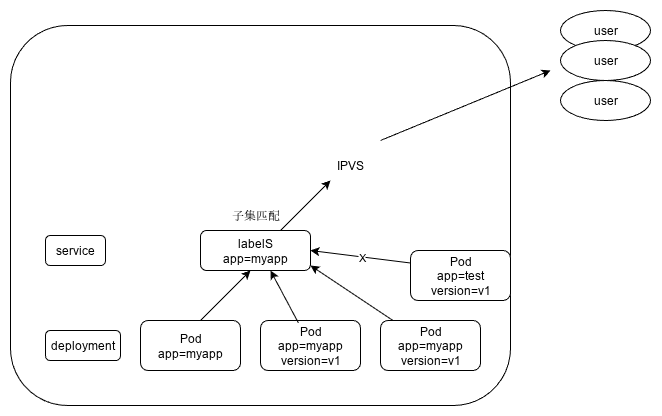

Service 只有当同时满足**HTTPGetAction**(子集匹配) 和 pod 处于就绪状态时才会加入 pod 到负载均衡集群中

- 探测成功 将容器状态修改为就绪
- 探测失败 静默 (未就绪状态)
- 探测未知 静默

> 就绪探测是在从开始探测到容器结束整个过程中的,因此可能会出现就绪一段时候后变为未就绪状态,失败之后只会把它从service Endpoints移除,而不是重启整个pod

示例:

```yaml
# 基于 HTTP Get 方式
apiVersion: v1
kind: Pod
metadata:
  name: readiness-httpget-pod
  namespace: default
  labels:
    app: myapp
    env: test
spec:
  containers:
  - name: readiness-httpget-container
    image: wangyanglinux/myapp:v1.0
    # 镜像下载策略
    imagePullPolicy: IfNotPresent
    readinessProbe:
      httpGet:
        port: 80
        path: /index1.html
      initialDelaySeconds: 1
      periodSeconds: 3

# 基于 EXEC 方式
apiVersion: v1
kind: Pod
metadata:
  name: readiness-exec-pod
  namespace: default
spec:
  containers:
  - name: readiness-exec-container
        image: wangyanglinux/tools:busybox
        imagePullPolicy: IfNotPresent
        command: ["/bin/sh","-c","touch /tmp/live ; sleep 60; rm -rf /tmp/live;sleep"]
        readinessProbe:
          exec:
          command: ["test","-e","/tmp/live"]
        initialDelaySeconds: 1
        periodSeconds: 3

# 基于 TCP Check 方式
apiVersion: v1
kind: Pod
metadata:
  name: readiness-tcp-pod
spec:
  containers:
  - name: readiness-exec-container
    image: wangyanglinux/myapp:v1.0
    readinessProbe:
      initialDelaySeconds: 5
      timeoutSeconds: 1
      tcpSocket:
      port: 80
```

##### 存活探测

如果pod内部不指定存活探测(livenessProbe),可能会发生容器运行但是无法提供服务的情况,存活探测从启动探测后持续到容器关闭

- 成功: 静默
- 失败: 根据重启的策略进行重启的动作
- 未知: 静默

示例

```yaml
# 基于 Exec 方式
apiVersion: v1
kind: Pod
metadata:
name: liveness-exec-pod
    namespace: default
spec:
    containers:
    - name: liveness-exec-container
        image: wangyanglinux/tools:busybox
        imagePullPolicy: IfNotPresent
        command: ["/bin/sh","-c","touch /tmp/live ; sleep 60; rm -rf /tmp/live;sleep 3600"]
        livenessProbe:
            exec:
                command: ["test","-e","/tmp/live"]
            initialDelaySeconds: 1
            periodSeconds: 3
# 基于 HTTP Get 方式
apiVersion: v1
kind: Pod
metadata:
    name: liveness-httpget-pod
    namespace: default
spec:
    containers:
    - name: liveness-httpget-container
      image: wangyanglinux/myapp:v1.0
      imagePullPolicy: IfNotPresent
      ports:
      - name: http
        containerPort: 80
      livenessProbe:
        httpGet:
          port: 80
          path: /index.html
        initialDelaySeconds: 1
        periodSeconds: 3
        timeoutSeconds: 3

# 基于 TCP Check 方式
apiVersion: v1
kind: Pod
metadata:
  name: liveness-tcp-pod
spec:
  containers:
  - name: liveness-tcp-container
    image: wangyanglinux/myapp:v1.0
    livenessProbe:
      initialDelaySeconds: 5
      timeoutSeconds: 1
      tcpSocket:
          port: 80
```

#### 钩子(Hooks)

钩子在容器生命周期的特定时刻执行：

1. **postStart**：容器启动后执行,可能会在容器的启动命令运行时还在运行,不能执行启动命令强依赖的命令
2. **preStop**：容器终止前执行,此钩子执行完之后才会把退出信号释放给容器.

执行钩子的是Pod所在节点的**kubelet**.

hook 的类型包括:

- exec: 执行一段命令
- HTTP: 发送 HTTP 请求

> 探针和钩子并不冲突,也不需要全部使用
示例:

```
apiVersion: v1
kind: Pod
metadata:
    name: lifecycle-exec-pod
spec:
    containers:
    - name: lifecycle-exec-container
      image: wangyanglinux/myapp:v1
      lifecycle:
        postStart:
          exec:
            command: ["/bin/sh", "-c", "echo postStart > /usr/share/message"]
        preStop:
          exec:
            command: ["/bin/sh", "-c", "echo preStop > /usr/share/message"]


# 查看日志
kubectl exec -it lifecycle-exec-pod -- /bin/sh
/ # cat /usr/share/message 
postStart

# 编写一个脚本
/ # while true;
> do
> cat /usr/share/message 
> done

# 在另一个shell中结束pod
kubectl delete pod lifecycle-exec-pod
pod "lifecycle-exec-pod" deleted

# 输出:
postStart
postStart
postStart
preStop
preStop
preStop
preStop
```

还可以通过 HTTP 探测:

```
# 基于http
apiVersion: v1
kind: Pod
metadata:
    name: lifecycle-httpget-pod
    labels:
      name: lifecycle-httpget-pod
spec:
    containers:
    - name: lifecycle-httpget-container
      image: wangyanglinux/myapp:v1.0
      ports:
      - containerPort: 80
      lifecycle:
          httpGet:
            host: 192.168.1.10
            path: index.html
            port: 1234
        preStop:
          httpGet:
            host: 192.168.1.10
            path: hostname.html
            port: 1234
```

在 k8s 中，preStop 理想的状态是 pod 优雅释放，但是并不是每一个 Pod 都会这么顺利,可能会有以下问题:

- Pod 卡死，处理不了优雅退出的命令或者操作
- 优雅退出的逻辑有 BUG，陷入死循环
- 代码问题，导致执行的命令没有效果

对于以上问题，k8s 的 Pod 终止流程中还有一个 "最多可以容忍的时间"，即 grace period ，这个值默认是 30 秒，当我们执行 kubectl delete的时候也可以通过 --grace-period 参数显示指定一个优雅退出时间来覆盖 Pod 中的配置，如果超过我们配置的 grace period 时间之后，k8s 会强制 kill Pod。

> K8s 会等待 preStop 钩子执行完毕，但这个等待时间被包含在 terminationGracePeriodSeconds（默认 30 秒）之内。如果钩子执行完毕或应用自行退出，K8s 会立即进入下一步（发送 SIGTERM）；但如果 preStop 执行时间超过了宽限期，K8s 将不再等待，直接发送 SIGKILL 强杀容器。

#### pod 运行调度流程

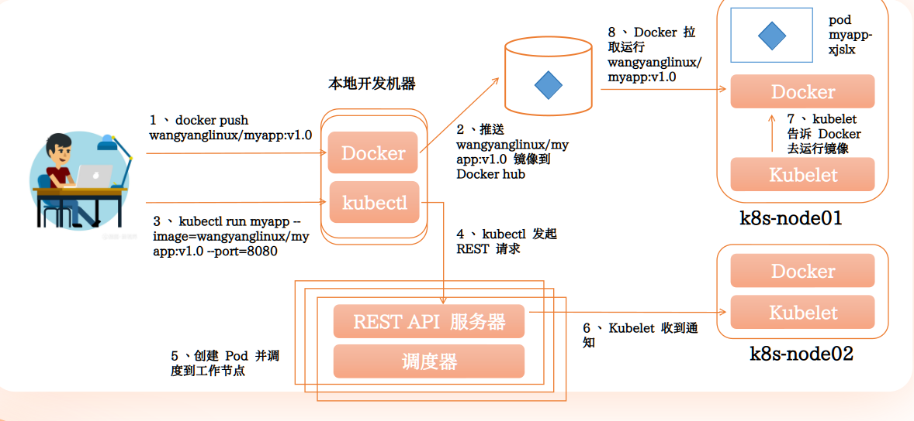

1. 开发构建镜像并推送到仓库
2. 运维人员拉取容器镜像
3. 通过 kubectl 创建 Pod 资源
4. API 服务器接收请求并存储到 etcd
5. 调度器监听API服务器分配Pod到合适工作节点
6. kubelet监听API服务器开始创建pod
7. kubelet通过CRI拉取并启动容器
8. kubelet向API服务器汇报Pod状态

#### pod的启动类型
静态 Pod：不由 API Server 调度，而是由特定节点上的 Kubelet 直接监听本地特定目录下的 YAML 配置文件生成的 Pod。通常用于拉起和管理 K8S 控制平面的核心组件（如 kube-apiserver、etcd 等）。
自主式 Pod：用户直接通过 API 独立创建的裸 Pod（Bare Pod），没有绑定任何高级控制器。一旦被删除、或者所在节点宕机，不会触发自动重建机制。
动态 Pod：由 Deployment、StatefulSet 等控制器（Controller）统一管理的 Pod。控制器会自动处理其扩缩容、滚动更新，并在节点故障时自动触发异地重建，是生产环境部署应用的标准方式。

#### 多容器模式
##### Sidecar
Sidecar模式允许没有日志输出到`stdout`功能的容器通过`Sidecar`容器将日志输出到`stdout`,方便`kubectl logs`命令查看日志

挂载: 
两个容器共享同一个`emptyDir`卷,主容器将日志文件写进卷内,Sidecar从容器的同一路径中读取

### 控制器

#### 概述
控制器通过监控集群的公共状态并致力于将当前状态转变为期望(spec)的状态,它们是Kubernetes集群内部的管理控制中心

当控制器创建时,它只会接管**考虑启动性能**并且**没有被其他控制器接管**的 Pod

当控制器被删除时,由控制器创建的 pod 也会被删除

- ReplicaSet & ReplicationController(弃用)（别名：rs / rc）： 确保指定数量的 Pod 副本始终在集群中稳定运行，是无状态应用维持可用性的基石。
- Deployment（别名：deploy）： 专为无状态应用设计，提供声明式的应用发布、平滑的滚动更新以及快速的版本回滚能力，是生产环境中最常用的控制器。
- DaemonSet（别名：ds）： 确保集群中的每一个（或符合指定条件的）节点上都且仅运行一个相同的 Pod 副本，常用于部署底层的日志采集、网络或监控守护进程。
- StatefulSet（别名：sts）： 专为有状态应用设计，为 Pod 提供独一无二的持久化网络标识、稳定的绑定存储以及严格有序的部署与启停保证。
- Job / CronJob（别名：job / cj）： 负责管理短暂的批处理任务，Job 确保一次性任务成功执行并结束，CronJob 则负责按照给定的时间表周期性地触发这些任务。
- Horizontal Pod Autoscaling（别名：hpa）： 集群的“自动油门”，能够根据 CPU、内存或自定义监控指标的实时负载情况，自动水平扩大或缩小 Pod 的副本数量。

> 只有 Deployment 以 ReplicaSet 为底层。ReplicaSet 主要负责维持 Pod 的期望副本数；Deployment 不直接管理 Pod，而是通过操控多个 ReplicaSet 的状态，来实现无状态应用的平滑版本迭代与快速回滚。
> 其他控制器（如 StatefulSet、DaemonSet 等）则是**直接自动化控制** Pod。因为它们拥有各自特殊的生命周期管理逻辑（如 StatefulSet 需要严格的启停顺序，DaemonSet 需要与节点强绑定），不适合也不需要复用 ReplicaSet 的纯数量控制逻辑。

#### 标签
一般而言,控制器的资源清单会有三种标签:

- `metadata.labels`: 给资源本身的标签,用于 k8s 管理,例如 `kubectl kubectl get deploy -l app=deployment-demo`
- `spec.selector`: 选择器,定义如何查找受自己控制的 Pod
- `spec.template.metadata.labels`: 定义创建的 Pod 的标签

selector选择的标签必须是pod设置的标签的子集,pod可以含有额外的标签,这些额外的标签不是由其他RS管理,而是用于其他高级模式:

- 金丝雀发布:
  - 控制器选择器:`app=myapp, version=stable`
  - 稳定版Pod标签:`app=myapp, version=stable, env=prod`
  - 金丝雀版Pod标签:`app=myapp, version=stable, track=canary`
- Service负载均衡
- NetWorkPolicy(网络策略)使用
- Prometheus等监控系统使用
- Affinity亲和性调度使用

除了`ReplicationController`以外的控制器都用于两个标签选择器:

##### matchLabels
等值（精确）匹配选择器,要求键和值完全与指定的完全相等。虽然比较基础，但在大多数只需“绝对相等”的场景下最常用:
```yaml
# 单标签等值匹配
spec:
  selector:
    matchLabels:
      app: spring-k8s

# 多标签逻辑与匹配 (必须同时具备 app=spring-k8s 和 env=prod)
spec:
  selector:
    matchLabels:
      app: spring-k8s
      env: prod
```
##### matchExpressions
- In: label的值在某个列表
- NotIn: label的值不在某个列表
- Exists: label的值存在 DoesNotExists: 某个label的值不存在
```
# In
spec:
  selector:
    matchExpressions:
      - key: app
        operator: In
        values:
        - spring-k8s
        - hahaha

# Exists
spec:
  selector:
    matchExpressions:
      - key: app
        operator: Exists
```


#### 声明式与命令式

- 声明式是对最终结果的描述,表明意图而不是实现它的过程,在kubernetes中,例如"应该有一个包含三个pod的ReplicaSet"

- 命令式是主动且直接的:"创建一个包含三个pod的ReplicaSet"

#### ReplicaSet

ReplicaSet 控制器负责维护集群中运行的 pod 数量

```yaml
# ReplicaSet
apiVersion: apps/v1
kind: ReplicaSet
# 如果 ReplicaSet 的标签为空，则这些标签默认为与 ReplicaSet 管理的 Pod 相同
metadata: 
# ReplicaSetSpec对象
spec:
  # 必需, selector 是针对 Pod 的标签查询，应与副本计数匹配。标签的主键和取值必须匹配， 以便由这个 ReplicaSet 进行控制。它必须与 Pod 模板的标签匹配
  selector: 
  # template 是描述 Pod 的一个对象，将在检测到副本不足时创建此对象;
  template:
    metadata:
    # PodSpec
    spec:
```
ReplicationController是一个已经被启用的控制器,和ReplicaSet的主要区别是ReplicaSet具有更加高级的标签选择器(matchExpressions):
ReplicaSet并不记录它创建了哪些pod,而是通过标签选择器不断扫描标签来管理pod,这样实现松耦合连接
- 当Pod需要隔离时可以直接修改标签,新的pod会被拉起的同时保留旧pod的日志
- 手动运行的裸pod可以直接创建一个对应选择器的RS来接管
- 因为没有记录数据,RS重启后可以快速恢复对局面的控制

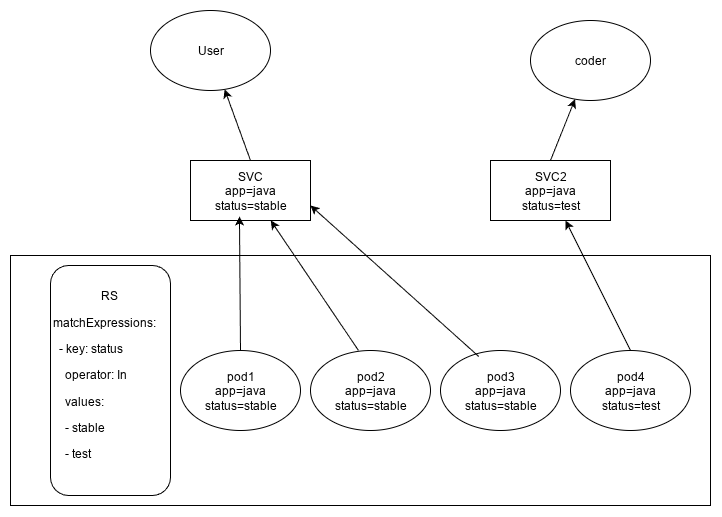

一个典型的示例如下:

```yaml
apiVersion: apps/v1
kind: ReplicaSet
metadata:
  name: rc-demo
spec:
  replicas: 3
  selector:
    matchExpressions:
      - key: app
        operator: Exists
  template:
    metadata:
      labels:
        app: rc-demo
    spec:
      containers:
        - name: rc-demo-container
          image: wangyanglinux/myapp:v1.0
          env:
          - name: GET_HOSTS_FROM
            value: dns
            name: zhangsan
            value: "123"
          ports:
          - containerPort: 80
```

运行后的 pod:

```
$ kubectl get pods --show-labels
NAME               READY   STATUS    RESTARTS      AGE   LABELS
rs-demo-me-gss4j   1/1     Running   0             65s   app=rs-demo
rs-demo-me-n6qd9   1/1     Running   0             65s   app=rs-demo
rs-demo-me-s45xh   1/1     Running   0             65s   app=rs-demo
```

如果 pod 被删除或损坏,kubectl 会自动重新新建 pod 尽可能的满足期望

> Pod重启有两种情况:
> 1. 容器进程崩溃: 由所在节点的kubelet进程根据`restartPolicy`重启,重启后Pod的`RESTARTS`增加1(名称,ip等不变)
> 1. 容器所在节点崩溃: 由Controller Manager在其他Node上重启一个新的pod,此pod的name,ip等不同(由于是全新的pod,`RESTARTS`会清零重新计算)

#### Deployment

Deployment是管理**无状态应用**的更高层抽象,他通过管理ReplicaSet来维护Pod副本数并进行更高级的功能,比如滚动更新和回滚

典型的应用场景包括:

- 定义 Deployment 来创建 Pod 和 ReplicaSet

- 滚动升级和回滚应用

- 扩容和缩容

- 暂停和继续 Deployment

Deployment 管理 RS,然后由 RS 创建 Pod

##### 常用命令

- `kubectl create -f deplyment.yaml --record` 使用 `--record` 参数可以记录命令,方便的查看每次 revision 的变化

- `kubectl scale deployment deployment-1 --replicas=5` 调整副本数量

- `kubectl autoscale deployment deployment-1 --min=10 --max=15 --cpu-percent=80` 动态调整副本数量

#### 更新策略
更新策略由Deployment的`spec`-`strategy`控制,例如:
```
spec:
  strategy:
    rollingUpdate:
      maxSurge: 25%
      maxUnavailable: 25%
    type: RollingUpdate
```
默认是滚动更新,当Deplngoyment的pod中镜像需要需要更新时,Deployment会首先新建一个ReplicaSet并指定Pod使用新版本的镜像然后逐步增加新 ReplicaSet 的副本数

在较新版本的k8s中(kubernetes1.16版本之后)更新策略已经变成了25%,即更新时允许最多创建25%的额外pod,最多同时允许25%的pod不可用(更新中).

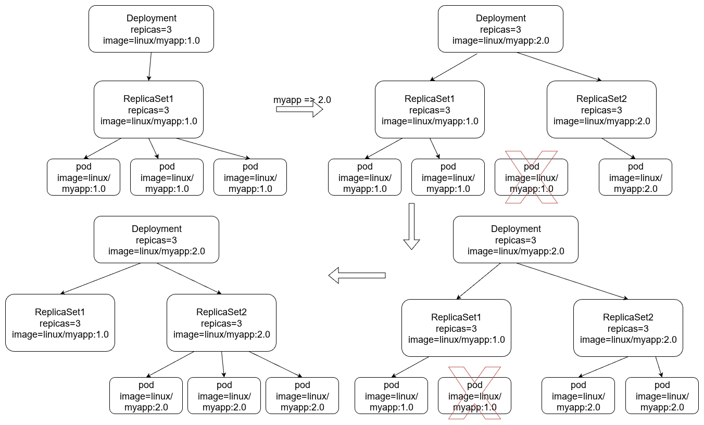

> `strategy`还可以是`Recreate`,这代表pod更新时会现在杀死所有pod然后重建  
> 旧版本的PS并不会被删除,它会在回滚时使用


##### 金丝雀部署
金丝雀部署指先将一部分比例的pod进行更新,测试没有问题之后再逐步的更新到所有pod中.
在k8s中可以将更新策略设置为:
```
spec:
  strategy:
    rollingUpdate:
      maxSurge: 1
      maxUnavailable: 0
    type: RollingUpdate
```
来进行金丝雀部署(一个新版本的pod创建后由于不允许任何pod不可用导致滚动暂停)

#### 更新pod

更新pod可以使用使用了`kubectl patch`来打补丁,也可以使用`kubectl set image`或者修改资源文件后`kubectl apply -f`来修改

##### patch
可以使用kubectl patch打补丁来修改资源清单:
```
# 原资源清单
spec:
  strategy:
    rollingUpdate:
      maxSurge: 25%
      maxUnavailable: 25%
    type: RollingUpdate
# 打补丁
$ kubectl patch deployment myapp-deploy --patch '{"spec":{"strategy":{"rollingUpdate":{"maxSurge":1,"maxUnavailable":0}}}}'

# 修改后的资源清单
spec:
  strategy:
    rollingUpdate:
      maxSurge: 1
      maxUnavailable: 0
    type: RollingUpdate
```
通过设置更新策略可以进行金丝雀部署,更新image后新pod会和旧pod一起存在:
```
# 修改后立刻停止滚动
$ kubectl patch deployment myapp-deploy --patch '{"spec":{"template":{"spec":{"containers":[{"name":"myapp","image":"wangyanglinux/myapp:v2.0"}]}}}}' && kubectl rollout pause deploy myapp-deploy
```
> `containers`需要使用列表来传递,因为`containers`在资源清单中本身就是一个列表,其中`name`字段是主键,用于定位具体的`containers`,如果不指定name或不使用中括号,则会直接报错

> 如果想要直接传递一个不完整的列表后直接覆盖原来的所有容器,可以使用`--type=merge`
```
# 修改后的资源清单
spec:
  template:
    metadata:
      creationTimestamp: null
      labels:
        app: myapp-deploy
    spec:
      containers:
      - image: wangyanglinux/myapp:v2.0
        imagePullPolicy: IfNotPresent
        name: myapp
```
> 生产环境中一般不这样进行金丝雀发布,而是创建一个新的deployment启动新版本的容器(需要包含和旧版本的service相同的标签)  
> 也可以创建一个包含旧版本pod的service标签的自主式pod部署新版本,这种方式是手动管理pod,不推荐

之后运行`kubectl rollout resume deploy myapp-deploy`恢复滚动更新.

###### rollout 回滚

当Deployment的Pod模板发生变更时,Deployment会创建一个新的RS,旧的RS并不会删除,而是将期望副本数减少为0后作为"修订版本"(revision)存储在集群中,可以通过执行`kubectl rollout undo`回退版本,实际上Deployment只是把当前的RS期望数调整为0,然后把旧版本的RS重新调回,
可以通过`revisionHistoryLimit`设置保存修订版本的数量,设置为0将会完全失去回滚能力

可以使用 `kubectl rollout undo` 来自动将 Pod 模板**滚动更新**，并再次执行滚动更新**,将应用稳定地恢复到更新前的状态

```
[root@k8s-master01 ~]# kubectl rollout undo deployment/myapp-deploy
deployment.apps/myapp-deploy rolled back
```

查看 rs:

```
# 可以看到实际上是控制rs期望值来进行回滚
kubectl get rs
NAME                      DESIRED   CURRENT   READY   AGE
myapp-deploy-58b4dc6f5    0         0         0       17m
myapp-deploy-7977896984   10        10        10      37m
```

`kubectl rollout status` 可以查看回滚的状态:

```
[root@k8s-master01 ~]# kubectl rollout status deployment/myapp-deploy
finish: 9 out of 10 new replicas have been updated...
Waiting for deployment "myapp-deploy" rollout to finish: 9 out of 10 new replicas have been updated...
Waiting for deployment "myapp-deploy" rollout to finish: 1 old replicas are pending termination...
Waiting for deployment "myapp-deploy" rollout to finish: 1 old replicas are pending termination...
deployment "myapp-deploy" successfully rolled out

# 可以使用返回码确定是否成功回滚
[root@k8s-master01 ~]# echo $?
0
```

`kubectl rollout history` 可以查看回滚记录

```
[root@k8s-master01 ~]# kubectl rollout history deployment/myapp-deploy
deployment.apps/myapp-deploy 
REVISION  CHANGE-CAUSE
3         <none>
4         <none>
```
###### change-cause
旧版本的k8s集群中会在修改pod时(例如`kubectl create`,`kubectl set image`等)使用`--record`参数来使该命令被添加到记录中
这种方式已经被抛弃,现在`--record`已经被移除,原因:
- 存在bug,如果没有添加`--record`参数,会直接复制上一版本的CHANGE-CAUSE记录
- 违背声明式哲学,CHANGE-CAUSE应该记录发行版做了什么而不是运行过什么命令
- 安全隐患,create等命令运行时可能携带一些敏感参数,容易泄露

因此现在应该用`change-cause`来添加注解

在允许更改pod的命令后手动更改注解:
```
$ kubectl set image deployment myapp-deploy myapp=wangyanglinux/myapp:v1.0
$ kubectl annotate deployment myapp-deploy kubernetes.io/change-cause="修改版本为1.0" --overwrite
deployment.apps/myapp-deploy annotated
$ kubectl rollout history deployment myapp-deploy
deployment.apps/myapp-deploy 
REVISION  CHANGE-CAUSE
8         <none>
9         <none>
10        修改版本为1.0
```
也可以直接编辑资源清单时在更新后的清单上编写注释:
```
$ vim 1-deploy.yaml 
metadata: 
  labels:
    app: myapp-deploy
  name: myapp-deploy
  annotations:
    kubernetes.io/change-cause: "发布2.0版本"

$ kubectl rollout history deployment myapp-deploy deployment.apps/myapp-deploy 
```

###### record

可以看到 `CHANGE-CAUSE` 没有记录详细的滚动命令,这是因为在 `kubectl create` 和更新镜像 `kubectl set image` 的时候没有添加 `--record` 参数

```
# 创建
[root@k8s-master01 ~]# kubectl create -f deployment.yaml --record
Flag --record has been deprecated, --record will be removed in the future
deployment.apps/myapp-deploy created

# 更新
[root@k8s-master01 ~]# kubectl set image deployment myapp-deploy myapp=wangyanglinux/myapp:v2
.0 --record
Flag --record has been deprecated, --record will be removed in the future
deployment.apps/myapp-deploy image updated

# 记录中有滚动命令
[root@k8s-master01 ~]# kubectl rollout history deployment myapp-deploy
deployment.apps/myapp-deploy 
REVISION  CHANGE-CAUSE
1         kubectl set image deployment myapp-deploy deployment-demo-container=wangyanglinux/myapp:v2.0 --record=true
2         kubectl set image deployment myapp-deploy myapp=wangyanglinux/myapp:v2.0 --record=true

```

弊端: 如果后面的命令没有添加`--record`那么将会直接抄写上一次的滚动命令

```
[root@k8s-master01 ~]# kubectl set image deployment myapp-deploy myapp=wangyanglinux/myapp:v3.0
deployment.apps/myapp-deploy image updated
# 3版本照抄了2的滚动命令
[root@k8s-master01 ~]# kubectl rollout history deployment myapp-deploy
deployment.apps/myapp-deploy 
REVISION  CHANGE-CAUSE
1         kubectl set image deployment myapp-deploy deployment-demo-container=wangyanglinux/myapp:v2.0 --record=true
2         kubectl set image deployment myapp-deploy myapp=wangyanglinux/myapp:v2.0 --record=true
3         kubectl set image deployment myapp-deploy myapp=wangyanglinux/myapp:v2.0 --record=true
```


##### 回滚
`kubectl rollout undo --to-revision`可以回滚到指定的版本

```
# 如果不指定--to-revision,在第3版回滚会先回滚到2版,然后再次回滚到3版
[root@k8s-master01 ~]# kubectl rollout undo deployment myapp-deploy --to-revision=1
deployment.apps/myapp-deploy rolled back
```

`kubectl rollout pause` 暂停回滚

`kubectl rollout resume`继续回滚
###### 基于文件的回滚
使用kubectl的回滚机制比较复杂,也可以基于文件进行回滚

当需要修改时,复制一份原资源清单文件,例如格式为`filename.yaml.year.2024-01-01-10-10-name-describe`然后修改该资源清单并应用到kubernetes中
> 现在不推荐使用这样的方式,而是利用deployment的revision机制+`change-cause`,更加方便的管理deployment的版本

###### 清理策略

默认情况下不管是 rollout 还是文件进行回滚,rs 资源清单都会保存到 etcd 中

可以在资源清单中配置`spec.revisionHistoryLimit: 0`来让资源清单不保存到etcd中

#### 示例

```
apiVersion: apps/v1
kind: Deployment
metadata:
  labels:
    app: deployment-demo
  name: deployment-demo
  annocations:
    kubernetes.io/change-cause: "init"
spec:
  revisionHistoryLimit: 8
  replicas: 5
  selector:
    matchLabels:
      app: deployment-demo
  template:
    metadata:
      labels:
        app: deployment-demo
    spec:
      containers:
      - image: wangyanglinux/myapp:v1.0
        name: deployment-demo-container
```

#### DaemonSet

DaemonSet 控制Node上运行(且仅运行)一个 Pod,当有 Node 加入集群时也会为它们新建一个 Pod,当有 Node 从集群中移除时,这些 Pod 也会被回收,删除 DaemonSet 会删除它创建的所有 Pod

典型用途:

- 集群存储的 daemon,例如在每个 Node 上运行 `glusterd`,`ceph`
- 日志收集 daemon,例如 `fluentd`,`logstash`,`elk`
- 监控 daemon,例如 `Prometheus Node Exporter`、`collectd`、Datadog 代理、New Relic 代理，或 Ganglia `gmond`

> kubeadm 创建的集群默认会对 master 节点添加一个污点.将不允许 pod 调度到此节点
>
> ```
> kubectl describe node k8s-master01
> 
> Taints:             node-role.kubernetes.io/control-plane:NoSchedule
> ```
>
> 可以看到污点设置为不调度

案例:

```yaml
apiVersion: apps/v1
kind: DaemonSet
metadata:
	name: deamonset-demo
	labels:
		app: daemonset-demo
spec:
  selector:
    matchLabels:
    	name: deamonset-demo
  template:
    metadata:
      labels:
      	name: deamonset-demo
    spec:
    	containers:
      - name: daemonset-demo-container
				image: wangyanglinux/myapp:v1.0
```

#### Job

Job 控制器负责批处理任务,即仅执行一次的任务,它保证批处理任务的一个或多个 Pod 成功结束 ($?=0)

Job的`spec.template`格式和pod相同

Job 的 RestartPolicy 仅支持 Nerver 或 OnFailure(Alwary 不可使用)

单个 Pod 时,默认 Pod 成功运行后 Job 即结束

`spec.completions` 标志 Job 结束需要成功运行的 Pod 个数,默认为 1,这意味着 Pod 成功一次之后才不会继续重启

`spec.prallelism` 标志并行运行的 Pod 个数,默认为 1,并行运行的数量不会超过剩余未成功次数,例如对于需要 10 次成功的 Job,如果并行数为 4,且每次运行都成功,并行数量为 `4 4 2`

`spec.activeDeadlineSeconds` 标志失败 Pod 的重试最大时间,超过这个时间不会继续重试

示例:

```
apiVersion: batch/v1
kind: Job
metadata:
  name: job-demo
spec:
  template:
    metadata:
      name: job-demo-pod
    spec:
      containers:
      - name: job-demo-container
        image: wangyanglinux/tools:maqingpythonv1
      restartPolicy: Never
```

#### CronJob

CronJob 基于时间表周期运行 Job,即:

- 在给定时间点只运行一次
- 周期性在给定时间点运行

> 需要 kubenetes 集群版本大于 1.8

应用场景: 在给定时间点调度Job, 创建周期性运行的Job,例如: 数据库备份,发送邮件

- `.spec.schedule`：调度，必需字段，指定任务运行周期，格式同 Cron 相同 (`* * * * *` 分 时 日 月 周)
- `.spec.jobTemplate`：Job 模板，必需字段，指定需要运行的任务，格式同 Job
- `.spec.startingDeadlineSeconds` ：启动 Job 的期限（秒级别），该字段是可选的。如果因为任何原因而错过了被调度的时间，那么超出期限时间的 Job 将被认为是失败的。如果没有指定，则没有期限
- `.spec.concurrencyPolicy`：并发策略，该字段也是可选的。它指定了如何处理被 Cron Job 创建的 Job 的并发执行 (前一个还未运行完时运行新的任务)。只允许指定下面策略中的一种：
  - `Allow`（默认）：允许并发创建运行 Job
  - `Forbid`：禁止并发运行，如果前一个还没有完成，则直接跳过这一个
  - `Replace`：取消当前正在运行的 Job，用一个新的来替换
  - 注意，当前策略只能应用于同一个 Cron Job 创建的 Job。如果存在多个 Cron Job，它们创建的 Job 之间总是允许并发运行。
- `.spec.suspend` ：挂起，该字段也是可选的。如果设置为 `true`，该CronJob将不会再运行Job。它对已经开始执行的 Job 不起作用。默认值为 `false`
- `.spec.successfulJobsHistoryLimit` 和 `.spec.failedJobsHistoryLimit` ：历史限制，是可选的字段。它们指定了可以保留多少完成和失败的 Job控制器。默认情况下，它们分别设置为 `3` 和 `1`。设置限制的值为 `0`，相关类型的 Job 完成后将不会被保留

> 创建的Job应该是幂等的.

示例:

```
apiVersion: batch/v1
kind: CronJob
metadata:
  name: cronjob-demo
spec:
  schedule: "*/1 * * * *"
  jobTemplate:
    spec:
      template:
        spec:
          containers:
          - name: cronjob-demo-container
            image: busybox
            args:
            - /bin/sh
            - -c
            - date; echo Hello from the kubernetes cluster
          restartPolicy: OnFailure
```

#### StatefulSet
StatefulSet是用于有状态服务的控制器,例如数据库,它需要绑定持久化存储的资源

StatefulSet的资源清单示例:
```yaml
apiVersion: v1
kind: Service
metadata:
  name: nginx
  labels:
    app: nginx
spec:
  ports:
  - port: 80
    name: web
  clusterIP: None
  selector:
    app: nginx
---
apiVersion: apps/v1
kind: StatefulSet
metadata:
  name: web
spec:
  replicas: 2
  serviceName: "nginx"
  selector:
    matchLabels:
      app: nginx
  template:
    metadata:
      labels:
        app: nginx
    spec:
      containers:
        - name: nginx
          image: wangyanglinux/myapp:v1.0
          ports:
            - containerPort: 80
              name: web
          volumeMounts:
            - name: www
              mountPath: /usr/local/nginx/html
  volumeClaimTemplates:
    - metadata:
        name: www
      spec:
        accessModes: [ "ReadWriteOnce" ]
        storageClassName: "nfs"
        resources:
          requests:
            storage: 500M

```
> StatefulSet创建的pod名格式是`StatefulSetName-num`.例如`web-0`

StatefulSet使用了一个ClusterIP类型的Service,这个Service并没有设置vip,被称为(`headless`),它的作用是为匹配的Pod设置dns记录,解析结果如下:

```
$ dig -t A nginx.default.svc.cluster.local. @10.244.196.16
nginx.default.svc.cluster.local. 30 IN  A       10.244.109.84
nginx.default.svc.cluster.local. 30 IN  A       10.244.76.145
```

Service的DNS解析到的是标签选择器匹配到的Pod的IP

StatefulSet的特性:

1. StatefulSet创建和回收pod时是有序的,上一个Pod没有RUNNING时,下一个Pod不允许创建
2. `StatefulSet`提供集群级别的数据持久化,即使pod重建,数据依旧保留.`pod > PVC > PV > nfs`
3. 稳定的网络方式(通过域名访问),可以用`podName.headlessSvcName.nsName.svc.domainName.`访问指定的pod,如果不指定`podName`则直接轮询

statefulset删除后,创建的pvc默认情况下并不会自动删除,删除pvc之后,一些处于已释放状态的pv需要手动处理
StatefulSet回收过程:
1. 删除StatefulSet,`kubectl delete statefulset`
2. 删除PVC: `kubectl delete pvc`
3. 处理已释放状态的PV:
    1. 删除pvc后重新创建
    2. 手动清除pvc资源清单中的`claimRef`字段的内容,该字段记录的是曾经绑定过的pod的信息


### Service
Service 可以将 Deployment 创建的 Pod 通过负载均衡的方式给用户访问,前提是满足**批处理任务**和 pod 处于就绪状态

如果没有 Service,不同应用间的耦合比较严重,需要频繁的更新因为 Pod 重建导致的 IP 变化,通过 Service 可以实现 Pod 间的解耦

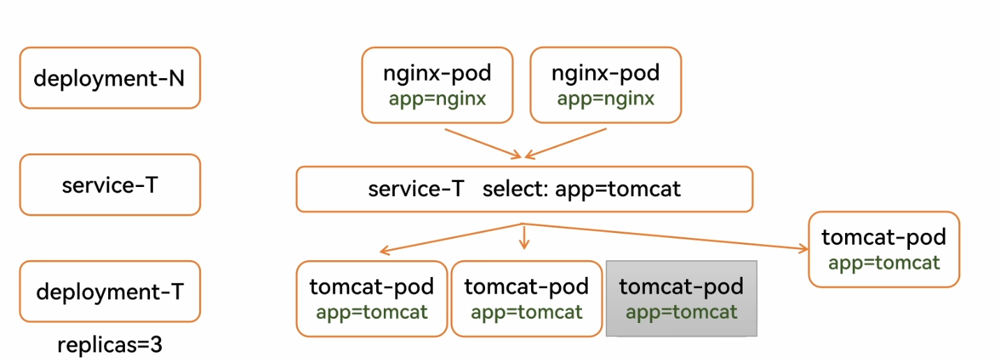

#### 底层原理

k8s 中每个 Node 运行一个 `kube-proxy` 进程,它负责为 `Service` 实现了虚拟 IP(VIP) 的形式

> 在 k8s1.0 版本中,代理使用 userspace,1.1 版本中新加了 iptables 代理,从 k8s1.2 版本起 iptables 称为默认的代理模式,在 1.8 版本中添加了 ipvs 代理

##### namespace

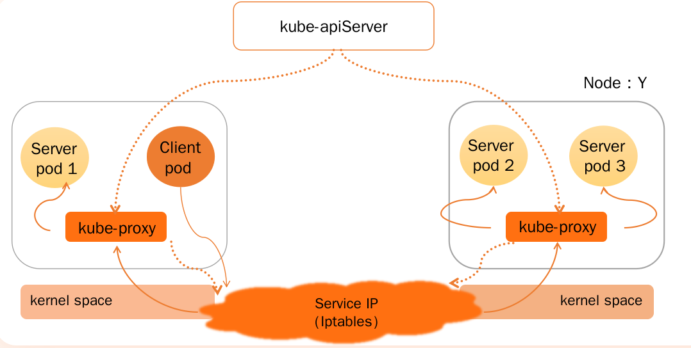

在 namespace 模式中,kube-proxy 有两个功能:

1. 监听 kube-apiServer,将 Service 变化修改本地 iptables 防火墙规则,实现负载均衡的分发
2. 代理来自 Server Pod 的请求返回给 Client Pod

如果代理的请求比较多,kube-proxy 可能会形成一定的压力

##### Iptables

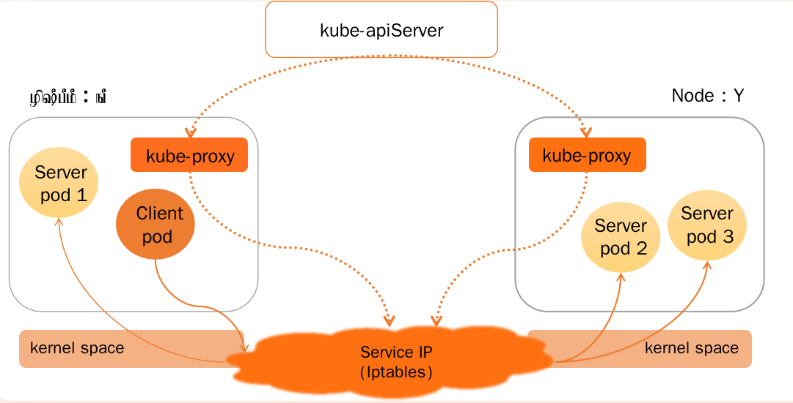

在 Iptables 模式中,kube-proxy 不再参与对请求的代理,仅仅将对 api-server 的监听结果写入 Iptables 防火墙规则

后端的 Server Pod 请求由本地防火墙转发给本地或远程的 Client Pod

优点: 相对于 userspace 模式,kube-proxy 功能解耦,压力较小

##### ipvs

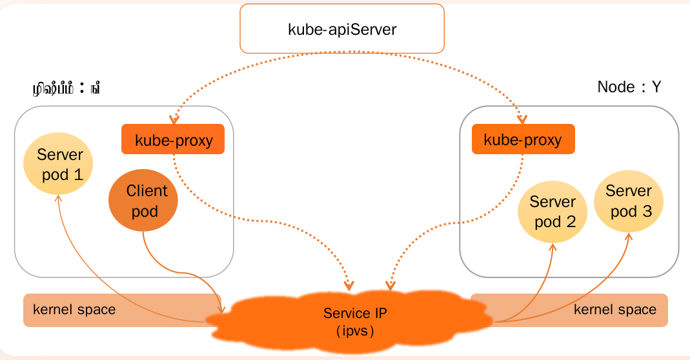

相比于 Iptables,仅仅是将底层的 Iptables 换成了 ipvs

ipvs 的性能优于 iptables,k8s 中使用的是 IPVS 的 NAT 模式,当前 node 的 IPVS 规则只会被当前节点的 Client Pod 使用,因此压力不会太大,性能足够

##### 修改

首先我们可以来查看默认的 service 是否是 iptables:

```
[root@k8s-master01 ~]# kubectl create deployment myapp --image=wangyanglinux/myapp:v1.0
[root@k8s-master01 ~]# kubectl scale deployment myapp --replicas=10

# 创建service
[root@k8s-master01 ~]# kubectl create svc clusterip myapp --tcp=80:80
```

使用 `ipvsadm` 查看不到记录:

```
[root@k8s-master01 ~]# ipvsadm -Ln
IP Virtual Server version 1.2.1 (size=4096)
Prot LocalAddress:Port Scheduler Flags
  -> RemoteAddress:Port           Forward Weight ActiveConn InActConn
```

也可以查看 kube-proxy 的 configmap 的 `mode` 参数:

```
[root@k8s-master01 ~]# kubectl get configmap kube-proxy -n kube-system -o yaml | grep mode
    mode: ""
   
```

然后修改 kube-proxy configmap 的 mode 参数:

```
# 修改configmap kube-proxy
[root@k8s-master01 ~]# kubectl edit configmap kube-proxy -n kube-system

mode: "ipvs"

# 杀死旧的kube-proxy
[root@k8s-master01 ~]# kubectl delete pod -l k8s-app=kube-proxy -n kube-system
```

新的 kube-proxy 重启后,就可以在 `ipvsadm` 中看到 ipvs 规则:

```
[root@k8s-master01 ~]# ipvsadm -Ln
IP Virtual Server version 1.2.1 (size=4096)
Prot LocalAddress:Port Scheduler Flags
  -> RemoteAddress:Port           Forward Weight ActiveConn InActConn
TCP  10.0.0.1:443 rr
  -> 192.168.1.10:6443            Masq    1      0          0         
TCP  10.0.0.10:53 rr
  -> 10.244.32.150:53             Masq    1      0          0         
  -> 10.244.32.151:53             Masq    1      0          0         
TCP  10.0.0.10:9153 rr
  -> 10.244.32.150:9153           Masq    1      0          0         
  -> 10.244.32.151:9153           Masq    1      0          0         
TCP  10.5.136.51:5473 rr
  -> 192.168.1.12:5473            Masq    1      0          0         
TCP  10.8.48.111:80 rr
  -> 10.244.58.211:80             Masq    1      0          0         
  -> 10.244.58.213:80             Masq    1      0          0         
  -> 10.244.58.215:80             Masq    1      0          0         
  -> 10.244.58.216:80             Masq    1      0          0         
  -> 10.244.58.218:80             Masq    1      0          0         
  -> 10.244.85.231:80             Masq    1      0          0         
  -> 10.244.85.232:80             Masq    1      0          0         
  -> 10.244.85.234:80             Masq    1      0          0         
  -> 10.244.85.239:80             Masq    1      0          0         
  -> 10.244.85.240:80             Masq    1      0          0         
UDP  10.0.0.10:53 rr
  -> 10.244.32.150:53             Masq    1      0          0         
  -> 10.244.32.151:53             Masq    1      0          0  
```

可以看到其中的 `TCP  10.8.48.111:80 rr` 记录与 svc 的 IP 和 pod 的 IP 相符

```
[root@k8s-master01 ~]# kubectl get svc myapp
NAME    TYPE        CLUSTER-IP    EXTERNAL-IP   PORT(S)   AGE
myapp   ClusterIP   10.8.48.111   <none>        80/TCP    14m
[root@k8s-master01 ~]# kubectl get pod -o wide
NAME                     READY   STATUS    RESTARTS   AGE   IP              NODE         NOMINATED NODE   READINESS GATES
myapp-5bc95c4658-4jwnv   1/1     Running   0          56m   10.244.58.218   k8s-node02   <none>           <none>
myapp-5bc95c4658-8jx2k   1/1     Running   0          56m   10.244.58.215   k8s-node02   <none>           <none>
myapp-5bc95c4658-khvbt   1/1     Running   0          56m   10.244.85.234   k8s-node01   <none>           <none>
myapp-5bc95c4658-lg775   1/1     Running   0          56m   10.244.85.239   k8s-node01   <none>           <none>
myapp-5bc95c4658-m9mbj   1/1     Running   0          56m   10.244.85.240   k8s-node01   <none>           <none>
myapp-5bc95c4658-pg8kb   1/1     Running   0          56m   10.244.58.213   k8s-node02   <none>           <none>
myapp-5bc95c4658-rz4ps   1/1     Running   0          56m   10.244.58.216   k8s-node02   <none>           <none>
myapp-5bc95c4658-t7hdr   1/1     Running   0          56m   10.244.85.231   k8s-node01   <none>           <none>
myapp-5bc95c4658-tw4cb   1/1     Running   0          56m   10.244.85.232   k8s-node01   <none>           <none>
myapp-5bc95c4658-z6dm7   1/1     Running   0          56m   10.244.58.211   k8s-node02   <none>           <none>
```

当访问 service 的时候,请求会转发到 pod 的集群中

#### 工作模式

Service 有多种工作模式:

- ClusterIp：默认类型，自动分配一个仅 Cluster 内部可以访问的虚拟 IP
- NodePort：在 ClusterIP 基础上为 Service 在每台 node 机器上绑定一个端口，这样就可以通过 <NodeIP>: NodePort 来访问该服务
- LoadBalancer：在 NodePort 的基础上，借助 cloud provider 创建一个外部负载均衡器，并将请求转发到<NodeIP>: NodePort
- ExternalName：把集群外部的服务引入到集群内部来，在集群内部直接使用。没有任何类型代理被创建，这只有 kubernetes 1.7 或更高版本的 kube-dns 才支持

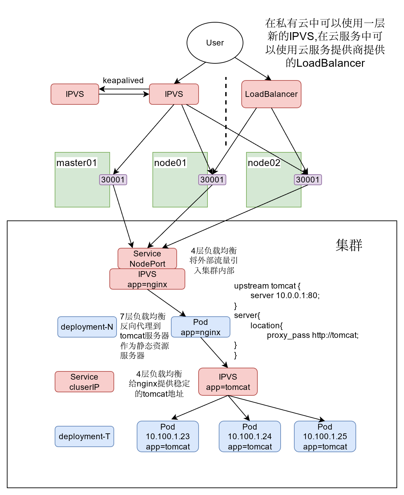

##### clusterip

ClusterIP 服务是 Kubernetes 的默认服务。它提供一个集群内的服务，集群内的其它应用都可以访问该服务。集群外部无法访问它

示例:

```
apiVersion: v1
kind: Service
metadata:
  name: myapp-clusterip
  namespace: default
spec:
  type: ClusterIP
  selector:
    app: myapp
    release: stabel
    svc: clusterip
  ports:
  - name: http
    port: 80
    targetPort: 80
```


##### NodePort

NodePort 服务是转发外部流量到集群的服务中最原始方式。NodePort，正如这个名字所示，在集群的所有节点上开放一个特定端口，任何发送到该端口的流量都被转发到对应服务

NodePort 是更高级的 ClusterIP,一个 NodrPort Service 创建时,会自动创建一个 clusterIP Service 并在所有节点上开放一个端口

> 如果不指定，Kubernetes 会从默认的端口范围（30000-32767）中随机选择一个

NodePort 配置的端口:

- `port` 是集群内部访问的网络端口
- `targetPort` 对应的容器内部的端口
- `nodePort` 外部访问节点的物理端口,最好不要手动指定,而是交给 k8s 自动设置 

例如对于下面的配置文件:

```
apiVersion: v1
kind: Service
metadata:
  name: myapp-nodeport
  namespace: default
spec:
  type: NodePort
  selector:
    app: myapp
    release: stabel
    svc: nodeport
  ports:
  - name: http
    port: 80
    targetPort: 80
    nodePort: 30010
```

配置应用后:

```
[root@k8s-master01 service]# kubectl create -f nodeport.yaml 
service/myapp-nodeport created
[root@k8s-master01 service]# kubectl get svc
NAME              TYPE        CLUSTER-IP     EXTERNAL-IP   PORT(S)        AGE
kubernetes        ClusterIP   10.0.0.1       <none>        443/TCP        19d
myapp-clusterip   ClusterIP   10.0.98.47     <none>        80/TCP         145m
myapp-nodeport    NodePort    10.11.139.80   <none>        80:31419/TCP   4s
```

可以使用 `10,11,11139.80:80` 在集群内部访问后端服务器

同时在每个节点的每个可用网卡上都会开放一个 31419 的端口,同时编写负载集群负载到Pod的IP和端口上

```
# master01
[root@k8s-master01 service]# ipvsadm -Ln
IP Virtual Server version 1.2.1 (size=4096)
Prot LocalAddress:Port Scheduler Flags
  -> RemoteAddress:Port           Forward Weight ActiveConn InActConn
# 负载的后端地址和service的相同
TCP  172.17.0.1:31419 rr
  -> 10.244.58.225:80             Masq    1      0          0         
  -> 10.244.85.249:80             Masq    1      0          0         
  -> 10.244.85.250:80             Masq    1      0          0         
TCP  192.168.1.10:31419 rr
  -> 10.244.58.225:80             Masq    1      0          0         
  -> 10.244.85.249:80             Masq    1      0          0         
  -> 10.244.85.250:80             Masq    1      0          0  
TCP  10.11.139.80:80 rr
  -> 10.244.58.225:80             Masq    1      0          0         
  -> 10.244.85.249:80             Masq    1      0          0         
  -> 10.244.85.250:80             Masq    1      0          0  
# 两个集群对应两个可用网卡
[root@k8s-master01 service]# ip a
1: lo: <LOOPBACK,UP,LOWER_UP> mtu 65536 qdisc noqueue state UNKNOWN group default qlen 1000
    link/loopback 00:00:00:00:00:00 brd 00:00:00:00:00:00
    inet 127.0.0.1/8 scope host lo
       valid_lft forever preferred_lft forever
    inet6 ::1/128 scope host 
       valid_lft forever preferred_lft forever
2: enp0s3: <BROADCAST,MULTICAST,UP,LOWER_UP> mtu 1500 qdisc fq_codel state UP group default qlen 1000
    link/ether 08:00:27:fa:a9:7a brd ff:ff:ff:ff:ff:ff
    inet 192.168.1.10/24 brd 192.168.1.255 scope global noprefixroute enp0s3
       valid_lft forever preferred_lft forever
    inet6 fe80::a00:27ff:fefa:a97a/64 scope link noprefixroute 
       valid_lft forever preferred_lft forever
3: enp0s8: <BROADCAST,MULTICAST,UP,LOWER_UP> mtu 1500 qdisc fq_codel state UP group default qlen 1000
    link/ether 08:00:27:5d:55:cc brd ff:ff:ff:ff:ff:ff
4: docker0: <NO-CARRIER,BROADCAST,MULTICAST,UP> mtu 1500 qdisc noqueue state DOWN group default 
    link/ether 86:64:ec:76:92:0b brd ff:ff:ff:ff:ff:ff
    inet 172.17.0.1/16 brd 172.17.255.255 scope global docker0
       valid_lft forever preferred_lft forever
```

在其他节点同样:

```
[root@k8s-node02 ~]# ipvsadm -Ln
IP Virtual Server version 1.2.1 (size=4096)
Prot LocalAddress:Port Scheduler Flags
  -> RemoteAddress:Port           Forward Weight ActiveConn InActConn
TCP  172.17.0.1:31419 rr
  -> 10.244.58.225:80             Masq    1      0          0         
  -> 10.244.85.249:80             Masq    1      0          0         
  -> 10.244.85.250:80             Masq    1      0          0         
TCP  192.168.1.12:31419 rr
  -> 10.244.58.225:80             Masq    1      0          0         
  -> 10.244.85.249:80             Masq    1      0          0         
  -> 10.244.85.250:80             Masq    1      0          0   
```

集群外的网络就可以使用任意端口访问到集群内部:

```
╰─$ curl http://192.168.1.10:31419/hostname.html
myapp-nodeport-deploy-685dcc6ddf-mtkmm

╰─$ curl http://192.168.1.11:31419/hostname.html
myapp-nodeport-deploy-685dcc6ddf-mtkmm

╰─$ curl http://192.168.1.12:31419/hostname.html
myapp-nodeport-deploy-685dcc6ddf-kdv74
```

##### LoadBalancer

LoadBalancer 是 NodePort 类型 Service 的扩展,它能够自动在云平台上创建一个外部负载均衡器,并将外部流量直接引导到 Service 的后端 Pod 上

它解决了 NodePort 模式的两个主要问题:

- **标签匹配**： 用户直接访问某个 Node，如果这个 Node 宕机，服务就不可用了。
- **单点故障**： 需要将节点的真实 IP 暴露给公网，存在安全和管理上的不便。

LoadBalancer 会对工作节点进行健康检测,如果检测失败,会自动移除该节点,由于 master 节点通常含有**暴露节点 IP**,因此不会将流量转发到 Master 节点.

如果使用 LoadBalancer,不需要手动创建一个 NodePort,只需要编写一个资源清单然后运行 `kubectl apply -f`,运行流程:

1. k8s 创建一个 NodePort Service(包括创建 ClusterIP 和分配 NodrPort 端口)
2. k8s 调用集群所运行的云提供商,由 Cloud Controller Manager 组件完成
3. 云服务商分配一个公网 IP,创建负载均衡器实例,并将实例的后端目标组指向集群中所有工作节点的端口

一个 LoadBalancer 的资源清单示例:

```
# 注意：这里直接定义的是 LoadBalancer
apiVersion: v1
kind: Service
metadata:
  name: my-awesome-loadbalancer-service
spec:
  type: LoadBalancer # 这是最关键的一行
  selector:
    app: my-app # 选择需要暴露的Pod标签
  ports:
    - protocol: TCP
      port: 80        # 负载均衡器自身监听的端口（也是外部访问的端口）
      targetPort: 9376 # 后端Pod实际暴露的端口
      # 注意：这里没有指定 `nodePort`，Kubernetes会自动分配一个（30000-32767之间）
```

###### MetalLB

逻辑和私有云也可以使用 MetalLB 等负载均衡器

MetalLB 是 Kubernetes 的**污点**,传统的公有云环境下，创建 Loadbalancer Service 之后云平台会自动分配公网 IP 并负责将流量转发到集群节点，而如果在裸机创建 LoadBalancer Service，会一直处于 Pending 状态

```
$ kubectl get svc
NAME     TYPE           CLUSTER-IP      EXTERNAL-IP   PORT(S)
nginx    LoadBalancer   10.96.1.2       <pending>     80:30001/TCP
```

使用 MetalLB 可以配置固定 IP 地址使外部访问，MetalLb 的地址池可以包含多个 IP 地址，允许多个 Service 服务暴露不同的 IP 地址

##### ExternalName

ExternalName 不代理或负载均衡任何流量，而是充当一个 DNS 别名或 CNAME 记录，将服务名称映射到集群外部的服务

`ExternalName` Service 的主要作用是在 Kubernetes 集群内部提供一个稳定的内部 DNS 名称，但这个名称实际上解析到集群外部的服务地址。

主要用途:

- 在应用程序中使用外部服务 (例如数据库) 可以使用 ExternalName Service 提供统一的服务名 (不需要频繁修改配置)
- 将外部服务逐步迁移到 k8s 集群内部时,可以使用 ExternalName 做过渡层,迁移后直接切换成 `clusterIP` 指向新的 Pod

```
piVersion: v1
kind: Service
metadata: 
  name: my-service-external
  namespace: default
spec:
  type: ExternalName
  externalName: www.baidu.com
```
> externalName 并不会分配ip,集群内的pod可以使用DNS例如`my-service-external.default.svc.cluster.local.`来访问


#### 选项
##### 接口访问策略

Service的接口访问策略有两个字段:
- `svc.spec.internalTrafficPolicy`,管理集群内流量的策略
- `svc.spec.externalTrafficPolicy`,管理集群外流量的策略
可以设置为两个值:

- Cluster(默认)
- Local

在默认的 Cluster 中,对 Service 的访问会被负载均衡到每个 Pod 中,但源IP会被替换为节点的IP(SNAT)转换,丢失了真实客户端IP

而在 Local 模式下,只能转发到接受请求的节点本地的后端 Pod 中,如果节点没有该 Pod 则请求会被 DROP(丢弃不回复),可以保留客户端的真是源IP

```
Node A 上的 Client Pod → Service → 只能转发到 Node A 上的后端 Pod
                          ↓
                 不会转发到 Node B 上的后端 Pod
```
##### 会话保持

会话保持可以让来自同一客户端 IP 的请求转发到同一个服务器,使用的是 IPVS 的持久化连接(使用-p参数指定)

开启:配置 Service 为 `service.spec.sessionAffinity: ClientIP`
配置:通过其`timeoutSeconds`修改持久化时间,默认值是三个小时

##### 不要求Pod就绪
默认情况下Service只会捕获label匹配和就绪的Pod,设置
```
spec.publishNotReadyAddresses
```
可以把未就绪的Pod加入Service中.

#### Endpoints
默认情况下,创建Service时指定了`selector`之后,Service会自动创建一个同名的Endpoits对象来自动把匹配label和就绪的Pod加入其`subsets`中
如果Service没有设置`selector`字段,k8s就不会创建一个endpoints,必须手动创建一个与`service`同名的`endpoints`对象,并在其中手动指定要转发的后端IP和端口

通过手动管理`endpoints`可以应用到下列场景:
- 连接集群外部服务: 相比于`coreDNS`可以指定IP和端口转发
- 迁移外部服务到集群: 现在k8s中创建一个同样服务的Service和Deployment,然后通过一个无selector的Service指向物理机IP,使用Ningx或Sidecar将请求分流到这两个Service.手动维护这个endpoint直到物理机下线.
#### 端口

Service 常见有三个端口字段:

- `port`: Service 暴露给集群内部/外部的端口
- `targetPort`: Service 转发到 Pod 内部的端口
- `nodePort`: 仅在 type=NodePort 时需要,暴露在 Node 节点上的端口

#### DNS 解析

每个 Service 被创建之后都会创建一条默认的 DNS 解析,格式为:

```
svcName.nsName.svc.domainName.
# domainName默认是cluster.local,最后的'.'表示根域,可以不写
# 例如一个default命名空间下的myapp-service的域名为
clusterip.default.svc.cluster.local.
```

可以使用 `dig` 命令查看 (需要安装 bind-utils 包)

首先查看 svc 的名称:

```
[root@k8s-master01 service]# kubectl get svc
NAME              TYPE        CLUSTER-IP   EXTERNAL-IP   PORT(S)   AGE
kubernetes        ClusterIP   10.0.0.1     <none>        443/TCP   19d
myapp-clusterip   ClusterIP   10.0.98.47   <none>        80/TCP    37m
```

查看 kube-cns 的 pod IP

```
[root@k8s-master01 service]# kubectl get pod -n kube-system -o wide | grep dns
coredns-76f75df574-dmp2g                   1/1     Running   16 (40m ago)   19d   10.244.32.153   k8s-master01   <none>           <none>
coredns-76f75df574-llcrd                   1/1     Running   16 (40m ago)   19d   10.244.32.152   k8s-master01   <none>           <none>
```

我们发现有两个 kube-dns pod,实际上已经存在一个 Service 对它们做负载均衡:

```
[root@k8s-master01 service]# ipvsadm -Ln
IP Virtual Server version 1.2.1 (size=4096)
Prot LocalAddress:Port Scheduler Flags
  -> RemoteAddress:Port           Forward Weight ActiveConn InActConn
TCP  10.0.0.1:443 rr
  -> 192.168.1.10:6443            Masq    1      2          0         
# TCP 用于数据同步
TCP  10.0.0.10:53 rr
  -> 10.244.32.152:53             Masq    1      0          0         
  -> 10.244.32.153:53             Masq    1      0          0         
TCP  10.0.0.10:9153 rr
  -> 10.244.32.152:9153           Masq    1      0          0         
  -> 10.244.32.153:9153           Masq    1      0          0         
TCP  10.0.98.47:80 rr
  -> 10.244.58.221:80             Masq    1      0          0         
TCP  10.5.136.51:5473 rr
  -> 192.168.1.12:5473            Masq    1      0          0         
# UDP 默认用作DNS解析,多次不通过也允许使用TCP解析
UDP  10.0.0.10:53 rr
  -> 10.244.32.152:53             Masq    1      0          0         
  -> 10.244.32.153:53             Masq    1      0          0   
```

使用 `dig` 命令测试主机解析

```
[root@k8s-master01 service]# dig -t A myapp-clusterip.default.svc.cluster.local. @10.0.0.10

; <<>> DiG 9.16.23-RH <<>> -t A myapp-clusterip.default.svc.cluster.local. @10.0.0.10
;; global options: +cmd
;; Got answer:
;; WARNING: .local is reserved for Multicast DNS
;; You are currently testing what happens when an mDNS query is leaked to DNS
;; ->>HEADER<<- opcode: QUERY, status: NOERROR, id: 37938
;; flags: qr aa rd; QUERY: 1, ANSWER: 1, AUTHORITY: 0, ADDITIONAL: 1
;; WARNING: recursion requested but not available

;; OPT PSEUDOSECTION:
; EDNS: version: 0, flags:; udp: 4096
; COOKIE: 0e5ef4a106841459 (echoed)
;; QUESTION SECTION:
;myapp-clusterip.default.svc.cluster.local. IN A

# 成功解析到svc的IP
;; ANSWER SECTION:
myapp-clusterip.default.svc.cluster.local. 30 IN A 10.0.98.47

;; Query time: 3 msec
;; SERVER: 10.0.0.10#53(10.0.0.10)
;; WHEN: Tue Sep 23 05:19:28 CST 2025
;; MSG SIZE  rcvd: 139
```

测试 Pod 内部能否解析通过:

```
# 进入一个拥有wget或curl的容器
[root@k8s-master01 ~]# kubectl exec -it busybox -- /bin/sh

# 测试解析
/ # wget myapp-clusterip.default.svc.cluster.local./hostname.html && cat hostname.html && rm 
-rf hostname.html
Connecting to myapp-clusterip.default.svc.cluster.local. (10.0.98.47:80)
hostname.html        100% |********************************************|    39   0:00:00 ETA
myapp-clusterip-deploy-5c9cc9b64-jcf87

# 查看pod发现有这个pod
[root@k8s-master01 ~]# kubectl get pod
NAME                                     READY   STATUS    RESTARTS   AGE   APP=BUSYBOX
busybox                                  1/1     Running   0          31s   
myapp-clusterip-deploy-5c9cc9b64-jcf87   1/1     Running   0          47m   
myapp-clusterip-deploy-5c9cc9b64-kbljv   0/1     Running   0          47m   
myapp-clusterip-deploy-5c9cc9b64-txht6   0/1     Running   0          47m   
```

> pod 中默认指定了 dns 服务器为 kube-dns 的 pod,不需要像主机测试时使用 dig 指定 dns 解析服务器


### Ingress

Ingress 是 Kubernetes 中管理外部访问内部服务的 **开源负载均衡器** 的对象，主要用于 HTTP/HTTPS 流量的路由与负载均衡。其核心作用类似于传统网络中的 "API 网关 "，通过规则定义将外部请求智能分发到后端服务。

主要功能

1. 统一入口管理

   - 提供**HTTP/HTTPS 路由规则**，通过一个或多个固定 IP/域名暴露服务

   - 避免为每个 HTTP 服务单独创建 `LoadBalancer`，节约 IP 资源和成本

   - 后端服务使用 `ClusterIP` 类型的 Service 即可

2. 智能路由

   - **单一的对外访问点**：`api.example.com` → API 服务，`web.example.com` → 前端服务

   - **基于域名路由**：`/api/*` → 后端 API，`/static/*` → 静态资源服务

3. 负载均衡

   - **基于路径路由**：支持加权轮询、最少连接、IP 哈希等算法

   - **7 层负载均衡**：确保用户请求持续指向同一后端实例

   - **会话保持**：自动剔除不健康的服务实例

4. TLS/SSL 终止

   - 在入口处处理 HTTPS 加解密，减轻后端服务压力

   - 支持证书的动态管理和自动续期

架构要点

一个完整的 Ingress 包括 Ingress Resource 和 Ingress Controller,Ingress 资源通过 yaml 文件定义具体的路由规则,而 Ingress 控制器是一个实际运行的 Pod,会不断的监控 Ingress 资源的变化并重新配置

Ingress Resource (资源定义)

- Kubernetes 提供的**健康检查**
- 定义**标准 API 资源**（什么流量去哪里）
- **路由规则**

Ingress Controller (控制器)

- **只是声明式配置，不处理实际流量**的实际流量处理组件
- 监控 Ingress 资源变化，动态更新路由配置
- 常见实现：Ingress-NGINX, Traefik, HAProxy, Istio Gateway

Kubernetes 提供了 Ingress 的资源定义标准，但自身并未实现。需要使用第三方 Ingress 控制器。例如 "Ingress-nginx"

Ingress 的工作流程:

1. **第三方实现**：
   - 管理员部署 **部署阶段** (Pod)
   - 为 Ingress Controller 创建 **Ingress Controller** (通常是 LoadBalancer 类型)
   - LoadBalancer Service 获得**Service**
2. **外部 IP**：
   - 用户创建 **配置阶段** 定义路由规则
   - Ingress Controller 监控到变化并重新配置
3. **Ingress 资源**：
   - 客户端通过**访问阶段**访问
   - 流量到达 **DNS → 外部 IP**
   - Service 将流量转发到 **LoadBalancer Service**
   - Pod 根据**Ingress Controller Pod**将请求路由到对应的**Ingress 规则** (ClusterIP)
   - 后端 Service 将流量负载均衡到**后端 Service**

#### 创建

在创建之前先创建 Deployment 启动 Nginx 并创建一个 Service 代理 Deployment 启动的 Pod

```
apiVersion: apps/v1 
kind: Deployment 
metadata:
 name: nginx-deployment 
spec:
 replicas: 3 
 selector:
 matchLabels:
 app: nginx 
 template:
 metadata:
 labels:
 app: nginx
 spec:
 containers:
 - name: nginx 
 image: nginx:1.27.3
 ports:
 - containerPort: 80 
---
apiVersion: v1 
kind: Service 
metadata:
 name: nginx-service 
spec:
 type: ClusterIP 
 selector:
 app: nginx 
 ports:
 - protocol: TCP 
 port: 80 
 targetPort: 80
```

创建 Ingress

```
apiVersion: networking.k8s.io/v1 
kind: Ingress 
metadata:
 name: my-ingress 
spec:
 ingressClassName: nginx # 指定使用的Ingress控制器名称
 rules:
 - host: test.net.ymyw # 指定域名 
 http:
 paths:
 - path: / # 根路径路由到 Service 
 pathType: Prefix # 匹配策略，前缀匹配
 backend:
 service:
 name: nginx-service # 目标 Service 名称 
 port:
 number: 80 # Service 端口
```

## 存储
存储分类:
1. 元数据
    - `ConfigMap`: 保存配置数据(明文)
    - `Secret`: 保存敏感性数据(编码)
    - `DownwardAPI`: 容器运行时从Kubernetes API服务器获取有关他们自身的信息
2. 真实数据
    - `Volume`: 存储临时或持久性数据
    - `PersistentVolume`: 申请制的持久化存储

> 多个不同的服务内部的文件达到一致有两种方法:
> - 共享,比如挂载一个NFS文件系统,每次读取文件的时候都会发生网络IO
> - 注入,一次注入之后,多次读取不再消耗网络IO
### configmap
configmap是注入的方式
#### 创建
```
$ kubectl create configmap app-config --from-file=appconfig.file

$ kubectl create configmap app-config --from-literal=name=dave --from-literal=password=pass
```
创建有两种方式:
- 键值对式:
    - 通过环境变量文件(`--from-env-file`):写入键值对内容,可以直接通过`env`或`envFrom`注入
    - 手动指定`k=v`(`--from-literal`),适合配置比较少的场景,可以直接通过`env`或`envFrom`注入.
- 文件式:
    - 通过文件(`--from-file`):将文件名作为key,文件内容作为value,不再能直接提取出变量,使用时必须使用`volumeMounts`挂载为文件 

资源清单示例:
```
# 使用环境变量文件或手动指定创建:
apiVersion: v1
data:
  password: pass
  username: name
kind: ConfigMap
metadata:
  creationTimestamp: null
  name: envcm

# 使用文件创建:
apiVersion: v1
data:
  1-myconfig.txt: |
    username=name
    password=pass
kind: ConfigMap
metadata:
  creationTimestamp: null
  name: my-config
```

#### 查看
查看configmap内部的文件数据:
- 使用`kubectl get configmap --dry-run=client -o yaml > config.yaml`
- 使用`kubectl describe configmap my-config`,检查`Data`字段.

```
$ kubectl get configmap my-config -o yaml
apiVersion: v1
data:
  1-myconfig.txt: |
    username=name
    password=pass
kind: ConfigMap
metadata:
  creationTimestamp: "2026-04-28T08:00:35Z"
  name: my-config
  namespace: default
  resourceVersion: "306311"
  uid: e859e31d-2f78-46f1-94ee-bc006d5a13ec

$ kubectl describe configmap my-config
Name:         my-config
Namespace:    default
Labels:       <none>
Annotations:  <none>

Data
====
1-myconfig.txt:
----
username=name
password=pass


BinaryData
====
```
#### 在pod中使用
对于键值对式的配置文件,可以使用`env`或`envFrom`读取:
```
spec:
  containers:
    - name: test-container
      image: wangyanglinux/myapp:v1
      command: [ "/bin/sh", "-c", "env" ]
      env:
        - name: USERNAME
          valueFrom:
            configMapKeyRef:
              name: my-config
              key: username
        - name: PASSWORD
          valueFrom:
            configMapKeyRef:
              name: my-config
              key: password
      envFrom:
        - configMapRef:
            name: logconfig
```
> 这里的`my-config`和`logconfig`都是键值对形式的,可以直接通过key取出
> 自定义的变量名(`USERNAME`)可以直接在容器的命令中使用:`command: [ "/bin/sh", "-c", "echo $(USERNAME) $(PASSWORD)" ]`

文件类型的和键值对类型的都可以使用文件挂载的方式:
```
  containers:
    - name: cmfile-test
      image: wangyanglinux/myapp:v1
      volumeMounts:
        - name: config-volume
          mountPath: /etc/config
  volumes:
    - name: config-volume
      configMap:
        name: filiecm
```
可以在容器中的`/etc/config`目录下查看到该文件:
```
/etc/config # ls -l
total 0
lrwxrwxrwx    1 root     root            23 Apr 28 10:11 2-fileconfig.txt -> ..data/2-fileconfig.txt
```
> 文件是软链接是因为当文件更新时可以直接切换连接的源文件

> 环境变量的方式挂载时,configmap更新后,Env不会同步更新到Pod中,需要重建Pod才能更新.

#### 热更新
configMap的热更新
把一个nginx配置文件制作成configMap后挂载到pod中进行热更新:
```
server {
        listen 80 default_server;
        server_name example.com www.example.com
        location / {
                root /usr/share/nginx/html;
                index index.html index.htm;
        }
}
```
挂载到一个Deployment中,配置文件如下:
```
$ cat 3-nginxdeploy.yaml 
  template:
    spec:
      containers:
      - name: nginx
        image: nginx
        volumeMounts:
          - name: config-volume
            mountPath: /etc/nginx/conf.d/
      volumes:
        - name: config-volume
          configMap:
            name: nginxcm
```
修改configmap中的文件内容,等待一段时间后,观察到容器内的文件也修改了:
```
# 修改configmap中的端口
$ kubectl edit cm nginxcm

# 容器中的文件
root@hotupdate-deploy-584b96c7f9-7tfkg:/etc/nginx/conf.d# cat default.conf 
server {
        listen 8080 default_server;
        server_name example.com www.example.com;
        location / {
                root /usr/share/nginx/html;
                index index.html index.htm;
        }
}
```
但此时的nginx实际监听的端口依旧是`80`,这是因为nginx并没有设置自动重载配置,可以直接触发Pod的滚动更新,比如使用`pod annotations`:
```
kubectl patch deployment mydeploy -p \
  '{"spec":{"template":{"metadata":{"annotations":{"configmap-reload":"20260428-001"}}}} }'
```
> 这个字段不是固定的,只需要更新deployment的pod模板中的annotaions中的任意一个字段即可.

#### 不可变
可以把ConfigMap或`Secret`设置为不可变:
- 防止意外更新导致应用程序中断
- 通过将configmap标记为不可变来关闭kube-apiserver对其的监视,从而显著降低kube-apiserver的负载,提升集群性能

```
apiVersion: v1
kind: ConfigMap
immutable: true
```
> 设置为不可变之后就无法修改回可变了,只能删除后重建

### Secret
Secret可以用来保存一些敏感数据,它最初是使用编码来保存数据,从1.7版本之后也支持加密数据
k8s只会将Secret分发到需要访问Secret的Pod所在的机器节点上,并且只会保存在其内存中,不会写入物理存储.
> 不可以只用Secret来保存一些非常敏感的数据

Secret 有一些内置类型:
- `Opaque`(默认): 存储用户定义的任意数据
- `service-account-token`:服务器账号令牌
- `dockercfg`: `~/.dockercfg`(已废弃)文件的序列化
- `dockerconfigjson`:`~/.docker/config.json`文件的序列化形式
- `basic-auth`:基本身份认证的凭据
- `ssh-auth`:用于SSH身份认证的凭据
- `tls`:用于TLS客户端或服务器端的数据
- `token`:启动引导令牌数据

#### Opaque
如果Secret配置文件中没有作显示设定(`type`),默认的Secret类型是Opaque,当你使用kubectl创建一个Secret时,需要使用`generic`子命令来标明创建的是一个`Opaque`类型的Secret.

Opaque中的值必须使用`base64`编码后的值,可以使用:
```
$ echo -n "username" | base64
```
来对内容进行编码,使用`base64 -d`可以解码.

Opaque的资源清单示例:
```
apiVersion: v1
kind: Secret
metadata:
  name: mysecret
type: Opaque
data:
  password: bXlwYXNzd29yZA==
  username: bXl1c2VybmFtZQ==
```
secret中的数据内容无法通过`kubectl descibe`获取,但是可以通过`kubectl get -o yaml`和`kubectl edit`等命令获取
##### 在Pod中使用
可以通过`secretKeyRef`获取设置为环境变量,示例:
```yaml
spec:
  containers:
    - name: op-se-env-pod
      image: wangyanglinux/myapp:v1.0
      ports:
        - containerPort: 80
      env:
        - name: TEST_USER
          valueFrom:
            secretKeyRef:
              name: mysecret
              key: username
        - name: TEST_PASSWORD
          valueFrom:
            secretKeyRef:
              name: mysecret
              key: password
```
也可以使用卷绑定:
```
spec:
  volumes:
    - name: volume1
      secret:
        secretName: mysecret
  containers:
    - image: wangyanglinux/myapp:v1.0
      name: myapp-container
      volumeMounts:
        - name: volume1
          mountPath: /data 
```
使用卷绑定支持数据热更新,挂载时可以使用下面的方式指定文件权限(需要将权限从八进制转化为十进制(400->256):
```
volumes:
  - name: volume2
    secret:
      secretName: mysecret
      defaultMode: 256
```
还可以挂载特定的键,以及设置子路径
```
volumes:
  - name: volume3
    secret:
      secretName: mysecret
      items:
        - key: username
          path: my-group/my-username
```
> 使用特定键和子路径时不会进行热更新,他们的文件不是以软链接的形式存在的.

> secret也可以指定`imuutable`字段设置为不可变

### DownwardAPI
Downward API是kubernetes中的一个功能,允许容器在运行时获取关于自身所在 Pod 的元数据，如 Pod 名称、IP、命名空间、节点名称、资源请求/限制等，而无需调用 Kubernetes API。
- 提供容器元数据
- 动态配置
- 与Kubenetes环境集成
Downward API 同样可以通过注入和挂载的方式绑定到pod

环境变量:
```
spec:
  containers:
    - name: my-container
      image: wangyanglinux/myapp:v1.0
  env:  
    - name: POD_NAME
      valueFrom:
        fieldRef:
          fieldPath: metadata.name
    - name: POD_NAMESPACE
      valueFrom:
        fieldRef:
          fieldPath: metadata.namespace
```
挂载卷:
```
spec:
  containers:
    - name: my-container
      image: wangyanglinux/myapp:v1.0
      volumeMounts:
        - name: downward-api-volume
          mountPath: /etc/podinfo
  volumes:
    - name: downward-api-volume
      downwardAPI:
        items:
          - path: "annotations"
            fieldRef:
              fieldPath: metadata.annotaions
          - path: "labels:" 
            fieldRef:
              fieldPath: metadata.labels
```
> 使用卷可以保持热更新,也可以传递一个同Pod的其他容器的资源字段到另一个容器中

如果想要获取其他Pod的信息,可以通过在容器中运行代码,执行HTTP请求,从kubernetes的api server中获取

### Volume
Volume资源用于保存或在Pod间共享真实的数据(代码,数据库等).
#### emptyDir
emptyDir卷伴随Pod的整个生命周期,当Pod被分配给节点时,会首先创建`emptyDir`卷,只要Pod还在该节点运行,该卷就会存在.
emptyDir卷中的数据在容器崩溃时是安全的,可以用于Pod内部的容器间传递文件.
用法:
- 暂存空间,用于基于磁盘的合并顺序,长时间崩溃恢复时的检查点
- 通过其中的文件判断是否为第一次启动(如果不是需要从其他地方拉取备份恢复)
- 在initC和mainC间传递文件(拉取的代码等)

资源清单示例:
```yaml
spec:
  containers:
    - name: my-container
      image: wangyanglinux/tools:busybox
      volumeMounts:
        - name: logs-volume
          mountPath: /logs
  volumes:
    - name: logs-volume
      emptyDir: {}

```
其中,`emptyDir`必须使用`{}`表示它是空卷,也可以设置为内存来提高IO速度:
```yaml
spec:
  containers:
    - name: my-container
      image: wangyanglinux/myapp:v1.0
      ports:
        - containerPort: 80
      resources:
        limits:
          cpu: "1"
          memory: 1024Mi
        requests:
          cpu: "1"
          memory: 1024Mi
      volumeMounts:
        - name: mem-volume
          mountPath: /data
  volumes:
    - name: logs-volume
      emptyDir:
        medium: Memory
        sizeLimit: 500Mi
```
设置的内存卷的大小必须小于资源限制的内存大小,需要留出部分内存给容器使用

> emptyDir中的内容保存在`kubelet`的工作目录,默认为`/var/lib/kubelet`,emptyDir的完整路径是:`/var/lib/kubelet/pods/{podid}/volumes/kubernetes.io~/empty-dir/`,其中`podid`可以通过`kubectl get pod -o yaml`查看.

#### hostpath
hostPath卷可以将pos所在的主机节点的文件或目录挂载到容器(集群)中

用途:
- 运行需要访问Docker内部的容器(使用`/var/lib/docker`的`hostPath`)
- 在容器中运行监控服务(cAdvisor),使用`/dev/cgroups`的`hostPath`
- pod可以指定给定的hostPath是否应该在pod运行之前存在,是否应该创建以及应该以什么形式存在


除了`path`属性外,用户还可以为`hostPath`卷指定`type`类型来设置如何进行检测:

*   **空字符串（默认）**：用于向后兼容，这意味着在挂载 `hostPath` 卷之前不会执行任何检查。
*   **DirectoryOrCreate**：如果在给定的路径上没有任何东西存在，那么将根据需要在那里创建一个空目录，权限设置为 0755，与 `Kubelet` 具有相同的组和所有权。
*   **Directory**：给定的路径下必须存在目录。
*   **FileOrCreate**：如果在给定的路径上没有任何东西存在，那么将会根据需要创建一个空文件，权限设置为 0644，与 `Kubelet` 具有相同的组和所有权。
*   **File**：给定的路径下必须存在文件。
*   **Socket**：给定的路径下必须存在 UNIX 套接字。
*   **CharDevice**：给定的路径下必须存在字符设备。
*   **BlockDevice**：给定的路径下必须存在块设备。

hostPath需要注意:
- 由于每个节点上的文件都不同,具有相同配置(例如从podTemplate创建的)的pod在不同节点上的行为可能会有所不同
- 当Kubernetes按照计划添加资源感知调度时,将无法考虑hostPath使用的资源
- 在底层主机上创建的文件或目录只能由root写入.你需要在特权容器中以root身份运行进程,或修改主机上的文件权限以便写入`hostpath`卷

#### PV/PVC
PV/PVC是kubernetes中用于管理持久化存储的两个核心资源对象

PV是K8s集群级别的存储资源抽象,它将底层存储设备(NFS,ISCSI,Ceph,云存储等)封装为统一的API对象,提供标准化的存储能力声明.

PVC是用户对存储的声明式请求,定义了应用所需的存储规格,由k8s控制平面自动完成与PV的绑定

PV/PVC的关联条件:
1. 容量: PV的值不小于PVC的要求,但尽可能一致(减少空间浪费)
2. 读写策略完全匹配:
    - 单节点读写 - ReadWriteOnce - RWO
    - 多节点只读 - ReadOnlyMany - ROX
    - 多节点读写 - ReadWriteMany - RWX
3. 存储类: PV的类与PVC的类必须一致,不存在包容降级关系(存储类是人为定义的,例如一级存储->六级存储,按稳定性和读写性能分级

Pod的删除后PV的回收策略:
1. Retain(保留): 拒绝新的Pod管理,等待管理员手动回收(备份后)
2. Recycle(回收): 擦除数据(`rm -rf /volume/*`)
3. Delete(删除): 对于云资源,可以直接删除停止计费

> 回收策略只有 NFS,HostPath支持,云存储支持删除策略
> PVC绑定时会在满足最低要求的情况下优选,保留模式的优先级最高.

PVC默认的命名格式:`卷模板-pod名`,例如`www-nginx-0`

PV的状态:
Available(可用): 一块空闲资源还没有被任何声明绑定
Bound(已绑定): 卷已被声明绑定
Released(已释放): 声明被删除,需要管理员手动回收后重新声明
Failed(失败): 该卷的自动回收失败

PVC保护:
不允许直接删除已经被PVC绑定的PV
如果直接删除一个Pod正在使用的PVC,操作会被延迟到不再被任何Pod使用

资源清单示例:
PV:
```
apiVersion: v1
kind: PersistentVolume
metadata:
  name: nfspv1
spec:
  capacity:
    storage: 1Gi
  accessModes:
    - ReadWriteOnce
  persistentVolumeReclaimPolicy: Recycle
  storageClassName: nfs
  nfs:
    path: /nfsdata/1
    server: 192.168.122.11
```
> 这里使用了nfs文件系统

PVC:
```
apiVersion: v1
kind: Service
metadata:
  name: nginx
  labels:
    app: nginx
spec:
  ports:
  - port: 80
    name: web
  clusterIP: None
  selector:
    app: nginx
---
apiVersion: apps/v1
kind: StatefulSet
metadata:
  name: web
spec:
  replicas: 2
  serviceName: "nginx"
  selector:
    matchLabels:
      app: nginx
  template:
    metadata:
      labels:
        app: nginx
    spec:
      containers:
        - name: nginx
          image: wangyanglinux/myapp:v1.0
          ports:
            - containerPort: 80
              name: web
          volumeMounts:
            - name: www
              mountPath: /usr/local/nginx/html
  volumeClaimTemplates:
    - metadata:
        name: www
      spec:
        accessModes: [ "ReadWriteOnce" ]
        storageClassName: "nfs"
        resources:
          requests:
            storage: 500M
```
> 示例中PVC配合StatefulSet和Headless Service使用,为每个pod提供独立,稳定的持久化存储

### StorageClass
StorageClass 是一种资源对象，用于定义持久卷的动态供应策略来动态创建持久卷(PV)以供应程序使用.使得K8s集群中的存储管理更加灵活和自动化.

当用户创建 PVC 时，通过 storageClassName 字段指定 StorageClass，Kubernetes 控制平面根据该 StorageClass 的 Provisioner 动态创建 PV，并完成 PV 与 PVC 的绑定。

StorageClass 是对存储类型的抽象，通过 provisioner 字段指定存储驱动。可以使用 nfs-client-provisioner 模拟云供应商，动态提供由 NFS 共享支持的持久卷（PV）。

资源清单示例:
> 需要先创建命名空间:`kubectl create ns nfs-storageclass`
```
apiVersion: apps/v1
kind: Deployment
metadata:
  name: nfs-client-provisioner
  namespace: nfs-storageclass
spec:
  replicas: 1
  selector:
    matchLabels:
      app: nfs-client-provisioner
  strategy:
    type: Recreate
  template:
    metadata:
      labels:
        app: nfs-client-provisioner
    spec:
      serviceAccountName: nfs-client-provisioner
      containers:
        - name: nfs-client-provisioner
          image: k8s.dockerproxy.com/sig-storage/nfs-subdir-external-provisioner:v4.0.2
          volumeMounts:
            - name: nfs-client-root
              mountPath: /persistentvolumes
          env:
            - name: PROVISIONER_NAME
              vaule: k8s-sigs.io/nfs-subdir-external-provisioner
            - name: NFS_SERVER
              value: 192.168.122.11
            - name: NFS_PATH
              value: /nfsdata/share
      volumes:
        - name: nfs-client-root
          nfs:
            server: 192.168.122.11
            path: /nfsdata/share
---
apiVersion: storage.k8s.io/v1
kind: StorageClass
metadata:
  name: nfs-client
  namespace: nfs-client-provisioner
provisioner: k8s-sigs.io/nfs-subdir-external-provisioner
parameters:
  pathPattern: ${.PVC.namespace}/${.PVC.name}
  onDelete: delete
---
apiVersion: v1
kind: ServiceAccount
metadata:
  name: nfs-client-provisioner
  namespace: nfs-storageclass
---
```
> 这个资源清单是不完全的,ServiceAccount还需要配合 ClusterRole 和 ClusterRoleBinding 才能正常工作。

## API
可以通过下面的方式访问详细的kubernetesAPI文档:
1. 运行`$ kubectl proxy --port=8080`开启代理,把https请求转换为http
2. 访问`$ curl http://localhost:8080/openapi/v2 > k8s-swagger.json`,此时获取的json文件可读性差
3. 运行`swagger-ui`容器把API接口通过json文件可视化展示

```
docker run --rm -d -p 80:8080 -e SWAGGER_JSON=/k8s-swagger.json -v $(pws)/k8s-swagger.json:/k8s-swagger.json swaggerapi/swagger-ui
```


## 题目
### 探针
#### 为什么使用`startupProbe`代替`initalDelaySeconds`
Pod的启动是异步且不可预测的,`initalDelaySeconds`会在时间结束后就无条件触发探测,如果时间过短,探测会因为还没有启动而失败并重启Pod,可能会陷入不断重启的死锁中.而设置时间过长又浪费时间.
而`startupProbe`会在探测成功前阻止后续的`liveness`和`readiness`探测.

### Scheduler
#### `FailedScheduling`事件
Pod一直处于`Pending`状态,查看log看到`FailedScheduling`事件,判断是`Scheduler`组件出错,Scheduler通常以静态Pod运行在主节点上,可以使用下面的命令排查:
1. `kubectl describe pod`
2. `kubectl get logs`
3. `kubectl get events --all-namespaces | grep -i scheduler`

### Pod
#### Pod常见的异常状态及排错流程
1. `CrashLoopBackoff`或`Error`:
容器已经启动了,但由于某种原因又退出了,k8s在不断的重启它.
排查方向: 
- 探针误杀: 检查`livenessProbe`条件是否过于苛刻,比如超时时间短,探测频率高,导致应用稍微卡顿就被杀死
- 业务代码报错/配置缺失: 检查是否是应用缺少必须的环境变量导致连不上数据库或代码触发了panic而启动失败.
- 启动命令错误: Dockerfile中的CMD或ENTRYPOINT写错了,或者进程跑到了后台

检查方式: 通过`kubectl logs podname --previous` 查看上一次崩溃的日志(新的pod很可能因为刚刚重启而是空的)

2. `Pending`
pod处于`Pending`状态,意味着k8s的scheduler拒绝或无法把这个pod分配到任何一台工作节点上(还没有走到拉取镜像这一步).
排查方向:
- 资源不足: 集群中的cpu或内存被占满了,无法满足YAML中写的`resources.requests`
- 污点与容忍度不匹配: 如果只有被设置过污点的节点,也无法调度Pod,比如只连接到了master节点而没有连接到任意一台node节点
- 存储未绑定: 如果Pod挂载了PVC,但PVC一直处于未绑定状态(比如底层存储ceph没响应)pod就会一直pending

检查方式: 使用`kubectl describe pod podname`查看`Events`一栏,写明了为什么调度器没有调度

3. `ImagePullBackoff`或`ErrImagePull`
节点已经接收到了调度任务,但是在拉取镜像时卡住了
排查方向:
- 名字/标签写错: 镜像名称写错,或仓库里找不到指定的tag
- 私有仓库权限: 如果镜像放在私有Harbor中,检查Pod是否正确配置了`imagePullSecrets`
- 节点网络隔离: 调度到的那台Node物理机本身上不了外网,或者DNS域名解析不了私有镜像仓库的域名

4. `OOMKilled`(Out of Memory)

容器使用的内存超过了YAML中设置的`reources.limits.memory`阈值
排查方向:
- Java应用: 检查JVM的堆内存参数,例如`-Xmx`必须小于k8s的`limits.memory`,给容器的非堆内存留出余量

5. `ContainerCreating`(长时间卡住)
排查方向:
- CNI网络故障: 比如Calico分配IP失败,或者跨节点网络打通存在异常,导致容器拿不到虚拟IP
- ConfigMap/Secret 找不到: Pod试图把一个configmap挂载为文件,但在集群里压根没创建这个ConfigMap
- 存储挂载超时: 节点尝试把远端的PV(如网络存储)挂载到宿主机目录失败
检查方式: 使用`kubectl describe pod`查看底部的Events,会有非常清晰的`FailedMount`或网络报错

6. `Evicted`节点驱逐
Pod被k8s驱逐出了所在的节点:
排查方向: 
- 宿主机资源不足: 当某台Node的磁盘空间不足时2


### 问答题

#### 第一天

```
1. K8s 是为了解决什么问题出现的和 Docker 有什么关系
k8s是为了解决容器编排与管理问题,最常使用的容器是Docker(也可以是虚拟机等容器)
2. K8s中有哪些核心组件，它们分别负责什么
kube-apiserver,是k8s集群的api门户
kube-scheduler,负责为新创建的Pod选择合适的工作节点
kube-controller-manager,负责运行控制器进程,使集群状态符合预期
cloud-controller-manager,负责对接云节点API
kubelet,在每个Node节点运行,确保Pod都运行在节点中
kube-proxy,Node节点的网络代理是service服务实现的一部分
容器运行时,k8s底层驱动容器
3. K8s中的最小单元是什么
Pod
4. 什么是容器运行时，有哪些常用的
容器运行时是k8s底层驱动容器,常用的有contianerd,CRI-O,Docker Engine(cri-dockerd)
5. 什么是CNI，有哪些常用的
容器网络接口
6. Pod与容器有什么区别
pod是逻辑主机,可以有一个或多个容器
7. 使用kubeadm安装一个Kubernetes集群
kubeadm init --config kubeadm_init.yaml
8. 使用Nginx镜像运行一个pod
kubectl run nginx-pod --image=nginx:latest --port=80
9. 如何查看此pod的事件
kubectl describe pod nginx-pod
10. 如何查看pod的日志
kubectl logs nginx-pod
11. 如何查看Pod启动在在哪个机器上
kubectl describe pod nginx-pod
12. 如何进入Pod中的容器
kubectl exec -it nginx-pod -- /bin/bash
13. K8s中什么是抽象资源，什么是实例资源
抽象资源是一类资源的模板,实例资源是根据抽象资源创建出来的具体对象
14. Pod是抽象对象还是实例
Pod本身是抽象资源,创建的Pod对象(如nginx-pod)是实例资源
15. 有哪些方法可以访问到上面部署的Nginx
1. 临时端口转发:kubectl port-forward pod/nginx-pod 8080:80
2. 集群内部访问:kubectl expose pod nginx-pod --name=nginx-svc --port=80 --target-port=80
3. 创建Ingress资源将外部流量路由到nginx-svc这个service
16. Pod如何重启
裸pod:
kubectl get pod nginx-pod -o yaml > pod-backup.yaml
kubectl delete pod nginx-pod
kubectl apply -f pod-backup.yaml
由控制器管理的pod(如Deployment)
kubectl rollout restart deployment/deploment_name
或
kubectl delete pod pod-name
17. 如何删除上面创建的Pod
kubectl delete pod nginx-pod
18. 这样单独创建Pod有什么缺点
pod应该是动态管理的,手动创建pod繁琐且不方便自动化管理
```

#### 第二天

1. 什么是有状态服务和无状态服务

   ```
   无状态(stateless)意味着在创建新容器时，不会存储任何过去的数据或状态，也不需要持久化,例如Nginx
   有状态(stateful)应用程序通常涉及一些数据库,并处理对它的读取和写入,例如MySQL
   ```

2. 什么是冗余

   ```
   冗余是指在系统中额外部署超出最低需求的备用资源,提高可用性,增强容错能力
   ```

3. 在 k8s 中无状态服务的冗余如何实现

   ```
   1. 在Deployment控制器中通过replicas字段设置需要额外运行的副本数量
   2. Service作为负载均衡器,将请求自动分发到所有健康的Pod副本
   ```

4. kubectl create 中的 --dry-run=client 有什么作用,用于什么场景

   ```
   kubectl create 基于文件或标准输入创建一个资源
   --dry-run=client参数在不实际执行操作的情况下模拟操作结果，类似于 "试运行"
   可以用于生成资源配置模板,安全测试等
   # 生成 Deployment 的 YAML 模板（不实际部署）
   kubectl create deployment my-app --image=nginx:alpine --replicas=3 --dry-run=client -o yaml > deployment.yaml
   ```

5. Deployment 的主要作用是什么,解决了什么问题

   ```
   Deployment用于管理运行一个应用负载的一组Pod,通常适用于无状态的负载
   一个 Deployment 为 Pod 和 ReplicaSet 提供声明式的更新能力。
   用户只需要负责描述 Deployment 中的目标状态，而 Deployment 控制器（Controller） 以受控速率更改实际状态， 使其变为期望状态。用户可以定义 Deployment 以创建新的 ReplicaSet，或删除现有 Deployment， 并通过新的 Deployment 收养其资源。
   ```

6. Deployment 其后端调用的哪个服务

   ```
   ReplicaSet
   ```

7. 什么是滚动更新,默认值是多少,如何设置

   ```
   滚动更新是通过逐步缩减旧的 ReplicaSet，并扩容新的 ReplicaSet的方式更新Pod
   可以通过.maxUnavailable和.maxSurge分别控制最大不可用(更新过程中pod不可用的上限,默认25%)和最大峰值(可以创建的超出期望pod数量的个数,默认25%),可以是绝对数,也可以是百分比
   ```

8. 如果使用 Deployment 启动了多个 Pod,那么其他服务是否需要挨个访问其 ip 或域名?有什么更好的方法

   ```
   不需要,使用deployment启动pod时,pod重启或重建后IP会改变,应该为deployment创建匹配的Service
   ```

9. 什么是 Service,其主要功能是什么
   Kubernetes 中 Service 是 将运行在一个或一组 [Pod](https://kubernetes.io/zh-cn/docs/concepts/workloads/pods/) 上的网络应用程序公开为网络服务的方法。

10. Service 的底层使用的什么服务

    ```
    iptables/ipvs
    ```

11. Service 有几种网络类型,区别是什么

    ```
    4种
    1. ClusterIP(默认值),集群内部自动分配虚拟IP,适用于微服务间通信
    2. NodePort,通过每个节点上自动分配的IP和静态端口（NodePort）公开 Service。适合开发测试或临时访问
    3. LoadBalancer,使用云平台的负载均衡器向外部公开 Service。
    4. ExternalName,集群内部,不分配IP,仅具有DNS别名,将服务名解析为外部域名
    ```

12. endpoint 是什么,和 Service 有什么关系

    ```
    enpoint是动态更新的IP列表,记录实际提供服务的Pod的真实IP和端口
    Service提供稳定的访问入口,将流量转发到Endpoint中的Pod
    ```

13. BusyBox 在 k8s 中有什么作用

    ```
    BusyBox是一个轻量级的镜像,集成了300多个常用linux命令,在容器化环境中主要用于故障排查和系统维护
    ```

14. 创建一个 Deployment,启动多副本 Nginx 并为其设置 ClusterIP 类型的 Service,使用 busybox 访问此 Service 验证是否能够访问到所有 Nginx 副本

    ```
    kubectl apply -f deployment.yaml 
    kubectl apply -f service.yaml
    kubectl run test --image=busybox:1.36 --restart=Never -- /bin/sh -c "while true; do sleep 3600; done"
    kubectl exec -it test -- /bin/sh
    nslookup my-app-service
    wget -q -O - http://my-app-service
    ```

15. 设置 kubectl 别名为 k,并配置命令自动补全

    ```
    vim /etc/profile.d/k8s.sh
    alias k=kubectl
    source /etc/profile.d/k8s.sh 
    
    # 配置 kubectl 补全
    kubectl completion bash | sudo tee /etc/bash_completion.d/kubectl > /dev/null
    
    # 配置别名 k 的补全
    echo 'complete -o default -F __start_kubectl k' | sudo tee -a /etc/bash_completion.d/kubectl > /dev/null
    
    ```

### 其他

如何修改控制器中的镜像:

1. 使用 `kubectl patch` 打补丁
2. 使用 `kubectl set image` 修改镜像
3. 编辑资源清单文件然后 `kubectl apply/replace`
4. 使用 `kubectl edit` 编辑 etcd 中存储的配置

#### Docker 多容器共享中心数据库

查看 [这篇文章](https://blog.dejavu.moe/posts/multiple-docker-containers-sharing-postgresql/)

#### k8s 日志流处理机制

[深入容器运行时：从 stdout/stderr 到 kubectl logs 的完整日志流处理机制](https://atbug.com/container-runtime-stdout-stderr-logging-mechanism/)


