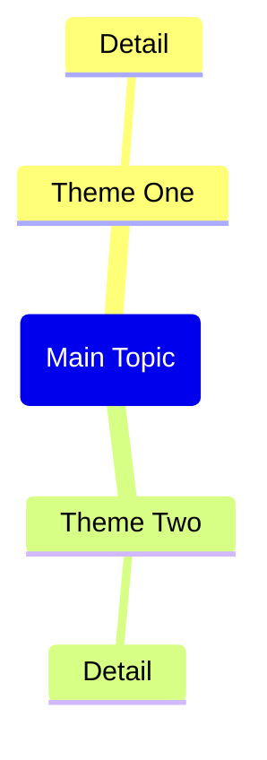

Based on the web page content provided in the context (from Obsidian Web Clipper or Web Viewer), generate a complete Obsidian note.

IMPORTANT: If no web page context is found, remind the user to:
1. Open a web page in Web Viewer (or use @ to select a web tab)
2. Or open a note clipped by Obsidian Web Clipper
3. Then use this command again

Generate the note with this exact structure:

---
title: "<page title>"
source: "<page url>"
description: "<brief description>"
tags:
  - "clippings"
---

## Summary

<Brief 2-3 paragraph summary of the page content>

## Key Takeaways

<List 5-8 key takeaways as bullet points>

## Mindmap

CRITICAL Mermaid mindmap syntax rules - MUST follow exactly:
- Root node format: root(Topic Name) - use round brackets, NO double brackets
- Child nodes: just plain text, no brackets needed
- Do NOT use quotes, parentheses, brackets, or any special characters in text
- Keep all node text short and simple - max 3-4 words per node

## Notable Quotes

<List 3-5 notable quotes from the content, if any>

Return only the markdown content without any explanations or comments.