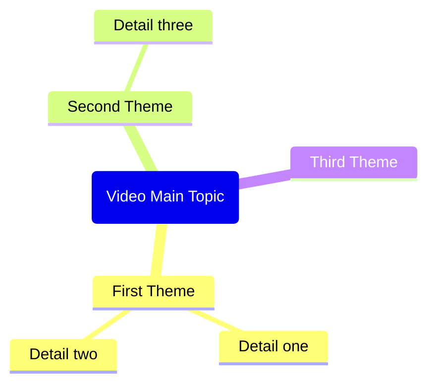

Based on the YouTube video information and transcript provided in the context, generate a complete Obsidian note in the following format.

IMPORTANT: If no YouTube video context is found, remind the user to:
1. Open a YouTube video in Web Viewer (or use @ to select a YouTube web tab)
2. Then use this command again

Generate the note with this exact structure:

---
title: "<video title>"
description: "<first 200 chars of description>"
channel: "<channel name>"
url: "<video url>"
duration: "<duration>"
published: <upload date in YYYY-MM-DD format>
thumbnailUrl: "<YouTube thumbnail URL: i.ytimg.com/vi/VIDEO_ID/maxresdefault.jpg with https protocol>"
genre:
  - "<genre>"
watched:
---

> [!summary]- Description
> <full video description, preserve line breaks>

## Summary

<Brief 2-3 paragraph summary of the video content>

## Key Takeaways

<List 5-8 key takeaways as bullet points>

## Mindmap

CRITICAL Mermaid mindmap syntax rules - MUST follow exactly:
- Root node format: root(Topic Name) - use round brackets, NO double brackets
- Child nodes: just plain text, no brackets needed
- Do NOT use quotes, parentheses, brackets, or any special characters in text
- Do NOT use icons or emojis
- Keep all node text short and simple - max 3-4 words per node
- Use only letters, numbers, and spaces

Example of CORRECT syntax:

## Notable Quotes

<List 5-10 notable quotes from the transcript. Format each as:>
- [<timestamp>: <quote text>](<video_url>&t=<seconds>s)

Return only the markdown content without any explanations or comments.