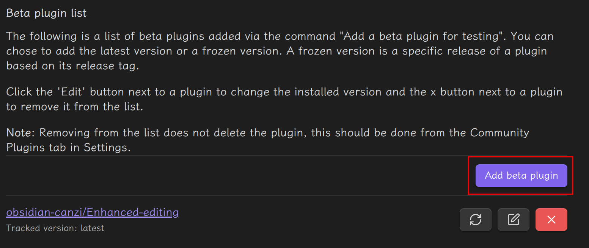
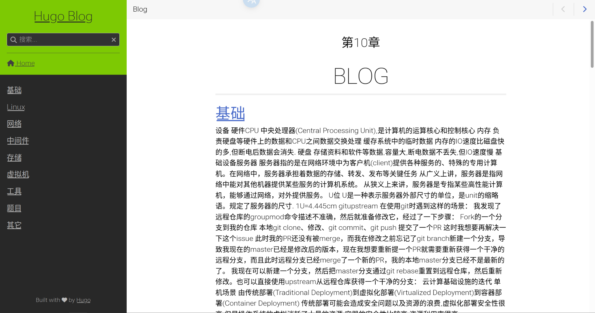
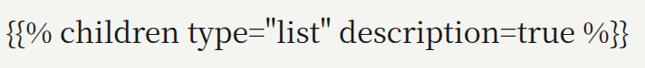
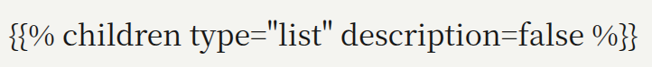

## 显示代码文件  

参考 [Hugo Shortcode 渲染外部代码和文件](https://blog.lockshell.com/posts/hugo-shortcode-render-external-file/)  
把代码从文件中读取并渲染在页面上,使用 [hugo shortcode](https://gohugo.io/content-management/shortcodes) 实现  
在 hugo 仓库根目录下新建 `layouts/shortcodes/code.html`,写入:  

```bash  
{{- /* 获取传入的相对路径，比如 assets/Smokeping/readTitleHostFromXLSX.py */ -}}  
{{- $relPath := .Get "file" -}}  
{{- /* 代码语言，默认 text，可以传 python/js 等 */ -}}  
{{- $lang := .Get "language" | default "text" -}}  
{{- /* 当前页面所在目录，比如 content/Blog/中间件/Smokeping/ */ -}}  
{{- $pageDir := .Page.File.Dir -}}  
{{- /* 拼出实际文件路径 */ -}}  
{{- $fullPath := printf "%s%s" $pageDir $relPath -}}  
{{- /* 读文件内容 */ -}}  
{{- $content := readFile $fullPath -}}  
{{- /* 包一层 Markdown 三引号代码块，再交给 markdownify 渲染 */ -}}  
{{- (print "```" $lang "\n" $content "\n```") | markdownify -}}  
```  

然后在文章中按照下面的格式导入即可:  

```bash  
  
```  

> 实际上如果在文章中也按照上面显示的格式写,会被 hugo 错误的解释为读取一个不存在的 py 文件,并导致显示出现错误,因此上面的代码在文件中写的其实是:  
> ```bash  
>   
> ```  

## 行末添加空格  

在 Obsidian 中默认的回车会被渲染为换行,而在 hugo 中两个空格后的回车才被显示为换行  
在 Obsidian 的设置中可以设置严格换行,但只在源码模式中有效 (切换为阅读视图时严格换行),在实时预览模式下无效  
可以安装 [增强编辑](https://github.com/obsidian-canzi/Enhanced-editing) 插件  
首先在第三方插件搜索 [BRAT](https://github.com/TfTHacker/obsidian42-brat) 插件并安装,然后在其中添加增强编辑插件 (输入仓库 url 即可)  
  

## 顺序  

hugo 的目录和文件都有一个 `weight` 属性,这个数字越小,目录或文件的顺序越靠前

## 文章标题格式转换

Obsidian 有一个好用的功能是关系图谱，使用它可以很容易的查看到文章直接的关系，在文章引用其他文章也可以复用重复的操作笔记，比如为 `ubunut` 配置软件源。  
但是 Obsidian 默认的 wiki 式的链接不能被 Hugo 框架读取，似乎有一个 [开源项目](https://github.com/devidw/obsidian-to-hugo) 做了这样的转换，我没有仔细研究，我在配置图片的时候就已经关闭了 wiki 短链接，而是使用 markdown 原格式，一个文件链接类似于这样:

```bash
[显示文字](文章名.md#标题名)
```

默认情况下在 Obsidian 输入两个 `[` 就会有弹窗可以很方便的链接其他文章，但是 Obsidian 链接的标题格式和 hugo 将标题转换为的 url 格式有很大区别，一个表格如下:  

```bash
文章源标题			Obsidian引用					Hugo转换后url标题

,.[]命令#-			,.[]命令%20-					命令-
WS WPS ''""			WS%20WPS%20''""				ws-wps-
LINUX-LINUX			LINUX-LINUX					linux-linux
UbunTTU -- 24141	UbunTTU%20--%2024141		ubunttu--24141
CentoU --- 24141 	CentoU%20---%2024141		centou--24141
ARCH---24141		ARCH---24141				arch24141
ROCKy ----- 24141 	ROCKy%20-----%2024141		rocky--24141
```

虽然脚本已经尽可能做到适配，但是有以下问题无法解决，是由于 Obsidian 自身链接过程中丢失了原标题内容的信息，因此无法被脚本读取到，只能尽量避免使用:

1. 标题内使用 `#`,Obsidian 的链接会将 `#` 转换为 `%20`(和空格一样)
2. 标题内使用两个及以上连续的空格,Obsidian 的链接会将两个以上的空格合并为一个，而 hugo 没有合并

下面有一些插入文章的测试用例:

```bash
[模板文件](Linux/Systemd.md#模板文件)  
[CentOS7](虚拟机/Docker.md#CentOS7)  
[mon daemon错误](存储/ceph.md#mon%20daemon错误)  
[Ubuntu22.04](虚拟机/安装操作系统.md#Ubuntu22.04)  
[VNC](网络/远程登录.md#VNC)  
[,.[]命令-](Link.md#,.[]命令-)  
[UbunTTU - 24141](Link.md#UbunTTU%20-%2024141)  
[CentoU --- 24141](Link.md#CentoU%20---%2024141)  
[ROCKy ----- 24141](Link.md#ROCKy%20-----%2024141)  
[ARCH---24141](Link.md#ARCH---24141)  
[LINUX-LINUX](Link.md#LINUX-LINUX)  
[WS WPS ''""](Link.md#WS%20WPS%20''"")  
[bianliaNg a,., 22 ()](Link.md#bianliaNg%20a,.,%2022%20())  
[Link](Link.md)  
[安装 过程](Link.md#安装%20过程)  
[构建,清单](Link.md#构建,清单)  
[元组](Link.md#元组)   
[,.[]命令#-](Link.md#,.[]命令%20-)  
[,.[]命令 -](Link.md#,.[]命令%20-)  
[安装  过程](Link.md#安装%20过程)  
[LINUX(2024)](Link.md#LINUX(2024))  
```

## 关闭摘要

我的目录页面非常的混乱:  
  
这是因为如果文章没有设置 `summary` 属性,默认会裁剪文章的前 70 个字符作为摘要,hugo 框架可以用 [这个链接](https://discourse.gohugo.io/t/how-to-disable-the-summary-for-a-post/25203/2) 的方式关闭.  
relearn 主题可以在 `_index` 中直接关闭,我之前的脚本在 `_index` 模板中设置了:  
  
直接修改为 `flase` 即可:  

