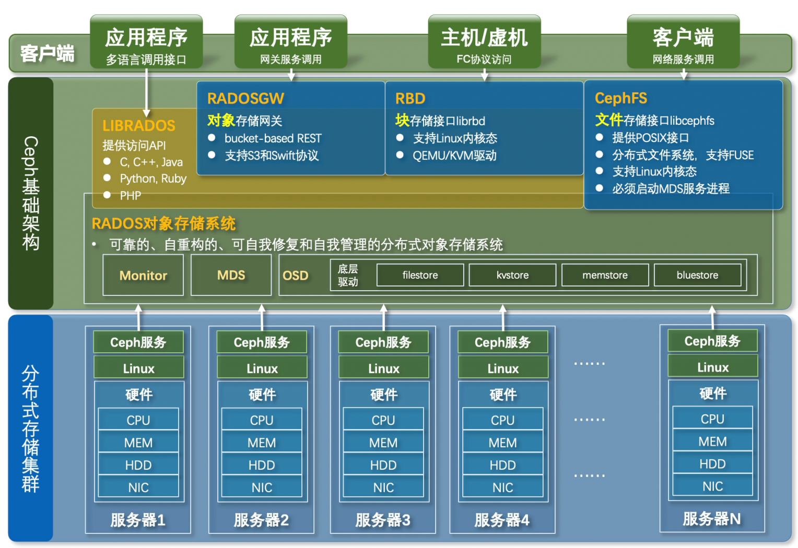
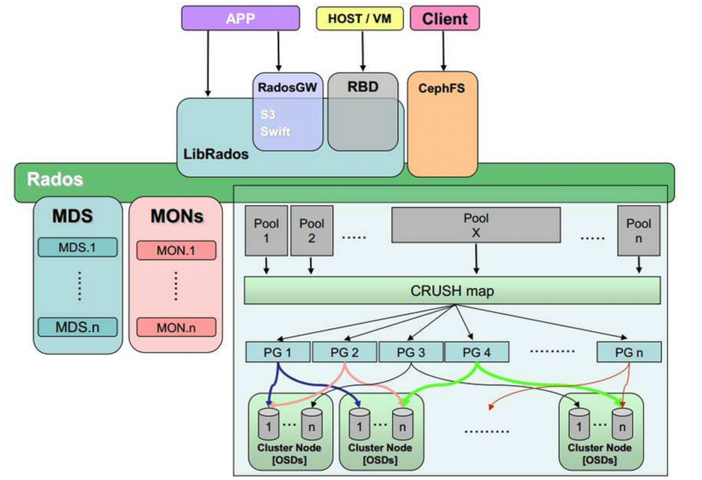

## 概述
Ceph 是一个提供**数据冗余**的**集群化**和**分布式**存储管理器:

- 存储管理器: Ceph 是帮助存储资源来存储数据的软件。存储资源有多种形式：硬盘驱动器（HDD）、固态驱动器（SSD）、磁带、软盘、穿孔纸带等都是存储资源的形式。
- 集群化: 存储管理器不仅仅安装在一台机器上，而是安装在多台协同工作的机器上，形成一个系统。
- 分布式: 存储的数据以及支持它的基础设施分布在多台机器上，而不是集中在一台机器上。
- 数据冗余: 在某处有数据的副本。

Ceph是一个开源的分布式存储系统,用于构建高性能,高可扩展性,高可靠性的存储集群.常用于云计算,企业数据中心,大规模存储等场景  
- 高性能  
	- 摒弃集中式存储元数据寻址方案,采用`CRUSH`算法,数据分布均衡并行度高  
	- 考虑容灾隔离,能实现各类负载副本放置规则,例如跨机房,机架感知等  
	- 支持上千存储节点的规模,支持TB到PB级数据  
- 高可扩展性  
	- 去中心化,扩展灵活,随节点增加而线性增加  
- 高可用性  
	- 副本数量可以灵活控制  
	- 支持故障分域,数据强一致性  
	- 多种故障场景自动进行修复自愈  
	- 无单点故障,自动管理  
- 接口丰富  
	- 支持块存储,文件存储,对象存储  
	- 支持自定义接口,支持多语言驱动  

统一存储：  
- ceph支持: 文件存储 + 块存储 + 对象存储  
- 传统存储支持: 文件存储 + 块存储  

原生对象存储：  
ceph将文件转换为4MB的对象集合,对象唯一标识符保存在kv数据库中,提供扁平寻址空间,提供规模扩展和性能提升可行性.  

## 架构  
  


### RADOS
Reliable Autonomic Distributed Object Store(可靠的，自动化的，分布式的对象存储)，这一层就是一个完整的对象存储系统，所有存储在Ceph系统中的数据都是在这一层来存储的。Ceph的高可靠，高可扩展，高性能也是这一层提供的，因此RADOS是Ceph的基础和关键。
#### 守护进程
##### MON
Monitors, daemon名称:`ceph-mon`  
主要职责是：
- 维护集群状态映射(cluster state map)，这些映射是 Ceph daemon 相互协调的关键信息，包括:
	- Monitor map
	- Manager map
	- OSD map
	- MDS map
	- CRUSH map
- 负责daemon和client之间的认证管理。  

通常至少需要部署3个Monitors以实现冗余和高可用(需要奇数个以形成quorum)。
##### MGR
Managers, daemon名称:`ceph-mgr`  
主要职责：
- 平衡集群数据，均匀分配负载
- 跟踪运行时指标和集群当前状态:
	- 存储利用率
	- 性能指标
	- 系统负载
- 托管基于Python的插件模块，用于管理和暴露集群信息，常见的有：
	- web-based Ceph Dashboard(仪表盘)
	- Prometheus监控模块

通常至少部署 2 个 Managers，实现高可用（一个 active，一个 standby，自动 failover）。  
##### OSD
Object Storage Daemons, daemon名称:`ceph-osd`  
主要职责:
- 实际存储集群大部分数据
- 处理数据的replication(复制),recovery(恢复),rebalancing(再平衡)。
- 通过心跳机制(heartbeat)向Monitors和Managers报告自身及其他OSD的状态，提供监控信息

通常每个OSD由一块磁盘组成，也可以由设备组合。Ceph集群至少需要3个OSDs，以实现高可用和冗余。  

OSD具有多种底层驱动  
- filestore: 需要磁盘具有文件系统,按照文件系统的规则进行读写  
- kvstore  
- memstore  
- bluestore: 操作底层空间,不需要文件系统,速度快,支持WAL预写机制  

##### MDS
Metadata Server, daemon名称:`ceph-mds`  
主要职责:
- 为CephFS文件系统存储文件元数据(inode,目录结构等)
- 使CephFS客户端能执行基本文件操作(ls,find等)，而不对底层存储集群造成负担。

根据CephFS负载，至少部署一个mds，生产环境推荐部署两个或更多  
> 仅在启用CephFS时需要，如果不使用文件系统接口，可以不部署MDS.

#### 存储数据
##### Pool
存储池(Pool)是Ceph存储对象的逻辑分区.存储池提供以下关键功能:
1. 弹性(Resilience):存储池可以设置在不丢失数据的情况下允许故障的OSD数量:
	- 副本存储池(Replicated Pools):通过保存对象的多个副本实现,典型的配置是`size=3`(存在一个主对象加两个副本)
	- 纠删码存储池(Erasure Coded Pools):通过将数据切分为`k`个数据块和`m`个编码块来实现,`,`的值决定了允许故障的OSD数量.
2. 规制组(PG):可以为存储池设置PG数量,通常的配置是每个OSD大约负责100个PGs,以在不消耗过多计算资源的情况下实现负载均衡.
3. CRUSH规则(CRUSH Rules):可以为特定的存储池创建自定义CRUSH规则.CRUSH规则决定了数据及其副本(或纠删码)在集群中的位置.
4. 快照(snapshots):可以对特定的存储池创建快照,保留其在某一时刻的数据状态.
5. 配额(quotas):可以限制存储池的最大字节数或最大对象数.

> 池类型决定池使用的数据持久性方式(副本或纠删码)，并且对客户端透明。池的数据耐久策略在整个池范围内保持统一，并在池创建后不可修改。  

> [pools](https://docs.ceph.com/en/latest/rados/operations/pools/) 

##### PG
放置组(Placement Groups, PG)  

Ceph 将一个池切分为多个放置组(PG).PG同样是Ceph存储对象的逻辑分区,Ceph在内部以PG为粒度管理数据，这比直接管理单个RADOS对象节省资源开销且具有更好的扩展性。

PG在对象和OSD之间扮演"中间层"的角色,一个PG聚合了存储池中的若干对象。Ceph 会将 PG 映射到一组 OSD。例如，如果一个存储池的副本数为 3，那么每个 PG 将被映射到 3 个 OSD

Ceph 客户端会计算对象应属于哪个归置组,具体方法是对对象 ID 进行哈希运算，并根据定义的存储池中的 PG 数量以及存储池的 ID 进行操作.    

当一个 OSD 发生故障时，Ceph 会通过扫描受影响的 PG，找到该 PG 在其他正常 OSD 上的存活副本，并开始恢复过程，以确保数据达到预定的副本数。这种机制允许 Ceph 集群自我修复并自动重新平衡数据。

管理员可以为pool设置 PG 数量(即 pool 被切成多少个 PG),在较新版本的Ceph中,Manager守护进程可以自动计算所需的PG数量并进行调整.每个存储池都有一个 `pg_autoscale_mode` 属性，可以设置为：
- `off`：禁用自动扩缩容。由管理员负责设置每个存储池的 `pg_num`。
- `warn`：当建议的 PG 数量与当前值偏差较大时，触发 `HEALTH_WARN` 健康警告。
- `on`：自动调整存储池的 PG 数量。  


> [placement-groups](https://docs.ceph.com/en/latest/rados/operations/placement-groups/)  
> [New in Nautilus: PG merging and autotuning](https://ceph.io/en/news/blog/2019/new-in-nautilus-pg-merging-and-autotuning/)
##### CRUSH
CRUSH(Controlled Replication Under Scalable Hashing 受控复制的可扩展哈希算法)是一种基于哈希的数据分布算法。以数据唯一标识符，当前存储集群的拓扑结构以及数据备份策略作为CRUSH输入，可以随时随地通过计算获取数据所在的底层存储设备位置并直接与其通信，CRUSH 使得 Ceph 客户端能够直接与 OSD 通信，而不是通过一个中心化的服务器或代理。通过这种算法分布计算存储位置，Ceph 实现了去中心化、高度并发和高可扩展性，避免了单点故障、性能瓶颈以及扩展性的物理限制。  

CRUSH使用(CRUSH Map)将数据映射到OSD并根据配置的复制策略和故障域在集群中分布数据.CRUSH Map包含一个OSD列表,一个"buckets(桶)"层级结构,以及管理CRUSH在集群池中复制数据的规则.

通过反映安装环境的底层物理组织，CRUSH 可以模拟并以此应对相关联设备同时故障的可能性。与 CRUSH 层级结构相关的因素包括机箱、机架、物理距离、共享电源、共享网络和故障域(failure domains)。通过将这些信息编码进 CRUSH map中，CRUSH 放置策略可以在保持所需分布的同时，将对象副本分布在不同的故障域中。例如，为了应对并发故障的可能性，可能需要确保数据副本位于处于不同机架、机架位、电源、控制器或物理位置的设备上。

部署 OSD 时，它们会自动添加到 CRUSH map中的 host 桶下，该桶以运行该 OSD 的节点命名。这种行为结合配置的 CRUSH 故障域，可确保副本或纠删码分片分布在不同主机上，并且单个主机故障或其他类型的故障不会影响可用性。

###### CRUSH Location
OSD 在 CRUSH map层级结构中的位置被称为其 **CRUSH location**。CRUSH locayion的规范采用键值对列表的形式。例如，如果一个 OSD 位于特定的行（row）、机架（rack）、机箱（chassis）和主机（host）中，并且是“default” CRUSH 根节点的一部分，则其 CRUSH location可以指定如下：
```
root=default row=a rack=a2 chassis=a2a host=a2a1
```
1. 键的顺序无关紧要
2. 键名必须是有效的CRUSH类型,默认情况下的CRUS类型有:`root、datacenter、room、row、pod、pdu、rack、chassis 和 host`,也可以自定义CRUSH类型

###### CRUSH Structure
CRUSH map由两部分组成:
1. 描述集群物理拓扑的层级结构,该层级结构的叶子节点是设备（OSD），内部节点对应于其他物理特征或分组：主机、机架、行、数据中心等。
2. 定义数据放置策略的一组规则。规则决定了副本如何根据该层级结构进行放置。

**设备**: 是存储数据的单个 OSD（通常每个存储驱动器一个设备）。设备由 id（非负整数）和 name（通常为 osd.N）标识。在 Luminous 及更高版本中，可以为 OSD 分配设备类（device class，例如 hdd、ssd 或 nvme），从而允许 CRUSH 规则定位它们。  

**类型和Buckets(桶)**: 在 CRUSH 的语境下，“Buckets”是指层级结构中任何内部节点的术语：主机、机架、行等。CRUSH  map定义了一系列用于标识这些节点的“类型”。默认类型包括：
```
osd, host, chassis, rack, row, pdu, pod, room, datacenter, zone, region, root
```
大多数集群仅使用这些类型中的少数几种。层级结构构建时，叶子节点是设备（通常类型为 osd），内部节点是非设备类型。根节点的类型为 root。

层级结构中的每个节点（设备或桶）都有一个“权重” (weight)，表示该设备或层级子树应存储的数据占总数据的相对比例。权重在叶子节点设置，表示设备的大小。这些权重会自动沿“树向上”的方向求和。权重通常以 tebibytes (TiB) 为单位测量。

**规则**: CRUSH 规则定义了控制数据如何在层级结构中的设备间分布的策略。这些规则允许你精确指定 CRUSH 放置数据副本的方式。可以通过命令行创建 CRUSH 规则，方法是指定它们将管理的池类型（副本或纠删码）、故障域，以及可选的设备类。

**设备类**: 每个设备都可以可选地分配一个类 (class)。默认情况下，OSD 在启动时会根据其背后的设备类型自动将自己的类设置为 hdd、ssd 或 nvme。

**权重集**:权重集是计算数据放置时使用的一组替代权重。权重集允许集群根据具体情况执行数值优化，以实现平衡的分布。

Ceph 支持两种类型的权重集：
1. compat 权重集：为集群中每个设备和节点提供的一组单一替代权重，与以前版本的 Ceph 向后兼容。
2. per-pool 权重集：更加灵活，允许为每个数据池优化放置。

如果同时使用了 compat 和 per-pool 权重集，特定池将优先使用其自己的 per-pool 权重集。

> [crush-map](https://docs.ceph.com/en/latest/rados/operations/crush-map/)

### 客户端
RADOS本身只支持对象存储，且不直接向最终用户暴露高层接口，而是通过客户端来实现统一存储：
- `LIBRADOS`: 原生接口，直接访问RADOS对象存储，提供访问**API**,允许应用程序通过多种语言调用接口  
- `RGW`: 提供RESTFUL风格的**对象存储网关**,支持应用程序通过`S3`和`Swift`协议访问,基于`LIBRADOS`  
- `RBD`: 提供**块存储**接口,基于`LIBRADOS`之上  
- `CephFS`: 提供**文件存储**接口,提供**POSIX接口**,支持**FUSE**,使用它必须启动**MDS服务进程**,Ceph和集群的交互分为两条路径:
	- 文件数据路径: 直接基于librados与OSD通信(读写文件内容)
	- 文件元数据路径: 通过专用协议与MDS守护进程通信(处理目录，权限，inode等操作)
#### RGW
Rados Object Gateway, daemon名称:`ceph-radosgw`
主要职责:
- 提供RESTful对象存储网关，让用户通过标准协议访问Ceph集群
- 支持S3API和 Swift API

通常部署两个或更多，配合负载均衡(HAProxy/Nginx)实现高可用。  
> 仅在需要对象存储接口(S3/Swift)时部署，如果只使用文件/块存储，可以不部署RGW。

## 部署
准备部署在三台服务器上：

| 主机名   | IP          | 磁盘数量 | 操作系统    |
| ----- | ----------- | ---- | ------- |
| ceph1 | 192.168.1.2 | 1+12 | CentOS7 |
| ceph2 | 192.168.1.3 | 1+12 | CentOS7 |
| ceph3 | 192.168.1.4 | 1+12 | CentOS7 |

> 我们会在ceph1机器上部署集群,然后添加另外两台机器到集群中,这种情况下,ceph1被称作"bootstrap host(引导主机)"

### 准备工作
Ceph集群上的主机都需要满足以下要求：
- Python3
- Systemd
- Podman or Docker 来运行容器
- 时间同步(Chrony或者ntpd)
- LVM2 配置存储设备

下面提及的准备工作都要在集群中的每台机器上运行：
#### 配置软件源
安装阿里云`epel`和`docker-ce`软件源
```
curl -o /etc/yum.repos.d/docker-ce.repo http://mirrors.aliyun.com/docker-ce/linux/centos/docker-ce.repo
curl -o /etc/yum.repos.d/epel-7.repo  http://mirrors.aliyun.com/repo/epel-7.repo

yum clean all 
yum makecache
```
#### 关闭防火墙和SELinux
```
systemctl disable --now firewalld

vim /etc/selinux/config
SELINUX=disabled

reboot
```
#### 设置服务器名
```
hostnamectl set-hostname ceph1
hostnamectl set-hostname ceph2
hostnamectl set-hostname ceph3
```
#### 安装chrony
安装chrony进行时间同步
```
yum install chrony -y

# 服务端配置
vim /etc/chrony.conf

pool ntp.aliyun.com iburst
driftfile /var/lib/chrony/drift
makestep 1.0 3
rtcsync
allow 192.168.1.0/24
local stratum 10
keyfile /etc/chrony.keys
logdir /var/log/chrony
leapsectz right/UTC

# 客户端配置
vim /etc/chrony.conf

pool 192.168.1.2 iburst # 这里是服务端IP
driftfile /var/lib/chrony/drift
makestep 1.0 3
rtcsync
keyfile /etc/chrony.keys
logdir /var/log/chrony
leapsectz right/UTC
```
安装后使用`chronyc sources -v`在客户端进行验证。  
#### 安装python3
安装编译用到的软件和openssl 1.1.1(自带的openssl 1.0太旧，python需要至少openssl 1.1.1)
```
yum groupinstall "Development Tools"
yum install bzip2-devel libffi-devel zlib-devel
#需要EPEL仓库
#安装openssl11，后期的pip3安装网络相关模块需要用到ssl模块。
yum install -y openssl11 openssl11-devel
```
进入刚解压缩的目录
```
cd /root/Python-3.11.0
```
在编译之前需要确保python的`configure`脚本能够找到正确的ssl头文件和lib文件位置  
在Centos上安装`openssl`和`openssl11-devel`软件包之后，相关文件位于：  
```
$ whereis openssl11
openssl11: /usr/bin/openssl11 /usr/lib64/openssl11 /usr/include/openssl11 /usr/share/man/man1/openssl11.1.gz

#此目录下存在ssl.h头文件
$ ls /usr/include/openssl11/
openssl

# 此目录下存在lib文件
$ ls /usr/lib64/openssl11/
libcrypto.so  libssl.so
# 实际上该目录中的文件是指向/usr/lib64目录下头文件的软链接
$ ll /usr/lib64/openssl11/
total 0
lrwxrwxrwx. 1 root root 22 Dec 15 14:05 libcrypto.so -> ../libcrypto.so.1.1.1k
lrwxrwxrwx. 1 root root 19 Dec 15 14:05 libssl.so -> ../libssl.so.1.1.1k
```
查看`configure`脚本可以看到，这两个目录的位置是无法被脚本找到的：
```
            if test x"$PKG_CONFIG" != x""; then
                OPENSSL_LDFLAGS=`$PKG_CONFIG openssl --libs-only-L 2>/dev/null`
                if test $? = 0; then
                    OPENSSL_LIBS=`$PKG_CONFIG openssl --libs-only-l 2>/dev/null`
                    OPENSSL_INCLUDES=`$PKG_CONFIG openssl --cflags-only-I 2>/dev/null`
                    found=true
                fi
            fi

            # no such luck; use some default ssldirs
            if ! $found; then
                ssldirs="/usr/local/ssl /usr/lib/ssl /usr/ssl /usr/pkg /usr/local /usr"
            fi


fi
    # note that we #include <openssl/foo.h>, so the OpenSSL headers have to be in
    # an 'openssl' subdirectory

    if ! $found; then
        OPENSSL_INCLUDES=
        for ssldir in $ssldirs; do
            { $as_echo "$as_me:${as_lineno-$LINENO}: checking for openssl/ssl.h in $ssldir" >&5
$as_echo_n "checking for openssl/ssl.h in $ssldir... " >&6; }
            if test -f "$ssldir/include/openssl/ssl.h"; then
                OPENSSL_INCLUDES="-I$ssldir/include"
                OPENSSL_LDFLAGS="-L$ssldir/lib"
                OPENSSL_LIBS="-lssl -lcrypto"
                found=true
                { $as_echo "$as_me:${as_lineno-$LINENO}: result: yes" >&5
$as_echo "yes" >&6; }
                break
            else
                { $as_echo "$as_me:${as_lineno-$LINENO}: result: no" >&5
$as_echo "no" >&6; }
            fi
        done
```
脚本首先会查看`PKG_CONFIG`环境变量，如果不存在，则在预定义的几个目录中查找，我们的`/usr`目录虽然也在预定义的目录中，但是其查找的是`/usr/include/openssl/ssl.h`，而我们的文件在`/usr/include/openssl11/openssl/ssl.h`。同理，脚本查找的lib文件在`/usr/lib`目录下，而我们的文件在`/usr/lib64`(存在软链接在`/usr/lib64/openssl/`)。  
可以创建软链接来解决：
```
$ ln -s /usr/include/openssl11/openssl/ /usr/include/openssl
$ ln -s /usr/lib64/openssl11/libcrypto.so /usr/lib/libcrypto.so
$ ln -s /usr/lib64/openssl11/libssl.so /usr/lib/libssl.so
```
开始编译:
```
./configure --prefix=/usr/python --with-openssl=/usr
#指定python3的安装目录为/usr/python并编译ssl模块，指定目录好处是后期删除此文件夹就可以完全删除python
make -j $(nproc)
```
测试`ssl 1.1.1`是否编译成功：
```
$ ./python -c "import ssl; print(ssl.OPENSSL_VERSION)"
OpenSSL 1.1.1k  FIPS 25 Mar 2021
```
安装：
```
make install
#源码编译并安装
ln -s /usr/python/bin/python3 /usr/bin/python3
ln -s /usr/python/bin/pip3 /usr/bin/pip3
```
#### 安装docker
```
yum install -y yum-utils device-mapper-persistent-data lvm2

# 需要docker-ce软件仓库
yum install -y docker-ce-24.0.7-1.el7 docker-ce-cli-24.0.7-1.el7 containerd.io
```
配置Docker的"live restore"，即允许在不重新启动所有正在运行的容器的情况下重新启动 Docker 引擎  
```
vim /etc/docker/daemon.json
{
  "live-restore": true
}

systemctl restart docker
```
### 安装 CEPHADM
`cephadm`需要集群中的每个机器安装
从[releases页面](https://docs.ceph.com/en/latest/releases/#active-releases)查看想要安装的大版本的最新版本，例如我想要安装的是Octopus版本，那么版本号就是15.2.17:  
```
CEPH_RELEASE=15.2.17

curl --silent --remote-name --location https://download.ceph.com/rpm-18.2.0/el9/noarch/cephadm
```
然而上面的链接似乎已经失效了，下载下来的是一个404错误消息，可以手动访问ceph仓库，切换到该版本的分支并前往`ceph/src/cephadm/cephadm`查看文件内容，将链接中的`blob`换成`raw`即可通过网络下载：
```
curl --silent --remote-name --location https://github.com/ceph/ceph/raw/octopus/src/cephadm/cephadm
```
下载之后可以发现`cephadm`实际上是一个python脚本。  
```
# 给予运行权限
chmod +x cephadm

# 添加一个yum存储库，这里需要指定的是版本名称，而不是版本号
./cephadm add-repo --release octopus

# 安装cephadm命令的软件包
./cephadm install 

# 确认命令是否成功安装
$ which cephadm
/usr/sbin/cephadm
```
### 创建集群
创建集群及之后的添加主机，添加OSD等操作在**引导服务器(ceph1)**上操作：  
创建集群之前需要确保：
1. 主机名不能太长，例如`localhost.localdomain`就太长
2. 主机上存在本主机名的DNS解析
3. SSH端口是默认的`22`，否则需要手动传入SSH配置文件
4. 需要一个集群内部其他机器可访问的IP地址

```
# 修改主机名
hostnamectl set-hostname ceph1

# 添加主机名的DNS解析
vim /etc/hosts

127.0.0.1   localhost ceph1
::1         localhost ceph1
192.168.1.2 localhost ceph1

192.168.1.3 localhost ceph2
192.168.1.4 localhost ceph3

# 创建一个SSH的配置文件
vim ssh_config

Host *
  Port 2222
  User root
  StrictHostKeyChecking no
```
然后通过`cephadm`命令创建一个集群：  
```
# 这里使用和其他Ceph机器同处的局域网IP即可
cephadm bootstrap --mon-ip 192.168.1.2 --ssh-config ./ssh_config
```
然后需要安装`ceph`命令，[官方文档](https://docs.ceph.com/en/latest/cephadm/install/#enable-ceph-cli)有几种方法：
- `cephadm shell`
- `cephadm shell -- ceph -s`
- `cephadm install ceph-common`

我这里选择第三种
```
# 官方源下载太慢，这里换成清华源
sed -i 's_download.ceph.com_mirrors.tuna.tsinghua.edu.cn/ceph_g' /etc/yum.repos.d/ceph.repo 

# 安装ceph-common软件包
cephadm install ceph-common
```
然后就可以使用`ceph`命令
```
# 查看集群状态
ceph status
  cluster:
    id:     59f56c2c-dafa-11f0-a750-68a8297ec412
    health: HEALTH_WARN    # 这里有一个warn很正常，是由于还没有添加OSD
            OSD count 0 < osd_pool_default_size 3
 
  services:
    mon: 1 daemons, quorum ceph1 (age 3h)
    mgr: ceph1.zxojlm(active, since 3h)
    osd: 0 osds: 0 up, 0 in
 
  data:
    pools:   0 pools, 0 pgs
    objects: 0 objects, 0 B
    usage:   0 B used, 0 B / 0 B avail
    pgs:     
```
### 添加主机
首先需要把集群的公共SSH密钥添加到新主机root用户的`authorized_keys`文件：
```
ssh-copy-id -f -i /etc/ceph/ceph.pub root@192.168.1.3
ssh-copy-id -f -i /etc/ceph/ceph.pub root@192.168.1.4
```
然后告诉Ceph新节点是集群的一部分：
```
# 命令是: ceph orch host add *<newhost>* [*<ip>*] [*<label1> ...*]，其中 newhost 必须是主机的hostname
ceph orch host add ceph2 192.168.1.3 --labels _admin

# 也可以先添加主机，后添加标签
ceph orch host add ceph3 192.168.1.4 
ceph orch host label add ceph3 _admin
```
> 默认情况下，`ceph.conf`和`ceph.client.admin.keyring`密钥环只在具有`_admin`标签的主机上存在，最好为多个主机提供`_admin`标签(创建集群的主机默认具有该权限)，以便 Ceph Cli 能够在多个主机上访问，否则一旦该主机故障，其他主机需要先复制下来这些文件才能访问 Ceph Cli。

查看当前集群的状态：
```
ceph orch host ls
HOST   ADDR         LABELS  STATUS  
ceph1  ceph1                        
ceph2  192.168.1.3  _admin          
ceph3  192.168.1.4  _admin          
```
状态没有显示，可能是已经`online`了，可以查看运行的容器，观察有没有运行在新的主机上：
```
ceph orch ps
NAME                 HOST   STATUS         REFRESHED  AGE  VERSION  IMAGE NAME                                IMAGE ID      CONTAINER ID  
alertmanager.ceph1   ceph1  running (39m)  2m ago     4h   0.20.0   quay.io/prometheus/alertmanager:v0.20.0   0881eb8f169f  84a620ebf962  
crash.ceph1          ceph1  running (4h)   2m ago     4h   15.2.17  quay.io/ceph/ceph:v15                     93146564743f  8a574d091104  
crash.ceph2          ceph2  running (39m)  2m ago     39m  15.2.17  quay.io/ceph/ceph:v15                     93146564743f  ab182ee00a2f  
crash.ceph3          ceph3  running (3m)   2m ago     3m   15.2.17  quay.io/ceph/ceph:v15                     93146564743f  f6e9ab35a36e  
```
默认集群中只有一个`Mon`，如果集群里的所有主机都在同一个子网，`cephadm`会自动管理Mon的数量，通常建议值是三到五个Mon，他们会自动分散到不同的主机上，可以手动干预指定Mon放置的主机：
```
ceph orch apply mon --placement="ceph1,ceph2,ceph3"
```
### 添加OSD
Ceph上使用的磁盘必须满足以下条件：
1. 没有分区
2. 不具有任何LVM状态
3. 没有被挂载
4. 不包含文件系统
5. 不包含Ceph BlueStore OSD
6. 空间大于5GB

列出所有节点上可用的磁盘：
```
ceph orch device ls
```
如果有存在的数据(lvm,文件系统,磁盘分区等)导致不可用，可以先手动擦除存在的数据：
```
ceph orch device zap ceph1 /dev/sdb --force
```
可以手动指定设备：
```
ceph orch daemon add osd ceph1:/dev/sdb
```
也可以直接消耗所有可用的设备：
```
ceph orch apply osd --all-available-devices
```
## 使用
### OSD
创建OSD之前可以先手动擦除可能存在的数据：
```
ceph orch device zap ceph1 /dev/sdb --force
```
列出所有节点上可用的磁盘：
```
ceph orch device ls
```
查看所有OSD，这会按照不同的主机分开显示：
```
$ ceph osd tree
ID  CLASS  WEIGHT    TYPE NAME       STATUS  REWEIGHT  PRI-AFF
-1         51.87561  root default                             
-3         51.87561      host ceph1                           
 9    hdd   5.45799          osd.9       up   1.00000  1.00000
10    hdd   5.45799          osd.10      up   1.00000  1.00000
11    hdd   5.45799          osd.11      up   1.00000  1.00000
12    hdd   5.45799          osd.12      up   1.00000  1.00000
13    hdd   5.45799          osd.13      up   1.00000  1.00000
14    hdd   5.45799          osd.14      up   1.00000  1.00000
15    hdd   5.45799          osd.15      up   1.00000  1.00000
16    hdd   5.45799          osd.16      up   1.00000  1.00000
17    hdd   5.45799          osd.17      up   1.00000  1.00000
 6    ssd   0.91789          osd.6       up   1.00000  1.00000
 7    ssd   0.91789          osd.7       up   1.00000  1.00000
 8    ssd   0.91789          osd.8       up   1.00000  1.00000
```
`ceph -s`也会显示当前集群OSD的数量：
```
$ ceph -s
  cluster:
    id:     501cba44-dd42-11f0-bf96-68a8282ec412
    health: HEALTH_OK
 
  services:
    mon: 1 daemons, quorum ceph1 (age 66m)
    mgr: ceph1.pkpqfn(active, since 65m)
    osd: 12 osds: 12 up (since 5m), 12 in (since 5m); 1 remapped pgs
 
  data:
    pools:   1 pools, 1 pgs
    objects: 0 objects, 0 B
    usage:   12 GiB used, 52 TiB / 52 TiB avail
    pgs:     1 active+clean
 
```
查看运行的osd容器：
```
ceph orch ps --daemon-type osd
NAME    HOST   STATUS        REFRESHED  AGE  VERSION  IMAGE NAME             IMAGE ID      CONTAINER ID  
osd.10  ceph1  running (6m)  3m ago     6m   15.2.17  quay.io/ceph/ceph:v15  93146564743f  b6e4afa6f4e4  
osd.11  ceph1  running (6m)  3m ago     6m   15.2.17  quay.io/ceph/ceph:v15  93146564743f  06b2e4cea3a6  
osd.12  ceph1  running (6m)  3m ago     6m   15.2.17  quay.io/ceph/ceph:v15  93146564743f  bab97c139e2b  
osd.13  ceph1  running (5m)  3m ago     5m   15.2.17  quay.io/ceph/ceph:v15  93146564743f  f82ac7e58180  
osd.14  ceph1  running (4m)  3m ago     4m   15.2.17  quay.io/ceph/ceph:v15  93146564743f  3fb8acbdff4c  
osd.15  ceph1  running (4m)  3m ago     4m   15.2.17  quay.io/ceph/ceph:v15  93146564743f  eab4786260d8  
osd.16  ceph1  running (4m)  3m ago     4m   15.2.17  quay.io/ceph/ceph:v15  93146564743f  90cd940be157  
osd.17  ceph1  running (3m)  3m ago     3m   15.2.17  quay.io/ceph/ceph:v15  93146564743f  71c0655d10a7  
osd.6   ceph1  running (8m)  3m ago     8m   15.2.17  quay.io/ceph/ceph:v15  93146564743f  e16cb2aaa6d9  
osd.7   ceph1  running (7m)  3m ago     7m   15.2.17  quay.io/ceph/ceph:v15  93146564743f  e1c3e86f0ae4  
osd.8   ceph1  running (7m)  3m ago     7m   15.2.17  quay.io/ceph/ceph:v15  93146564743f  742b27b751c3  
osd.9   ceph1  running (7m)  3m ago     7m   15.2.17  quay.io/ceph/ceph:v15  93146564743f  b2b79aff8869  
```
查看磁盘上运行着哪个OSD:
```
# 进入集群环境
[root@ceph1 ~]# cephadm shell
Inferring fsid e34c50e0-dedc-11f0-9b15-68a8282ec412
Inferring config /var/lib/ceph/e34c50e0-dedc-11f0-9b15-68a8282ec412/mon.ceph1/config
Using recent ceph image quay.io/ceph/ceph@sha256:c08064dde4bba4e72a1f55d90ca32df9ef5aafab82efe2e0a0722444a5aaacca


[ceph: root@ceph1 /]# ceph-volume lvm list
====== osd.0 =======
  [block]       /dev/ceph-aea67dae-52d6-4881-b3d0-2313ff9d2c01/osd-block-bdbce2f6-508b-409a-a9ff-843c5147573a

      block device              /dev/ceph-aea67dae-52d6-4881-b3d0-2313ff9d2c01/osd-block-bdbce2f6-508b-409a-a9ff-843c5147573a
      block uuid                UGscNo-Absm-iSDU-vkuO-yMj7-8MDr-DjI7gK
      cephx lockbox secret      
      cluster fsid              e34c50e0-dedc-11f0-9b15-68a8282ec412
      cluster name              ceph
      crush device class        
      encrypted                 0
      osd fsid                  bdbce2f6-508b-409a-a9ff-843c5147573a
      osd id                    0
      osdspec affinity          all-available-devices
      type                      block
      vdo                       0
      devices                   /dev/sdb
      
[ceph: root@ceph1 /]# ceph-volume inventory --format json-pretty
[
    {
        "available": false,
        "device_id": "HP_LOGICAL_VOLUME_PDNNF0ARH8R0F7",
        "lsm_data": {},
        "lvs": [
            {
                "comment": "not used by ceph",
                "name": "swap"
            },
            {
                "comment": "not used by ceph",
                "name": "home"
            },
            {
                "comment": "not used by ceph",
                "name": "root"
            }
        ],
        "path": "/dev/sda",
        "rejected_reasons": [
            "Has partitions",
            "locked",
            "LVM detected",
            "Insufficient space (<10 extents) on vgs"
        ],
        "sys_api": {
            "human_readable_size": "745.18 GB",
            "locked": 1,
            "model": "LOGICAL VOLUME",
            "nr_requests": "128",
            "partitions": {
                "sda1": {
                    "holders": [],
                    "human_readable_size": "1.00 GB",
                    "sectors": "2097152",
                    "sectorsize": 512,
                    "size": 1073741824.0,
                    "start": "2048"
                },
                "sda2": {
                    "holders": [
                        "dm-0",
                        "dm-1",
                        "dm-3"
                    ],
                    "human_readable_size": "744.18 GB",
                    "sectors": "1560657920",
                    "sectorsize": 512,
                    "size": 799056855040.0,
                    "start": "2099200"
                }
            },
            "path": "/dev/sda",
            "removable": "0",
            "rev": "2.52",
            "ro": "0",
            "rotational": "0",
            "sas_address": "",
            "sas_device_handle": "",
            "scheduler_mode": "deadline",
            "sectors": 0,
            "sectorsize": "512",
            "size": 800132521984.0,
            "support_discard": "0",
            "vendor": "HP"
        }
    },
```
### 删除集群
```
# 查看集群的fsid
$ ceph -s
  cluster:
    id:     501cba44-dd42-11f0-bf96-68a8282ec412
    health: HEALTH_WARN
            Reduced data availability: 1 pg inactive, 1 pg stale
            Degraded data redundancy: 1 pg undersized
 
  services:
    mon: 1 daemons, quorum ceph1 (age 2d)
    mgr: ceph1.pkpqfn(active, since 2d)
    osd: 12 osds: 12 up (since 47h), 12 in (since 47h)
 
  data:
    pools:   1 pools, 1 pgs
    objects: 0 objects, 0 B
    usage:   12 GiB used, 52 TiB / 52 TiB avail
    pgs:     100.000% pgs not active
             1 stale+undersized+remapped+peered
$ cephadm rm-cluster --force  --fsid 501cba44-dd42-11f0-bf96-68a8282ec412
```
### 主机
查看集群中主机信息：
```
$ ceph orch host ls
HOST   ADDR         LABELS  STATUS  
ceph1  ceph1                        
ceph2  192.168.1.3  _admin          
ceph3  192.168.1.4  _admin          
```
### 结构
ceph的daemon由systemd管理，通过docker或podman在容器中运行，在添加到集群的主机中的`/var/lib/ceph`目录下存储集群中daemon的内容：
```
/var/lib/ceph/
├── 59f56c2c-dafa-11f0-a750-68a8282ec412
│   ├── mon.ceph2
│   │   ├── config
│   │   ├── keyring
│   │   ├── kv_backend
│   │   ├── store.db
│   │   │   ├── 021416.sst
│   │   │   ├── 021417.sst
│   │   │   ├── 021418.sst
│   │   │   ├── 021419.log
│   │   │   ├── 021420.sst
│   │   │   ├── CURRENT
│   │   │   ├── IDENTITY
│   │   │   ├── LOCK
│   │   │   ├── MANIFEST-002608
│   │   │   ├── OPTIONS-002608
│   │   │   └── OPTIONS-002611
│   │   ├── unit.configured
│   │   ├── unit.created
│   │   ├── unit.image
│   │   ├── unit.poststop
│   │   └── unit.run
└── e34c50e0-dedc-11f0-9b15-68a8282ec412
    ├── mon.ceph2
    │   ├── config
    │   ├── keyring
    │   ├── kv_backend
    │   ├── store.db
    │   │   ├── 000004.sst
    │   │   ├── 000018.log
    │   │   ├── CURRENT
    │   │   ├── IDENTITY
    │   │   ├── LOCK
    │   │   ├── MANIFEST-000017
    │   │   ├── OPTIONS-000017
    │   │   └── OPTIONS-000020
    │   ├── unit.configured
    │   ├── unit.created
    │   ├── unit.image
    │   ├── unit.poststop
    │   └── unit.run
```
在目录中存在以集群fsid命名的目录，内部是该集群在这台主机上运行的daemon的目录，目录中存储着daemon的数据，比如`unit.run`中存储的是daemon的启动命令，这些文件在ceph的[模板单元](../Linux/Systemd.md#模板单元)中被使用,例如:
```
cat /etc/systemd/system/ceph-59f56c2c-dafa-11f0-a750-68a8282ec412@.service

# generated by cephadm
[Unit]
Description=Ceph %i for 59f56c2c-dafa-11f0-a750-68a8282ec412

# According to:
#   http://www.freedesktop.org/wiki/Software/systemd/NetworkTarget
# these can be removed once ceph-mon will dynamically change network
# configuration.
After=network-online.target local-fs.target time-sync.target docker.service
Wants=network-online.target local-fs.target time-sync.target
Requires=docker.service


PartOf=ceph-59f56c2c-dafa-11f0-a750-68a8282ec412.target
Before=ceph-59f56c2c-dafa-11f0-a750-68a8282ec412.target

[Service]
LimitNOFILE=1048576
LimitNPROC=1048576
EnvironmentFile=-/etc/environment
ExecStart=/bin/bash /var/lib/ceph/59f56c2c-dafa-11f0-a750-68a8282ec412/%i/unit.run
ExecStop=-/bin/docker stop ceph-59f56c2c-dafa-11f0-a750-68a8282ec412-%i
ExecStopPost=-/bin/bash /var/lib/ceph/59f56c2c-dafa-11f0-a750-68a8282ec412/%i/unit.poststop
KillMode=none
Restart=on-failure
RestartSec=10s
TimeoutStartSec=120
TimeoutStopSec=120
StartLimitInterval=30min
StartLimitBurst=5

[Install]
WantedBy=ceph-59f56c2c-dafa-11f0-a750-68a8282ec412.target

```
其中使用了`/var/lib/ceph/59f56c2c-dafa-11f0-a750-68a8282ec412/%i/unit.run`作为daemon容器的启动脚本，其中的`%i`读取自该模板单元的实例，例如对于:
```
systemctl start 59f56c2c-dafa-11f0-a750-68a8282ec412@mon.ceph2.service
```
它会读取`/var/lib/ceph/59f56c2c-dafa-11f0-a750-68a8282ec412/mon.ceph2/unit.run`作为启动文件:
```
cat /var/lib/ceph/59f56c2c-dafa-11f0-a750-68a8282ec412/mon.ceph2/unit.run 
set -e
/bin/install -d -m0770 -o 167 -g 167 /var/run/ceph/59f56c2c-dafa-11f0-a750-68a8282ec412
# mon.ceph2
! /bin/docker rm -f ceph-59f56c2c-dafa-11f0-a750-68a8282ec412-mon.ceph2 2> /dev/null
/bin/docker run --rm --ipc=host --net=host --entrypoint /usr/bin/ceph-mon --privileged --group-add=disk --name ceph-59f56c2c-dafa-11f0-a750-68a8282ec412-mon.ceph2 -e CONTAINER_IMAGE=quay.io/ceph/ceph:v15 -e NODE_NAME=ceph2 -v /var/run/ceph/59f56c2c-dafa-11f0-a750-68a8282ec412:/var/run/ceph:z -v /var/log/ceph/59f56c2c-dafa-11f0-a750-68a8282ec412:/var/log/ceph:z -v /var/lib/ceph/59f56c2c-dafa-11f0-a750-68a8282ec412/crash:/var/lib/ceph/crash:z -v /var/lib/ceph/59f56c2c-dafa-11f0-a750-68a8282ec412/mon.ceph2:/var/lib/ceph/mon/ceph-ceph2:z -v /var/lib/ceph/59f56c2c-dafa-11f0-a750-68a8282ec412/mon.ceph2/config:/etc/ceph/ceph.conf:z -v /dev:/dev -v /run/udev:/run/udev quay.io/ceph/ceph:v15 -n mon.ceph2 -f --setuser ceph --setgroup ceph --default-log-to-file=false --default-log-to-stderr=true '--default-log-stderr-prefix=debug ' --default-mon-cluster-log-to-file=false --default-mon-cluster-log-to-stderr=true
```
### Web
Web服务器的信息在集群刚创建的时候会打印在输出中，包括Dashboard运行的端口，初始Admin密码等。  
后续如果要查看端口信息可以使用:
```
ceph mgr services
{
    "dashboard": "https://localhost.localdomain:8443/",
    "prometheus": "http://localhost.localdomain:9283/"
}
```
使用`ss`查看到它是允许任意IP访问的:
```
ss -tnulp | grep 8443
tcp    LISTEN     0      5      [::]:8443               [::]:*                   users:(("ceph-mgr",pid=25572,fd=46))
```
因此可以直接在浏览器通过`ip:8443`访问  
使用下面的命令可以查看Dashboard用户的信息:
```
ceph dashboard ac-user-show admin
{"username": "admin", "password": "$2b$12$hYefUfyn1WXsDFhxl3F8guW76ShLdg2DleGP3wbMumtpYba7oVKdu", "roles": ["administrator"], "name": null, "email": null, "lastUpdate": 1766370132, "enabled": true, "pwdExpirationDate": null, "pwdUpdateRequired": true}
```
可以看到的密码是加密后的密码，此时我们不知道密码，可以直接修改密码：
```
echo "YourNewStrongPassword123" > /tmp/dashboard-admin-passwd
chmod 600 /tmp/dashboard-admin-passwd
ceph dashboard ac-user-set-password admin -i /tmp/dashboard-admin-passwd
rm /tmp/dashboard-admin-passwd
```
### CephFS
#### CephFS volume
创建CephFS volume:
```
[root@ceph1 ~]# ceph fs volume create newfs
```
创建之后会默认创建两个`pool`:
```
[root@ceph1 ~]# ceph osd lspools
1 device_health_metrics
2 cephfs.newfs.meta
3 cephfs.newfs.data
```
集群状态也会显示mds的数量:
```
[root@ceph1 ~]# ceph -s
  cluster:
    id:     e34c50e0-dedc-11f0-9b15-68a8282ec412
    health: HEALTH_OK
 
  services:
    mon: 3 daemons, quorum ceph1,ceph2,ceph3 (age 7d)
    mgr: ceph1.djiyps(active, since 8d), standbys: ceph3.didzkk
    mds: newfs:1 {0=newfs.ceph3.hvwaec=up:active} 1 up:standby
    osd: 36 osds: 36 up (since 7d), 36 in (since 7d)
 
  data:
    pools:   3 pools, 65 pgs
    objects: 22 objects, 2.2 KiB
    usage:   37 GiB used, 156 TiB / 156 TiB avail
    pgs:     65 active+clean
 
```
查看CephFS volume:
```
[root@ceph1 ~]# ceph fs volume ls
[
    {
        "name": "newfs"
    }
]
```
删除CephFS volume:
```
[root@ceph1 ~]# ceph fs volume rm newfs --yes-i-really-mean-it
Error EPERM: pool deletion is disabled; you must first set the mon_allow_pool_delete config option to true before volumes can be deleted
```
删除这个卷会删除它的两个pool,这里需要在`mon`上设置`mon_allow_pool_delete`[选项](https://docs.ceph.com/en/octopus/rados/configuration/mon-config-ref/#pool-settings):
```
# 现在的选项配置
[root@ceph1 ~]# ceph config get mon mon_allow_pool_delete
false

# 设置为允许
[root@ceph1 ~]# ceph config set mon mon_allow_pool_delete true

# 删除volume
[root@ceph1 ~]# ceph fs volume rm newfs --yes-i-really-mean-it
metadata pool: cephfs.newfs.meta data pool: ['cephfs.newfs.data'] removed

# 查看volume
[root@ceph1 ~]# ceph fs volume ls
[]
```
> 删除之后最好把`mon_allow_pool_delete`选项重新打开
> ```
> [root@ceph1 ~]# ceph config set mon mon_allow_pool_delete false
> ```
## 排错
### mon daemon错误
在执行`ceph -s`观察到demon有三个错误:
```
$ ceph -s
  cluster:
    id:     e34c50e0-dedc-11f0-9b15-68a8282ec412
    health: HEALTH_WARN
            3 failed cephadm daemon(s)
 
  services:
    mon: 1 daemons, quorum ceph1 (age 61m)
    mgr: ceph1.djiyps(active, since 61m), standbys: ceph3.didzkk  # 注意这里ceph2没有mgr
    osd: 39 osds: 36 up (since 23s), 36 in (since 23s)
 
  data:
    pools:   1 pools, 1 pgs
    objects: 0 objects, 0 B
    usage:   36 GiB used, 156 TiB / 156 TiB avail
    pgs:     1 active+clean
```
通过`ceph health detail`查看，发现两个mon，一个osd.19挂掉了：
```
ceph health detail
HEALTH_WARN 3 failed cephadm daemon(s)
[WRN] CEPHADM_FAILED_DAEMON: 3 failed cephadm daemon(s)
    daemon mon.ceph2 on ceph2 is in error state
    daemon osd.19 on ceph2 is in error state
    daemon mon.ceph3 on ceph3 is in error state
```
查看一下集群容器状态：
```
$ ceph orch ps

NAME                 HOST   STATUS         REFRESHED  AGE  VERSION    IMAGE NAME                                IMAGE ID      CONTAINER ID  
alertmanager.ceph1   ceph1  running (15m)  6m ago     66m  0.20.0     quay.io/prometheus/alertmanager:v0.20.0   0881eb8f169f  e4cc03120e6f  
crash.ceph1          ceph1  running (66m)  6m ago     66m  15.2.17    quay.io/ceph/ceph:v15                     93146564743f  2428e08d018a  
crash.ceph2          ceph2  running (16m)  6m ago     16m  15.2.17    quay.io/ceph/ceph:v15                     93146564743f  3d516e3cdbb6  
crash.ceph3          ceph3  running (15m)  6m ago     15m  15.2.17    quay.io/ceph/ceph:v15                     93146564743f  664b7cca137c  
grafana.ceph1        ceph1  running (66m)  6m ago     66m  6.7.4      quay.io/ceph/ceph-grafana:6.7.4           557c83e11646  65d8c05b439d  
mgr.ceph1.djiyps     ceph1  running (67m)  6m ago     67m  15.2.17    quay.io/ceph/ceph:v15                     93146564743f  bb6ad5c67fe6  
mgr.ceph3.didzkk     ceph3  running (15m)  6m ago     15m  15.2.17    quay.io/ceph/ceph:v15                     93146564743f  d85729e7391a  
mon.ceph1            ceph1  running (67m)  6m ago     68m  15.2.17    quay.io/ceph/ceph:v15                     93146564743f  4b15eaef36a1  
mon.ceph2            ceph2  error          6m ago     15m  <unknown>  quay.io/ceph/ceph:v15                     <unknown>     <unknown>     
mon.ceph3            ceph3  error          6m ago     15m  <unknown>  quay.io/ceph/ceph:v15                     <unknown>     <unknown>     
node-exporter.ceph1  ceph1  running (66m)  6m ago     66m  0.18.1     quay.io/prometheus/node-exporter:v0.18.1  e5a616e4b9cf  4588a749a1ae  
osd.0                ceph1  running (30m)  6m ago     30m  15.2.17    quay.io/ceph/ceph:v15                     93146564743f  488ba56f54f9  
osd.1                ceph1  running (30m)  6m ago     30m  15.2.17    quay.io/ceph/ceph:v15                     93146564743f  374f1b5f1bf4  
osd.10               ceph1  running (30m)  6m ago     30m  15.2.17    quay.io/ceph/ceph:v15                     93146564743f  665c92b67f95  
osd.11               ceph1  running (30m)  6m ago     30m  15.2.17    quay.io/ceph/ceph:v15                     93146564743f  03f0ab2d97e9  
osd.12               ceph2  running (9m)   6m ago     9m   15.2.17    quay.io/ceph/ceph:v15                     93146564743f  acc1a989f157  
osd.13               ceph2  running (9m)   6m ago     9m   15.2.17    quay.io/ceph/ceph:v15                     93146564743f  2a0c7e464202  
osd.15               ceph2  running (9m)   6m ago     9m   15.2.17    quay.io/ceph/ceph:v15                     93146564743f  9c0554ec7871  
osd.16               ceph2  running (9m)   6m ago     9m   15.2.17    quay.io/ceph/ceph:v15                     93146564743f  4ccf7313c3ff  
osd.17               ceph2  running (9m)   6m ago     9m   15.2.17    quay.io/ceph/ceph:v15                     93146564743f  991e3d1b14af  
osd.19               ceph2  error          6m ago     9m   <unknown>  quay.io/ceph/ceph:v15                     <unknown>     <unknown>     
```
查看一下mon的容器状态：
```
ceph orch ps --daemon-type mon --format yaml
daemon_type: mon
daemon_id: ceph1
hostname: ceph1
container_id: 4b15eaef36a1
container_image_id: 93146564743febec815d6a764dad93fc07ce971e88315403ac508cb5da6d35f4
container_image_name: quay.io/ceph/ceph:v15
version: 15.2.17
status: 1
status_desc: running
is_active: false
last_refresh: '2025-12-22T06:16:50.826494Z'
created: '2025-12-22T02:21:19.637580Z'
started: '2025-12-22T02:21:22.141901Z'
events:
- 2025-12-22T02:22:38.357550Z daemon:mon.ceph1 [INFO] "Reconfigured mon.ceph1 on host
  'ceph1'"
---
daemon_type: mon
daemon_id: ceph2
hostname: ceph2
container_image_name: quay.io/ceph/ceph:v15
status: -1
status_desc: error
is_active: false
last_refresh: '2025-12-22T06:16:50.067226Z'
created: '2025-12-22T03:13:30.828172Z'
events:
- 2025-12-22T03:13:30.881061Z daemon:mon.ceph2 [INFO] "Deployed mon.ceph2 on host
  'ceph2'"
---
daemon_type: mon
daemon_id: ceph3
hostname: ceph3
container_image_name: quay.io/ceph/ceph:v15
status: -1
status_desc: error
is_active: false
last_refresh: '2025-12-22T06:16:49.038519Z'
created: '2025-12-22T03:13:29.222681Z'
events:
- 2025-12-22T03:13:29.254455Z daemon:mon.ceph3 [INFO] "Deployed mon.ceph3 on host
  'ceph3'"
```
> 这里的 mon-ceph1 的`inactive`是`false`是正常的，这个只有在存在多个mon时，选举出来的主MON会显示`active`。  

尝试查看一下`mon.ceph2`的日志：
```
cephadm logs --name mon.ceph2 --fsid e34c50e0-dedc-11f0-9b15-68a8282ec412
ERROR: Daemon not found: mon.ceph2. See `cephadm ls`
```
结果提示该daemon不存在，`ceph orch ps`能够看到它的状态是`error`，但一些信息是`unknow`，查看`cephadm ls`发现集群中确实不存在这三个daemon。  
此时可以先ssh到目标主机，然后查看`journal`日志(`systemd`的日志)，`ceph orch ps`默认显示daemon所在的主机：
```
ceph orch ps

NAME                 HOST   STATUS        REFRESHED  AGE  VERSION    IMAGE NAME                                IMAGE ID      CONTAINER ID  
osd.19               ceph2  error         8m ago     3h   <unknown>  quay.io/ceph/ceph:v15                     <unknown>     <unknown>  
```
service的命名规则是`ceph-集群id@daemon名`
```
journalctl -u ceph-e34c50e0-dedc-11f0-9b15-68a8282ec412@mon.ceph2.service

Dec 22 11:14:53 ceph2 bash[475]: Uptime(secs): 0.0 total, 0.0 interval
Dec 22 11:14:53 ceph2 bash[475]: Flush(GB): cumulative 0.000, interval 0.000
Dec 22 11:14:53 ceph2 bash[475]: AddFile(GB): cumulative 0.000, interval 0.000
Dec 22 11:14:53 ceph2 bash[475]: AddFile(Total Files): cumulative 0, interval 0
Dec 22 11:14:53 ceph2 bash[475]: AddFile(L0 Files): cumulative 0, interval 0
Dec 22 11:14:53 ceph2 bash[475]: AddFile(Keys): cumulative 0, interval 0
Dec 22 11:14:53 ceph2 bash[475]: Cumulative compaction: 0.00 GB write, 0.00 MB/s write, 0.00 GB read, 0.00 MB/s read, 0.0 seconds
Dec 22 11:14:53 ceph2 bash[475]: Interval compaction: 0.00 GB write, 0.00 MB/s write, 0.00 GB read, 0.00 MB/s read, 0.0 seconds
Dec 22 11:14:53 ceph2 bash[475]: Stalls(count): 0 level0_slowdown, 0 level0_slowdown_with_compaction, 0 level0_numfiles, 0 level0_numfiles_with_compaction, 0 stop for pend
Dec 22 11:14:53 ceph2 bash[475]: ** File Read Latency Histogram By Level [default] **
Dec 22 11:14:53 ceph2 bash[475]: debug 2025-12-22T03:14:53.121+0000 7fb09d29c6c0  0 mon.ceph2 does not exist in monmap, will attempt to join an existing cluster
Dec 22 11:14:53 ceph2 bash[475]: debug 2025-12-22T03:14:53.122+0000 7fb09d29c6c0  0 using public_addr v2:192.168.1.3:0/0 -> [v2:192.168.1.3:3300/0,v1:192.168.1.3:6789/0]
Dec 22 11:14:53 ceph2 bash[475]: debug 2025-12-22T03:14:53.123+0000 7fb09d29c6c0  0 starting mon.ceph2 rank -1 at public addrs [v2:192.168.1.3:3300/0,v1:192.168.1.3:6789/0
Dec 22 11:14:53 ceph2 bash[475]: debug 2025-12-22T03:14:53.126+0000 7fb09d29c6c0  1 mon.ceph2@-1(???) e0 preinit fsid e34c50e0-dedc-11f0-9b15-68a8282ec412
Dec 22 11:14:53 ceph2 bash[475]: debug 2025-12-22T03:14:53.128+0000 7fb09d29c6c0 -1  Processor -- bind unable to bind to v2:192.168.1.3:3300/0: (98) Address already in use
Dec 22 11:14:53 ceph2 bash[475]: debug 2025-12-22T03:14:53.128+0000 7fb09d29c6c0 -1  Processor -- bind was unable to bind. Trying again in 5 seconds
Dec 22 11:14:58 ceph2 bash[475]: debug 2025-12-22T03:14:58.129+0000 7fb09d29c6c0 -1  Processor -- bind unable to bind to v2:192.168.1.3:3300/0: (98) Address already in use
Dec 22 11:14:58 ceph2 bash[475]: debug 2025-12-22T03:14:58.129+0000 7fb09d29c6c0 -1  Processor -- bind was unable to bind. Trying again in 5 seconds
Dec 22 11:15:03 ceph2 bash[475]: debug 2025-12-22T03:15:03.129+0000 7fb09d29c6c0 -1  Processor -- bind unable to bind to v2:192.168.1.3:3300/0: (98) Address already in use
Dec 22 11:15:03 ceph2 bash[475]: debug 2025-12-22T03:15:03.129+0000 7fb09d29c6c0 -1  Processor -- bind was unable to bind after 3 attempts: (98) Address already in use
Dec 22 11:15:03 ceph2 bash[475]: debug 2025-12-22T03:15:03.129+0000 7fb09d29c6c0 -1 unable to bind monitor to [v2:192.168.1.3:3300/0,v1:192.168.1.3:6789/0]
Dec 22 11:15:03 ceph2 systemd[1]: ceph-e34c50e0-dedc-11f0-9b15-68a8282ec412@mon.ceph2.service: main process exited, code=exited, status=1/FAILURE
Dec 22 11:15:03 ceph2 systemd[1]: Unit ceph-e34c50e0-dedc-11f0-9b15-68a8282ec412@mon.ceph2.service entered failed state.
Dec 22 11:15:03 ceph2 systemd[1]: ceph-e34c50e0-dedc-11f0-9b15-68a8282ec412@mon.ceph2.service failed.
Dec 22 11:15:13 ceph2 systemd[1]: ceph-e34c50e0-dedc-11f0-9b15-68a8282ec412@mon.ceph2.service holdoff time over, scheduling restart.
Dec 22 11:15:13 ceph2 systemd[1]: Stopped Ceph mon.ceph2 for e34c50e0-dedc-11f0-9b15-68a8282ec412.
Dec 22 11:15:13 ceph2 systemd[1]: start request repeated too quickly for ceph-e34c50e0-dedc-11f0-9b15-68a8282ec412@mon.ceph2.service
Dec 22 11:15:13 ceph2 systemd[1]: Failed to start Ceph mon.ceph2 for e34c50e0-dedc-11f0-9b15-68a8282ec412.
Dec 22 11:15:13 ceph2 systemd[1]: Unit ceph-e34c50e0-dedc-11f0-9b15-68a8282ec412@mon.ceph2.service entered failed state.
Dec 22 11:15:13 ceph2 systemd[1]: ceph-e34c50e0-dedc-11f0-9b15-68a8282ec412@mon.ceph2.service failed.
```
通过查看日志发现：`mon.ceph2 does not exist in monmap, will attempt to join an existing cluster`，`unable to bind monitor to [v2:192.168.1.3:3300/0,v1:192.168.1.3:6789/0]`。指`mon.ceph2`发现自己没有在`monmap`中，于是尝试以新成员身份加入集群，但是在进程试图绑定`3300`端口的时候发现端口已经被使用，我们查看一下这台机器的端口使用情况:
```
ss -tnulp | grep  -E ':3300|:6789'
tcp    LISTEN     0      128    192.168.1.3:3300                  *:*                   users:(("ceph-mon",pid=2486,fd=30))
tcp    LISTEN     0      128    192.168.1.3:6789                  *:*                   users:(("ceph-mon",pid=2486,fd=31))
```
发现确实被旧的mon进程占用，然后我尝试查看该机器的docker容器状态，发现这个mon处于up状态：
```
docker ps -a
CONTAINER ID   IMAGE                                      COMMAND                  CREATED       STATUS       PORTS     NAMES
6645d7384a98   quay.io/ceph/ceph:v15                      "/usr/bin/ceph-osd -…"   5 hours ago   Up 5 hours             ceph-e34c50e0-dedc-11f0-9b15-68a8282ec412-osd.26
8ec665545a5d   quay.io/ceph/ceph:v15                      "/usr/bin/ceph-osd -…"   5 hours ago   Up 5 hours             ceph-e34c50e0-dedc-11f0-9b15-68a8282ec412-osd.25
a0b38a765e41   quay.io/ceph/ceph:v15                      "/usr/bin/ceph-osd -…"   5 hours ago   Up 5 hours             ceph-e34c50e0-dedc-11f0-9b15-68a8282ec412-osd.24
de2de082d710   quay.io/ceph/ceph:v15                      "/usr/bin/ceph-osd -…"   5 hours ago   Up 5 hours             ceph-e34c50e0-dedc-11f0-9b15-68a8282ec412-osd.23
f5207aefebee   quay.io/ceph/ceph:v15                      "/usr/bin/ceph-osd -…"   5 hours ago   Up 5 hours             ceph-e34c50e0-dedc-11f0-9b15-68a8282ec412-osd.22
87517df22a23   quay.io/ceph/ceph:v15                      "/usr/bin/ceph-osd -…"   5 hours ago   Up 5 hours             ceph-e34c50e0-dedc-11f0-9b15-68a8282ec412-osd.21
418529bb4b13   quay.io/ceph/ceph:v15                      "/usr/bin/ceph-osd -…"   5 hours ago   Up 5 hours             ceph-e34c50e0-dedc-11f0-9b15-68a8282ec412-osd.20
991e3d1b14af   quay.io/ceph/ceph:v15                      "/usr/bin/ceph-osd -…"   5 hours ago   Up 5 hours             ceph-e34c50e0-dedc-11f0-9b15-68a8282ec412-osd.17
4ccf7313c3ff   quay.io/ceph/ceph:v15                      "/usr/bin/ceph-osd -…"   5 hours ago   Up 5 hours             ceph-e34c50e0-dedc-11f0-9b15-68a8282ec412-osd.16
9c0554ec7871   quay.io/ceph/ceph:v15                      "/usr/bin/ceph-osd -…"   5 hours ago   Up 5 hours             ceph-e34c50e0-dedc-11f0-9b15-68a8282ec412-osd.15
2a0c7e464202   quay.io/ceph/ceph:v15                      "/usr/bin/ceph-osd -…"   5 hours ago   Up 5 hours             ceph-e34c50e0-dedc-11f0-9b15-68a8282ec412-osd.13
acc1a989f157   quay.io/ceph/ceph:v15                      "/usr/bin/ceph-osd -…"   5 hours ago   Up 5 hours             ceph-e34c50e0-dedc-11f0-9b15-68a8282ec412-osd.12
3d516e3cdbb6   quay.io/ceph/ceph:v15                      "/usr/bin/ceph-crash…"   5 hours ago   Up 5 hours             ceph-e34c50e0-dedc-11f0-9b15-68a8282ec412-crash.ceph2
4e94952280db   quay.io/ceph/ceph:v15                      "/usr/bin/ceph-mgr -…"   4 days ago    Up 4 days              ceph-59f56c2c-dafa-11f0-a750-68a8282ec412-mgr.ceph2.jqoppg
6015d791566b   quay.io/ceph/ceph:v15                      "/usr/bin/ceph-mon -…"   4 days ago    Up 4 days              ceph-59f56c2c-dafa-11f0-a750-68a8282ec412-mon.ceph2
55a8a8523fe6   quay.io/ceph/ceph:v15                      "/usr/bin/ceph-crash…"   4 days ago    Up 4 days              ceph-59f56c2c-dafa-11f0-a750-68a8282ec412-crash.ceph2
75f408b8eb61   quay.io/prometheus/node-exporter:v0.18.1   "/bin/node_exporter …"   4 days ago    Up 4 days              ceph-59f56c2c-dafa-11f0-a750-68a8282ec412-node-exporter.ceph2
```
既然容器状态是正常的，那为什么mon日志存在错误？为什么集群显示mon状态是error？  
仔细看docker容器名，发现原来是ceph-mon容器属于一个旧ceph集群！我在先前删除了一个测试用的ceph集群，在这个节点上的daemon却并没有被删除，因此当我重新建立一个集群并加入主机之后，新创建的daemon端口被旧集群的daemon占用，不仅仅是`mon`,还有`mgr`,`crash`和`node-exporter`再查看一下ceph3上的容器状态：
```
docker ps -a

f219e6d76471   quay.io/ceph/ceph:v15                      "/usr/bin/ceph-crash…"   4 days ago    Up 4 days              ceph-59f56c2c-dafa-11f0-a750-68a8282ec412-crash.ceph3
77e573335397   quay.io/ceph/ceph:v15                      "/usr/bin/ceph-mon -…"   4 days ago    Up 4 days              ceph-59f56c2c-dafa-11f0-a750-68a8282ec412-mon.ceph3
e5829016067e   quay.io/prometheus/node-exporter:v0.18.1   "/bin/node_exporter …"   4 days ago    Up 4 days              ceph-59f56c2c-dafa-11f0-a750-68a8282ec412-node-exporter.ceph3
```
ceph3上只有`mon`,`crash`和`node_exporter`存在，`mgr`是正常的，这也和`ceph -s`的结果一致(只有ceph1和ceph3两个`mgr`)  
下面来停止这些daemon，ceph虽然使用容器启动daemon，但是实际上是通过systemd管理的
> 刚才查看日志的时候就是查看的systemd的日志，由于容器内部将日志发送到stdout和stderr，所以可以在systemd的日志系统jounal中查看

systemd service文件在`/etc/systemd/system/`，下面是ceph2-mon的单元文件:
```
cat /etc/systemd/system/ceph-59f56c2c-dafa-11f0-a750-68a8282ec412@.service
# generated by cephadm
[Unit]
Description=Ceph %i for 59f56c2c-dafa-11f0-a750-68a8282ec412

# According to:
#   http://www.freedesktop.org/wiki/Software/systemd/NetworkTarget
# these can be removed once ceph-mon will dynamically change network
# configuration.
After=network-online.target local-fs.target time-sync.target docker.service
Wants=network-online.target local-fs.target time-sync.target
Requires=docker.service


PartOf=ceph-59f56c2c-dafa-11f0-a750-68a8282ec412.target
Before=ceph-59f56c2c-dafa-11f0-a750-68a8282ec412.target

[Service]
LimitNOFILE=1048576
LimitNPROC=1048576
EnvironmentFile=-/etc/environment
ExecStart=/bin/bash /var/lib/ceph/59f56c2c-dafa-11f0-a750-68a8282ec412/%i/unit.run
ExecStop=-/bin/docker stop ceph-59f56c2c-dafa-11f0-a750-68a8282ec412-%i
ExecStopPost=-/bin/bash /var/lib/ceph/59f56c2c-dafa-11f0-a750-68a8282ec412/%i/unit.poststop
KillMode=none
Restart=on-failure
RestartSec=10s
TimeoutStartSec=120
TimeoutStopSec=120
StartLimitInterval=30min
StartLimitBurst=5

[Install]
WantedBy=ceph-59f56c2c-dafa-11f0-a750-68a8282ec412.target

```
它的启动命令是运行的下面的文件：
```
cat /var/lib/ceph/59f56c2c-dafa-11f0-a750-68a8282ec412/mon.ceph2/unit.run 
set -e
/bin/install -d -m0770 -o 167 -g 167 /var/run/ceph/59f56c2c-dafa-11f0-a750-68a8282ec412
# mon.ceph2
! /bin/docker rm -f ceph-59f56c2c-dafa-11f0-a750-68a8282ec412-mon.ceph2 2> /dev/null
/bin/docker run --rm --ipc=host --net=host --entrypoint /usr/bin/ceph-mon --privileged --group-add=disk --name ceph-59f56c2c-dafa-11f0-a750-68a8282ec412-mon.ceph2 -e CONTAINER_IMAGE=quay.io/ceph/ceph:v15 -e NODE_NAME=ceph2 -v /var/run/ceph/59f56c2c-dafa-11f0-a750-68a8282ec412:/var/run/ceph:z -v /var/log/ceph/59f56c2c-dafa-11f0-a750-68a8282ec412:/var/log/ceph:z -v /var/lib/ceph/59f56c2c-dafa-11f0-a750-68a8282ec412/crash:/var/lib/ceph/crash:z -v /var/lib/ceph/59f56c2c-dafa-11f0-a750-68a8282ec412/mon.ceph2:/var/lib/ceph/mon/ceph-ceph2:z -v /var/lib/ceph/59f56c2c-dafa-11f0-a750-68a8282ec412/mon.ceph2/config:/etc/ceph/ceph.conf:z -v /dev:/dev -v /run/udev:/run/udev quay.io/ceph/ceph:v15 -n mon.ceph2 -f --setuser ceph --setgroup ceph --default-log-to-file=false --default-log-to-stderr=true '--default-log-stderr-prefix=debug ' --default-mon-cluster-log-to-file=false --default-mon-cluster-log-to-stderr=true
```
可以看到它的启动和停止是使用的docker,`--net=host`表明它使用主机的网络端口。  
停止mon和其他daemon的service：
```
systemctl stop ceph-59f56c2c-dafa-11f0-a750-68a8282ec412@mon.ceph2.service
systemctl stop ceph-59f56c2c-dafa-11f0-a750-68a8282ec412@crash.ceph2
systemctl stop ceph-59f56c2c-dafa-11f0-a750-68a8282ec412@mgr.ceph2.jqoppg
systemctl stop ceph-59f56c2c-dafa-11f0-a750-68a8282ec412@node-exporter.ceph2
```
查看一下docker容器，发现它们都没有了：
```
docker ps -a
CONTAINER ID   IMAGE                   COMMAND                  CREATED       STATUS       PORTS     NAMES
6645d7384a98   quay.io/ceph/ceph:v15   "/usr/bin/ceph-osd -…"   5 hours ago   Up 5 hours             ceph-e34c50e0-dedc-11f0-9b15-68a8282ec412-osd.26
8ec665545a5d   quay.io/ceph/ceph:v15   "/usr/bin/ceph-osd -…"   5 hours ago   Up 5 hours             ceph-e34c50e0-dedc-11f0-9b15-68a8282ec412-osd.25
a0b38a765e41   quay.io/ceph/ceph:v15   "/usr/bin/ceph-osd -…"   5 hours ago   Up 5 hours             ceph-e34c50e0-dedc-11f0-9b15-68a8282ec412-osd.24
de2de082d710   quay.io/ceph/ceph:v15   "/usr/bin/ceph-osd -…"   5 hours ago   Up 5 hours             ceph-e34c50e0-dedc-11f0-9b15-68a8282ec412-osd.23
f5207aefebee   quay.io/ceph/ceph:v15   "/usr/bin/ceph-osd -…"   5 hours ago   Up 5 hours             ceph-e34c50e0-dedc-11f0-9b15-68a8282ec412-osd.22
87517df22a23   quay.io/ceph/ceph:v15   "/usr/bin/ceph-osd -…"   5 hours ago   Up 5 hours             ceph-e34c50e0-dedc-11f0-9b15-68a8282ec412-osd.21
418529bb4b13   quay.io/ceph/ceph:v15   "/usr/bin/ceph-osd -…"   5 hours ago   Up 5 hours             ceph-e34c50e0-dedc-11f0-9b15-68a8282ec412-osd.20
991e3d1b14af   quay.io/ceph/ceph:v15   "/usr/bin/ceph-osd -…"   5 hours ago   Up 5 hours             ceph-e34c50e0-dedc-11f0-9b15-68a8282ec412-osd.17
4ccf7313c3ff   quay.io/ceph/ceph:v15   "/usr/bin/ceph-osd -…"   5 hours ago   Up 5 hours             ceph-e34c50e0-dedc-11f0-9b15-68a8282ec412-osd.16
9c0554ec7871   quay.io/ceph/ceph:v15   "/usr/bin/ceph-osd -…"   5 hours ago   Up 5 hours             ceph-e34c50e0-dedc-11f0-9b15-68a8282ec412-osd.15
2a0c7e464202   quay.io/ceph/ceph:v15   "/usr/bin/ceph-osd -…"   5 hours ago   Up 5 hours             ceph-e34c50e0-dedc-11f0-9b15-68a8282ec412-osd.13
acc1a989f157   quay.io/ceph/ceph:v15   "/usr/bin/ceph-osd -…"   5 hours ago   Up 5 hours             ceph-e34c50e0-dedc-11f0-9b15-68a8282ec412-osd.12
3d516e3cdbb6   quay.io/ceph/ceph:v15   "/usr/bin/ceph-crash…"   6 hours ago   Up 6 hours             ceph-e34c50e0-dedc-11f0-9b15-68a8282ec412-crash.ceph2
```
然后删除`/var/lib/ceph`目录下这个集群的所有内容：
```
rm -rf /var/lib/ceph/59f56c2c-dafa-11f0-a750-68a8282ec412/
```
然后尝试在`ceph1`直接重新部署mon-ceph2：
```
ceph orch daemon redeploy mon.ceph2
```
等了一会发现还是失败：
```
ceph orch ps
NAME                 HOST   STATUS         REFRESHED  AGE  VERSION    IMAGE NAME                                IMAGE ID      CONTAINER ID  
alertmanager.ceph1   ceph1  running (5h)   46s ago    6h   0.20.0     quay.io/prometheus/alertmanager:v0.20.0   0881eb8f169f  e4cc03120e6f  
crash.ceph1          ceph1  running (6h)   46s ago    6h   15.2.17    quay.io/ceph/ceph:v15                     93146564743f  2428e08d018a  
crash.ceph2          ceph2  running (5h)   47s ago    5h   15.2.17    quay.io/ceph/ceph:v15                     93146564743f  3d516e3cdbb6  
crash.ceph3          ceph3  running (5h)   67s ago    5h   15.2.17    quay.io/ceph/ceph:v15                     93146564743f  664b7cca137c  
grafana.ceph1        ceph1  running (6h)   46s ago    6h   6.7.4      quay.io/ceph/ceph-grafana:6.7.4           557c83e11646  65d8c05b439d  
mgr.ceph1.djiyps     ceph1  running (6h)   46s ago    6h   15.2.17    quay.io/ceph/ceph:v15                     93146564743f  bb6ad5c67fe6  
mgr.ceph3.didzkk     ceph3  running (5h)   67s ago    5h   15.2.17    quay.io/ceph/ceph:v15                     93146564743f  d85729e7391a  
mon.ceph1            ceph1  running (6h)   46s ago    6h   15.2.17    quay.io/ceph/ceph:v15                     93146564743f  4b15eaef36a1  
mon.ceph2            ceph2  unknown        47s ago    5h   <unknown>  quay.io/ceph/ceph:v15                     <unknown>     <unknown>     
mon.ceph3            ceph3  error          67s ago    5h   <unknown>  quay.io/ceph/ceph:v15                     <unknown>     <unknown>     
```
查看容器状态发现容器没有起来，查看日志发现还是有报错:
```
journalctl -u ceph-e34c50e0-dedc-11f0-9b15-68a8282ec412@mon.ceph2.service

Dec 22 17:02:59 ceph2 bash[30329]: debug 2025-12-22T09:02:59.868+0000 7f645a7736c0  0 mon.ceph2 does not exist in monmap, will attempt to join an existing cluster
Dec 22 17:02:59 ceph2 bash[30329]: debug 2025-12-22T09:02:59.869+0000 7f645a7736c0 -1 no public_addr or public_network specified, and mon.ceph2 not present in monmap or ce
Dec 22 17:02:59 ceph2 systemd[1]: ceph-e34c50e0-dedc-11f0-9b15-68a8282ec412@mon.ceph2.service: main process exited, code=exited, status=1/FAILURE
Dec 22 17:02:59 ceph2 systemd[1]: Unit ceph-e34c50e0-dedc-11f0-9b15-68a8282ec412@mon.ceph2.service entered failed state.
Dec 22 17:02:59 ceph2 systemd[1]: ceph-e34c50e0-dedc-11f0-9b15-68a8282ec412@mon.ceph2.service failed.
Dec 22 17:03:10 ceph2 systemd[1]: ceph-e34c50e0-dedc-11f0-9b15-68a8282ec412@mon.ceph2.service holdoff time over, scheduling restart.
Dec 22 17:03:10 ceph2 systemd[1]: Stopped Ceph mon.ceph2 for e34c50e0-dedc-11f0-9b15-68a8282ec412.
Dec 22 17:03:10 ceph2 systemd[1]: start request repeated too quickly for ceph-e34c50e0-dedc-11f0-9b15-68a8282ec412@mon.ceph2.service
Dec 22 17:03:10 ceph2 systemd[1]: Failed to start Ceph mon.ceph2 for e34c50e0-dedc-11f0-9b15-68a8282ec412.
Dec 22 17:03:10 ceph2 systemd[1]: Unit ceph-e34c50e0-dedc-11f0-9b15-68a8282ec412@mon.ceph2.service entered failed state.
Dec 22 17:03:10 ceph2 systemd[1]: ceph-e34c50e0-dedc-11f0-9b15-68a8282ec412@mon.ceph2.service failed.
```
错误`no public_addr or public_network specified, and mon.ceph2 not present in monmap or ce`表明Ceph 配置中没有为 mon.ceph2 明确指定 public_addr，我们在`ceph1`上手动指定一下：
```
ceph orch daemon rm mon.ceph2 --force
Removed mon.ceph2 from host 'ceph2'

ceph orch daemon add mon ceph2:192.168.1.3
Deployed mon.ceph2 on host 'ceph2'
```
然后ceph2.mon成功运行：
```
ceph orch ps
NAME                 HOST   STATUS         REFRESHED  AGE  VERSION    IMAGE NAME                                IMAGE ID      CONTAINER ID  
alertmanager.ceph1   ceph1  running (6h)   80s ago    6h   0.20.0     quay.io/prometheus/alertmanager:v0.20.0   0881eb8f169f  e4cc03120e6f  
crash.ceph1          ceph1  running (6h)   80s ago    6h   15.2.17    quay.io/ceph/ceph:v15                     93146564743f  2428e08d018a  
crash.ceph2          ceph2  running (6h)   81s ago    6h   15.2.17    quay.io/ceph/ceph:v15                     93146564743f  3d516e3cdbb6  
crash.ceph3          ceph3  running (6h)   82s ago    6h   15.2.17    quay.io/ceph/ceph:v15                     93146564743f  664b7cca137c  
grafana.ceph1        ceph1  running (6h)   80s ago    6h   6.7.4      quay.io/ceph/ceph-grafana:6.7.4           557c83e11646  65d8c05b439d  
mgr.ceph1.djiyps     ceph1  running (6h)   80s ago    6h   15.2.17    quay.io/ceph/ceph:v15                     93146564743f  bb6ad5c67fe6  
mgr.ceph3.didzkk     ceph3  running (6h)   82s ago    6h   15.2.17    quay.io/ceph/ceph:v15                     93146564743f  d85729e7391a  
mon.ceph1            ceph1  running (6h)   80s ago    6h   15.2.17    quay.io/ceph/ceph:v15                     93146564743f  4b15eaef36a1  
mon.ceph2            ceph2  running (2m)   81s ago    2m   15.2.17    quay.io/ceph/ceph:v15                     93146564743f  3bf208da40a0  
```
同样的步骤：
```
ceph orch daemon rm mon.ceph3 --force
Removed mon.ceph3 from host 'ceph3'

# 这里是因为间隔太长，新的mon.ceph3被自动运行
ceph orch daemon add mon ceph3:192.168.1.4
Error EINVAL: name mon.ceph3 already in use

ceph orch daemon rm mon.ceph3 --force
Removed mon.ceph3 from host 'ceph3'
```
等待一小段时间之后mon.ceph3也恢复正常:
```
ceph orch ps
NAME                 HOST   STATUS         REFRESHED  AGE  VERSION    IMAGE NAME                                IMAGE ID      CONTAINER ID  
mon.ceph1            ceph1  running (23h)  9m ago     23h  15.2.17    quay.io/ceph/ceph:v15                     93146564743f  4b15eaef36a1  
mon.ceph2            ceph2  running (16h)  9m ago     16h  15.2.17    quay.io/ceph/ceph:v15                     93146564743f  3bf208da40a0  
mon.ceph3            ceph3  running (16h)  9m ago     16h  15.2.17    quay.io/ceph/ceph:v15                     93146564743f  5795a64576d1  
```
随后再来查看这个`osd.19`，发现我的OSD数量是正常的(36):
```
ceph -s
  cluster:
    id:     e34c50e0-dedc-11f0-9b15-68a8282ec412
    health: HEALTH_WARN
            1 failed cephadm daemon(s)
            noout,nobackfill,norebalance,norecover flag(s) set
 
  services:
    mon: 3 daemons, quorum ceph1,ceph2,ceph3 (age 16h)
    mgr: ceph1.djiyps(active, since 23h), standbys: ceph3.didzkk
    osd: 39 osds: 36 up (since 22h), 36 in (since 22h)
         flags noout,nobackfill,norebalance,norecover
 
  data:
    pools:   1 pools, 1 pgs
    objects: 0 objects, 0 B
    usage:   36 GiB used, 156 TiB / 156 TiB avail
    pgs:     1 active+clean
    
    
# 每个节点12个磁盘
ceph osd tree
ID   CLASS  WEIGHT     TYPE NAME       STATUS  REWEIGHT  PRI-AFF
 -1         155.60193  root default                             
 -3          51.87561      host ceph1                           
  3    hdd    5.45799          osd.3       up   1.00000  1.00000
  4    hdd    5.45799          osd.4       up   1.00000  1.00000
  5    hdd    5.45799          osd.5       up   1.00000  1.00000
  6    hdd    5.45799          osd.6       up   1.00000  1.00000
  7    hdd    5.45799          osd.7       up   1.00000  1.00000
  8    hdd    5.45799          osd.8       up   1.00000  1.00000
  9    hdd    5.45799          osd.9       up   1.00000  1.00000
 10    hdd    5.45799          osd.10      up   1.00000  1.00000
 11    hdd    5.45799          osd.11      up   1.00000  1.00000
  0    ssd    0.91789          osd.0       up   1.00000  1.00000
  1    ssd    0.91789          osd.1       up   1.00000  1.00000
  2    ssd    0.91789          osd.2       up   1.00000  1.00000
 -7          51.85071      host ceph2                           
 12    hdd    5.45799          osd.12      up   1.00000  1.00000
 13    hdd    5.45799          osd.13      up   1.00000  1.00000
 15    hdd    5.45799          osd.15      up   1.00000  1.00000
 16    hdd    5.45799          osd.16      up   1.00000  1.00000
 17    hdd    5.45799          osd.17      up   1.00000  1.00000
 23    hdd    5.45799          osd.23      up   1.00000  1.00000
 24    hdd    5.45799          osd.24      up   1.00000  1.00000
 25    hdd    5.45799          osd.25      up   1.00000  1.00000
 26    hdd    5.45799          osd.26      up   1.00000  1.00000
 20    ssd    0.90959          osd.20      up   1.00000  1.00000
 21    ssd    0.90959          osd.21      up   1.00000  1.00000
 22    ssd    0.90959          osd.22      up   1.00000  1.00000
-10          51.87561      host ceph3                           
 30    hdd    5.45799          osd.30      up   1.00000  1.00000
 31    hdd    5.45799          osd.31      up   1.00000  1.00000
 32    hdd    5.45799          osd.32      up   1.00000  1.00000
 33    hdd    5.45799          osd.33      up   1.00000  1.00000
 34    hdd    5.45799          osd.34      up   1.00000  1.00000
 35    hdd    5.45799          osd.35      up   1.00000  1.00000
 36    hdd    5.45799          osd.36      up   1.00000  1.00000
 37    hdd    5.45799          osd.37      up   1.00000  1.00000
 38    hdd    5.45799          osd.38      up   1.00000  1.00000
 27    ssd    0.91789          osd.27      up   1.00000  1.00000
 28    ssd    0.91789          osd.28      up   1.00000  1.00000
 29    ssd    0.91789          osd.29      up   1.00000  1.00000
 14                 0  osd.14            down         0  1.00000
 18                 0  osd.18            down         0  1.00000
 19                 0  osd.19            down         0  1.00000
```
`osd.19`确实是挂掉了，但是在这个磁盘上已经重新启动了另外一个osd。  
移除之前先要设置flag:
```
ceph osd set norecover
ceph osd set norebalance
ceph osd set nobackfill
ceph osd set noout
```
确认这个osd.19已经down并且weight是0，所以可以移除这个osd:
```
# 移除daemon
ceph orch daemon rm osd.19 --force

# 标记为 destroy
ceph osd destroy osd.19 --force

# 可以看到状态已经变成了destroyed
ceph osd tree | grep osd.19
 19                 0  osd.19          destroyed         0  1.00000

# 彻底删除，删除后ceph osd tree就没有osd.19了
ceph osd purge osd.19 --yes-i-really-mean-it
```
顺手把另外两个down掉的osd也删除(前提是weright是0，没有数据):
```
[root@ceph1 ~]# ceph osd destroy osd.14 --force
destroyed osd.14
[root@ceph1 ~]# ceph osd destroy osd.18 --force
destroyed osd.18
[root@ceph1 ~]# ceph osd tree | grep -E 'osd.14|osd.18'
 14                 0  osd.14          destroyed         0  1.00000
 18                 0  osd.18          destroyed         0  1.00000
[root@ceph1 ~]# ceph osd purge osd.14 --yes-i-really-mean-it
purged osd.14
[root@ceph1 ~]# ceph osd purge osd.18 --yes-i-really-mean-it
purged osd.18
```
随后状态恢复正常:
```
 ceph -s
  cluster:
    id:     e34c50e0-dedc-11f0-9b15-68a8282ec412
    health: HEALTH_WARN
            noout,nobackfill,norebalance,norecover flag(s) set
 
  services:
    mon: 3 daemons, quorum ceph1,ceph2,ceph3 (age 17h)
    mgr: ceph1.djiyps(active, since 24h), standbys: ceph3.didzkk
    osd: 36 osds: 36 up (since 23h), 36 in (since 23h)
         flags noout,nobackfill,norebalance,norecover
 
  data:
    pools:   1 pools, 1 pgs
    objects: 0 objects, 0 B
    usage:   36 GiB used, 156 TiB / 156 TiB avail
    pgs:     1 active+clean
```
此时`health`提示还有flag存在，移除：
```
ceph osd unset norecover
ceph osd unset norebalance
ceph osd unset nobackfill
ceph osd unset noout
```

## 参考
- [Red Hat Ceph Storage 架构指南](https://docs.redhat.com/zh-cn/documentation/red_hat_ceph_storage/8/html/architecture_guide/index)
- [Centos7.9离线部署ceph（octopus）](https://www.cnblogs.com/Pigs-Will-Fly/p/18671388#_label3_0)
- [ceph官方文档](https://docs.ceph.com/en/latest/cephadm/)
- [ceph官方文档-中文机翻](https://www.wuzao.com/ceph/en/latest/cephadm/install/index.html#cephadm-install-curl)
- [分布式存储ceph](https://www.yuque.com/xianzhou-eiffx/aklhoc/vz2kwrequbkhoxhv)
