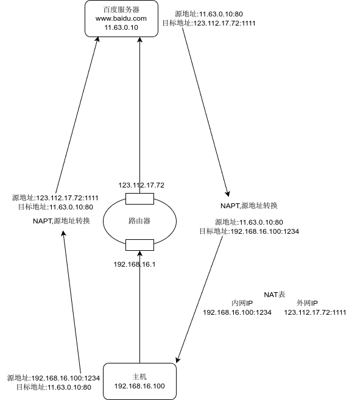

NAT(network address translation) 网络地址转换

## 静态 NAT

基本网络地址转换 (Basic NAT) 也被称作 " 静态 NAT",仅支持地址转换,不支持端口映射.要求每一个当前连接都对应一个公网 IP 地址.

Basic NAT 要维护一个无端口号 NAT 表,结构如下:

|    内网 IP     |     外网 IP      |
| :-----------: | :-------------: |
| 192.168.1.55  | 219.152.168.222 |
| 192.168.1.59  | 219.152.168.223 |
| 192.168.1.155 | 219.152.168.224 |

## 网络地址端口转换

NAPT 这种方式支持传输层协议 (TCP,UDP 等) 的端口映射,并允许多台主机共享一个公网 IP 地址.

> 支持端口转换的 NAT 又可以分为两类：源地址转换和目的地址转换。前一种情形下发起连接的计算机的 IP 地址将会被重写，使得内网主机发出的数据包能够到达外网主机。后一种情况下被连接计算机的 IP 地址将被重写，使得外网主机发出的数据包能够到达内网主机。实际上，以上两种方式通常会一起被使用以支持双向通信。

NAPT 维护一个带有 IP 以及端口号的 NAT 表，结构如下:

|      内网 IP       |        外网 IP        |
| :---------------: | :------------------: |
| 192.168.1.55:5566 | 219.152.168.222:9200 |
|  192.168.1.59:80  | 219.152.168.222:9201 |
| 192.168.1.59:4465 | 219.152.168.222:9202 |

一个使用 NAPT 的网络结构图:

一台电脑的使用大概需要 70 个随机端口,一个公网 IP (65535 个端口) 大概支持 700-900 台电脑
