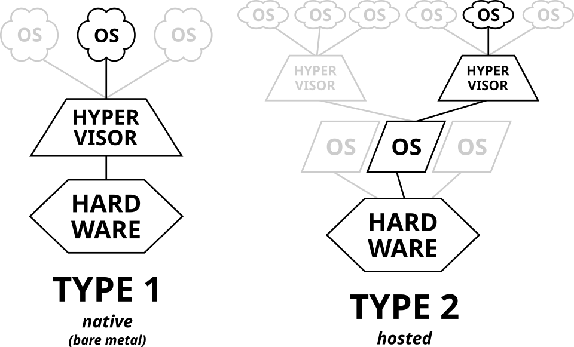

KVM(Kernel-based Virtual Machine 基于内核的虚拟机)，它是内置于Linux内核的`hypervisor`，属于`Type 1 Hypervisor`。  
KVM是QEMU的一种特殊运行模式，通过KVM可以运行多台未修改的 GNU/Linux、Windows 或任何其他操作系统的虚拟机。每台虚拟机都有独享的虚拟硬件：网卡、硬盘、显卡等。  
> `Type 1 Hypervisor` 和 `Type 2 Hypervisor`的区别：  
> - `Type 1 Hypervisor`，原生或裸机 hypervisor，这些虚拟机管理程序直接运行在宿主机的硬件上来控制硬件和管理客操作系统。   
> 	包括：**VMware ESX服务器版本**， **Xen 3.0 及以后版本**， **Virtual PC 2005**，**KVM**。
> - `Type 2 Hypervisor`，寄居或托管 hypervisor，这些虚拟机管理程序作为应用程序运行在传统的操作系统上，就像其他计算机程序那样运行，运行效率一般较类型 I 低   
> 	包括：**VMware workstation**， **Xen 3.0 以前版本**， **Virtual PC 2004**， **Virtual Box**
> 
> 

KVM一般使用QEMU来运行，QEMU是一个广泛使用的开源计算机模拟器和虚拟机。  
QEMU可以同时作为**架构模拟器**和**虚拟机**：  
- 当作为架构模拟器时，可以在一种架构（如x86 PC）下运行另一种架构（如ARM）下的操作系统和程序。通过使用动态转换，它可以获得非常好的性能。  
- 作为虚拟机时，QEMU可以使用其他虚拟机管理程序（如 Xen 或 KVM）来使用 CPU 扩展（HVM）进行虚拟化，通过在主机 CPU 上直接执行客户机代码来获得接近于宿主机的性能。   
QEMU 有两种运行模式：  
- 全系统模拟模式（full-system emulation）,在该模式下, QEMU 将会模拟一个完整的系统，包含一个或多个处理器以及各种外围设备。这种模式更加贴近真实的系统，且这种模式不要求被模拟的客户机系统是 Linux，但它的速度较慢。  
- 用户模式（Usermode emulation）, 在此模式下, QEMU 能够利用宿主机的系统资源来调用为其他架构编译的 Linux 可执行文件，且只支持Linux程序。  

## 前置
### 检查KVM支持
#### 硬件支持
KVM 需要虚拟机宿主的处理器支持虚拟化（对于 Intel 处理器来说是 VT-x，对于 AMD 处理器来说是 AMD-V）。你可通过以下命令来检查你的处理器是否支持硬件虚拟化：   
```
$ LC_ALL=C.UTF-8 lscpu | grep Virtualization
Virtualization:                          AMD-V
```
#### 内核支持
KVM需要的模块：
- `kvm`
- `kvm_amd`或`kvm_intel`
```
$ lsmod | grep kvm
kvm_amd               245760  0
kvm                  1425408  1 kvm_amd
irqbypass              12288  1 kvm
ccp                   155648  1 kvm_amd
```
### Virtio准虚拟化
准虚拟化为客户机提供了一种使用主机上设备的快速有效的通信方式。KVM 使用 Virtio API 作为虚拟机管理程序和客户机之间的连接层，为虚拟机提供准虚拟化设备。   
#### 内核支持
用以下命令检查虚拟机中内核的 VIRTIO 模块是否可用： 
```
zgrep VIRTIO /proc/config.gz
```
内核配置还可能位于:
```
/boot/config
/boot/config-$(uname -r)
```
有些内核已经集成了Virtio支持，因此不会
## 参考
- [archlinux wiki QEMU](https://wiki.archlinuxcn.org/wiki/QEMU)
- [archlinux wiki KVM](https://wiki.archlinuxcn.org/wiki/KVM)
- [Hypervisor](https://zh.wikipedia.org/wiki/Hypervisor)
- [how-to-obtain-kernel-config-from-currently-running-linux-system](https://superuser.com/questions/287371/how-to-obtain-kernel-config-from-currently-running-linux-system/287372)