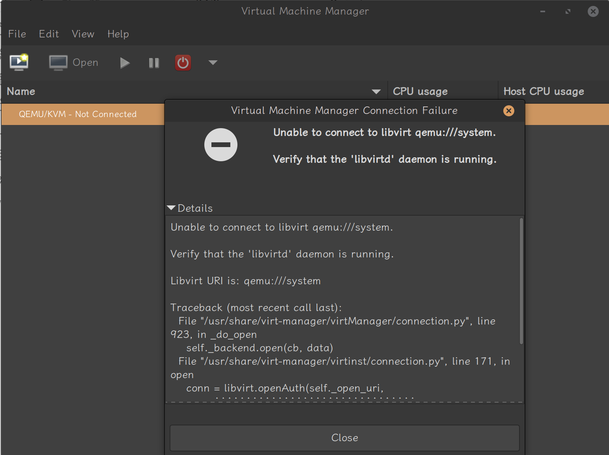
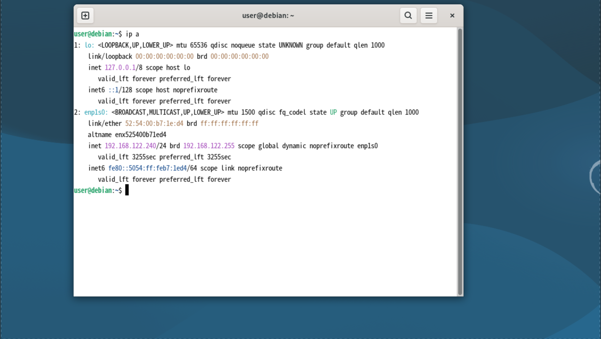

KVM(Kernel-based Virtual Machine 基于内核的虚拟机)，它是内置于 Linux 内核的 `hypervisor`，属于 `Type 1 Hypervisor`。  
KVM 是 QEMU 的一种特殊运行模式，通过 KVM 可以运行多台未修改的 GNU/Linux、Windows 或任何其他操作系统的虚拟机。每台虚拟机都有独享的虚拟硬件：网卡、硬盘、显卡等。  

> `Type 1 Hypervisor` 和 `Type 2 Hypervisor` 的区别：  
> - `Type 1 Hypervisor`，原生或裸机 hypervisor，这些虚拟机管理程序直接运行在宿主机的硬件上来控制硬件和管理客操作系统。  
> 	包括：**VMware ESX 服务器版本**， **Xen 3.0 及以后版本**， **Virtual PC 2005**，**KVM**。
> - `Type 2 Hypervisor`，寄居或托管 hypervisor，这些虚拟机管理程序作为应用程序运行在传统的操作系统上，就像其他计算机程序那样运行，运行效率一般较类型 I 低  
> 	包括：**VMware workstation**， **Xen 3.0 以前版本**， **Virtual PC 2004**， **Virtual Box**
> 
> 

KVM 一般使用 QEMU 来运行，QEMU 是一个广泛使用的开源计算机模拟器和虚拟机。  
QEMU 可以同时作为**架构模拟器**和**虚拟机**：  

- 当作为架构模拟器时，可以在一种架构（如 x86 PC）下运行另一种架构（如 ARM）下的操作系统和程序。通过使用动态转换，它可以获得非常好的性能。  
- 作为虚拟机时，QEMU 可以使用其他虚拟机管理程序（如 Xen 或 KVM）来使用 CPU 扩展（HVM）进行虚拟化，通过在主机 CPU 上直接执行客户机代码来获得接近于宿主机的性能。  
QEMU 有两种运行模式：  
- 全系统模拟模式（full-system emulation）,在该模式下, QEMU 将会模拟一个完整的系统，包含一个或多个处理器以及各种外围设备。这种模式更加贴近真实的系统，且这种模式不要求被模拟的客户机系统是 Linux，但它的速度较慢。  
- 用户模式（Usermode emulation）, 在此模式下, QEMU 能够利用宿主机的系统资源来调用为其他架构编译的 Linux 可执行文件，且只支持 Linux 程序。  

## 前置

### 检查 KVM 支持

#### 硬件支持

KVM 需要虚拟机宿主的处理器支持虚拟化（对于 Intel 处理器来说是 VT-x，对于 AMD 处理器来说是 AMD-V）。你可通过以下命令来检查你的处理器是否支持硬件虚拟化：

```bash
$ LC_ALL=C.UTF-8 lscpu | grep Virtualization
Virtualization:                          AMD-V
```

也可以使用:

```bash
$ grep -E 'svm|vmx' /proc/cpuinfo
```

#### 内核支持

KVM 需要的模块：

- `kvm`
- `kvm_amd` 或 `kvm_intel`

```bash
$ lsmod | grep kvm
kvm_amd               245760  0
kvm                  1425408  1 kvm_amd
irqbypass              12288  1 kvm
ccp                   155648  1 kvm_amd
```

### Virtio 准虚拟化

准虚拟化为客户机提供了一种使用主机上设备的快速有效的通信方式。KVM 使用 Virtio API 作为虚拟机管理程序和客户机之间的连接层，为虚拟机提供准虚拟化设备。

#### 内核支持

用以下命令检查虚拟机中内核的 VIRTIO 模块是否可用：

```bash
zgrep VIRTIO /proc/config.gz
```

内核配置还可能位于:

```bash
/boot/config
/boot/config-$(uname -r)
```

## 安装

### CentOS7

#### 软件包

在 CentOS7 中安装 KVM 需要安装软件包:

核心包:

- `qemu-kvm`: 这个软件包提供了 QEMU 的系统模拟器 + KVM 加速，它和内核 `kvm` 模块一起完成虚拟化
- `libvirt`: 提供与 hypervisor(虚拟机管理器)/host 交互的库与守护进程 `libvirtd`,负责管理虚拟机

管理虚拟机:

- `libvirt-client`: 包含 `virsh` 等客户端工具/库，用于从命令行与 `libvirtd`/`hypervisor` 交互
- `virt-install`: 基于 `libvirt` 的命令行工具,用于创建/安装虚拟机
- `virt-viewer`: 用来打开/连接虚拟机图形控制台的 viewer
- `virt-manager`: 图形化虚拟机管理工具,使用 `libvirt` 作为管理 API
- `gnome-boxes`: 更轻量的桌面端图形虚拟化工具

其它工具:

- `libguestfs`: 一套访问与修改虚拟机磁盘镜像的库与工具集,主要修改镜像内容,通常安装的是 `libguestfs-tools`
- `qemu-img`: 管理虚拟机的磁盘镜像,很多操作要求镜像处于离线状态 (未被 VM 使用)

#### 安装过程

安装软件包:

```bash
[root@localhost ~]# yum install qemu-kvm libvirt libvirt-client virt-install qemu-img libguestfs
```

启动 libvirtd 守护进程:

```bash
[root@localhost ~]# systemctl enable --now libvirtd
```

##### 使用 virt-manager 远程管理

在客户端 (我自己的电脑,系统是 Linux Mint 22.2 Cinnamon) 安装 `virt-manager` 然后通过 `qemu+ssh` 连接到虚拟机

安装软件包:

```bash
sudo apt install -y virt-manager virt-viewer ssh-askpass
```

然后打开 `virt-manager`,默认会连接到本地的 libvirtd 守护进程,并且由于我们没有安装 libvirt 软件包而失败:



关闭之后在 File - Add Connection 中选择 QEMU/KVM,输入用户名和 IP 连接:


之后会弹窗提示输入 `yes` 和 root 密码,蓝绿色的方块显示输入的字数,连接成功之后点击左上角创建虚拟机:


### Ubuntu2204

#### 软件包

Ubuntu22.04 中的软件包和 CentOS7 有所不同:

核心包:

- `qemu-kvm`
- `libvirt-daemon`: 相当于 `libvirt`,提供 `libvirtd` 守护进程

管理工具:

- `libvirt-clients`: 包含 `virsh` 等客户端工具/库，用于从命令行与 `libvirtd`/`hypervisor` 交互
- `virtinst`: 相当于 CentOS7 中的 `virt-install` 包
- `virt-manager`: 图形化虚拟机管理工具,使用 `libvirt` 作为管理 API

#### 安装过程

安装软件包:

```bash
apt install -y qemu-kvm libvirt-daemon-system libvirt-clients virtinst
```

安装完后重启,`libvirtd` 守护进程会默认启用,接着把用户加入到 `kvm` 和 `libvirt` 组:

```bash
sudo usermod -aG kvm libvirt kvmuser
```

检查一下 kvm 的状态:

```bash
kvmuser@kvm:~$ virsh -c qemu:///system list --all
 Id   Name       State
---------------------------
 -    debian13   shut off

kvmuser@kvm:~$ virsh net-list --all
 Name      State    Autostart   Persistent
--------------------------------------------
 default   active   yes         yes

```

##### 使用 virt-manager 远程管理

同样尝试在远程使用 `virt-manager` 连接一下,安装过程参考 [使用 virt-manager 远程管理](KVM.md#使用%20virt-manager%20远程管理)

连接到虚拟机之后选择从本地安装介质,这里的本地指 kvm 服务器,需要把 iso 上传到 kvm 服务器上


默认的存储池位于 `/var/lib/libvirt/images/` 目录下,将 iso 文件上传到此,就可以查看到该卷:


选择安装的操作系统 (Debian13):


设置一下内存和 CPU 核心:


设置磁盘镜像的大小:


设置一下网络,并开始安装


虚拟机启动之后需要输入非常多次连接服务器的密码,可能和建立了多条 ssh 连接有关

走完安装流程就能正常进入虚拟机


##### 使用 virsh+virt-install 本地管理

使用 `virt-install` 创建虚拟机:

```bash
virt-install --cdrom /var/lib/libvirt/images/debian-13.3.0-amd64-DVD-1.iso \
--name debian-virtins \
--memory 4096 \
--vcpus 4 \
--os-variant debian13 \
--disk /var/lib/libvirt/images/test/debian-virtins.qcow2,size=100 \
--network network=default,model=virtio \
--graphics vnc,listen=0.0.0.0,port=5910

```

运行参数:

- `-c, --cdrom STRING`: 安装方式,这里是通过本地光盘介质安装
- `-n, --name STRING`: 指定 VM 名称,必须全局唯一
- `--memory MEMORY`: 指定内存大小
- `--vcpus VCPUS`: 指定 VM 的 vCPUs(虚拟 CPU) 个数
- `--os-variant OS_VARIANT, --osinfo OS_VARIANT`: 指定安装的系统类型,可以通过 `virt-install --osinfo list` 查看全部可用类型
- `--disk DISK`: 指定 VM 存储介质
- `-w NETWORK, --network NETWORK`: 配置 VM 网络接口,这里使用的默认的 NAT 网络
- `--graphics GRAPHICS`: 配置 VM 显示设置,这里开放了一个全局 VNC 端口

运行之后因为没有图形环境,默认尝试连接 `virt-viewer` 失败,然后转为等待安装完成 (等待使用 VNC 远程连接运行安装过程):

```bash
$ virt-install --cdrom /var/lib/libvirt/images/debian-13.3.0-amd64-DVD-1.iso --name debian-virtins --memory 4096 --vcpus 4 --os-variant debian13 --disk /var/lib/libvirt/images/test/debian-virtins.qcow2,size=100 --network network=default,model=virtio --graphics vnc,listen=0.0.0.0,port=5910

WARNING  Graphics requested but DISPLAY is not set. Not running virt-viewer.
WARNING  No console to launch for the guest, defaulting to --wait -1

Starting install…
Allocating 'debian-virtins.qcow2'                                                                    |  15 MB  00:00:04 … 
Creating domain…                                                                                   |    0 B  00:00:00     

Domain is still running. Installation may be in progress.
Waiting for the installation to complete.
```

然后在自己的电脑上使用 VNC 远程连接到 `ip:5910`,需要在自动选择安装方式 (图形/命令行) 之前连接并选择到图形安装,选择之后 VNC 会中断,过一会之后重新连接即可:


安装完成之后仍然在等待,`Ctrl+c` 停止即可,虚拟机不会停止

还可以基于现有磁盘镜像构建虚拟机:

```bash
# 先删除该虚拟机
$ virsh undefine debian13
Domain 'debian13' has been undefined
# 根据该虚拟机的镜像运行
$ virt-install --import --name debian-virtins --memory 4096 --vcpus 4 --os-variant debian13 --disk /var/lib/libvirt/images/debian13.qcow2,size=100 --network network=default,model=virtio --graphics vnc,listen=0.0.0.0,port=5910

WARNING  Graphics requested but DISPLAY is not set. Not running virt-viewer.
WARNING  No console to launch for the guest, defaulting to --wait -1

Starting install…
Creating domain…                                                                                   |    0 B  00:00:00     

Domain is still running. Installation may be in progress.
Waiting for the installation to complete.
```


##### 使用 Cockpit Web 管理

安装 `cockpit` 和 `cockpit-machines` 软件包 (需要从 `backports` 仓库下载最新版):

```bash
$ sudo apt install -t jammy-backports cockpit cockpit-machines
```

安装完成之后通过浏览器访问服务器的 `9090` 端口,密码是系统的用户和密码,需要先在右上角解锁管理权限,然后在虚拟机标签页创建虚拟机:


点击创建并运行会采用一些默认设置创建虚拟机,可以点击创建并编辑在创建前编辑这些配置,创建完成之后就可以管理虚拟机:


##### 修改网络为桥接

现在系统中的网络配置为 NAT 转换



首先根据 [Ubuntu网络切换为网桥模式](网络配置.md#切换为网桥模式) 创建一个网桥并将网卡添加上:

```bash
$ ip a
8: ens1: <BROADCAST,MULTICAST,UP,LOWER_UP> mtu 1500 qdisc mq master br0 state UP group default qlen 1000
    link/ether 90:e2:ba:8b:8c:ec brd ff:ff:ff:ff:ff:ff
    altname enp5s0
10: virbr0: <BROADCAST,MULTICAST,UP,LOWER_UP> mtu 1500 qdisc noqueue state UP group default qlen 1000
    link/ether 52:54:00:90:36:64 brd ff:ff:ff:ff:ff:ff
    inet 192.168.122.1/24 brd 192.168.122.255 scope global virbr0
       valid_lft forever preferred_lft forever
22: vnet11: <BROADCAST,MULTICAST,UP,LOWER_UP> mtu 1500 qdisc noqueue master virbr0 state UNKNOWN group default qlen 1000
    link/ether fe:54:00:b7:1e:d4 brd ff:ff:ff:ff:ff:ff
    inet6 fe80::fc54:ff:feb7:1ed4/64 scope link 
       valid_lft forever preferred_lft forever
23: br0: <BROADCAST,MULTICAST,UP,LOWER_UP> mtu 1500 qdisc noqueue state UP group default qlen 1000
    link/ether 26:36:b0:44:1f:08 brd ff:ff:ff:ff:ff:ff
    inet 10.0.0.5/24 brd 10.0.0.255 scope global br0
       valid_lft forever preferred_lft forever
    inet6 fe80::2436:b0ff:fe44:1f08/64 scope link 
       valid_lft forever preferred_lft forever

$ ip r
default via 10.0.0.1 dev br0 proto static 
10.0.0.0/24 dev br0 proto kernel scope link src 10.0.0.5 
192.168.122.0/24 dev virbr0 proto kernel scope link src 192.168.122.1 
```

然后在 virt-install 创建虚拟机时将其网卡加入到网桥中:

```bash
$ virt-install --import --name debian-virtins --memory 4096 --vcpus 4 --os-variant debian13 --disk /var/lib/libvirt/images/debian13.qcow2,size=100 --network bridge=br0,model=virtio --graphics vnc,listen=0.0.0.0,port=5910
```

随后在虚拟机中需要手动配置静态 IP,配置为网桥所配置的 IP 段即可

##### virsh 管理虚拟机

列出所有虚拟机:

```bash
$ virsh list --all
 Id   Name             State
---------------------------------
 10   debian-virtins   running
 -    debian13         shut off
```

停止和删除虚拟机:

```bash
$ virsh list --all
 Id   Name             State
---------------------------------
 10   debian-virtins   running
 -    debian13         shut off

$ virsh destroy debian-virtins
Domain 'debian-virtins' destroyed

$ virsh list --all
 Id   Name             State
---------------------------------
 -    debian-virtins   shut off
 -    debian13         shut off

$ virsh undefine debian-virtins
Domain 'debian-virtins' has been undefined

$ virsh list --all
 Id   Name       State
---------------------------
 -    debian13   shut off
```

查看网络状态:

```bash
$ virsh net-list --all
 Name      State    Autostart   Persistent
--------------------------------------------
 default   active   yes         yes
```

查看 XML 格式的网络信息:

```bash
$ virsh net-dumpxml default
<network connections='1'>
  <name>default</name>
  <uuid>4ee9e6a8-f26a-4770-940b-14c3e9452623</uuid>
  <forward mode='nat'>
    <nat>
      <port start='1024' end='65535'/>
    </nat>
  </forward>
  <bridge name='virbr0' stp='on' delay='0'/>
  <mac address='52:54:00:90:36:64'/>
  <ip address='192.168.122.1' netmask='255.255.255.0'>
    <dhcp>
      <range start='192.168.122.2' end='192.168.122.254'/>
    </dhcp>
  </ip>
</network>
```

## 问题

### virt-manager

#### 输入密码需要多次

virt-manager 通过 `qemu+ssh` 连接到远端 KVM 主机时,在打开虚拟机图形控制台时会触发多条 SSH 会话,导致重复弹出输入密码的认证窗口,大概十几次

解决方法是使用 SSH 公钥认证,并启用 SSH 连接复用

##### 使用 SSH 密钥登录

生成一个公钥上传到连接到服务器的用户中,比如 root 或者新建的用户 (我这里是 user)

```bash
ssh-keygen -t ed25519 

ssh-copy-id -i ~/.ssh/id_ed25519.pub user@ip
```

然后在创建服务器连接的时候使用这个用户

##### 使用 ssh-agent 替代 gnome keyring

使用一段时间之后发现这个密钥的私钥需要解锁,因为私钥带 passphrase,桌面环境会通过 GNOME Keyring 弹窗解锁,在多条 SSH 连接并发时同样会出现多次解锁提示,如果拒绝,则会直接提示输入服务器用户的密码.

可以改用 `ssh-agent` 在终端一次性解锁:

```bash
eval "$(ssh-agent -s)"
ssh-add ~/.ssh/id_ed25519
```

> 从该终端启动 virt-manager，确保继承 agent 环境；从桌面图标启动不一定继承。

##### 启用 SSH 连接复用

启用 SSH 连接复用可以从根源上解决,多个连接只需要输入一次密码,在 `~/.ssh/config` 文件中添加配置:

```bash
Host kvmhost
	HostName ip
	User user
	IdentityFile ~/.ssh/id_ed25519
	IdentitiesOnly yes
	
	ControlMaster auto
	ControlPath ~/.ssh/cm-%C
	ControlPersist 1h

```

可以在终端验证是否生效:

```bash
ssh kvmhost "echo ok"
```

然后在 virt-manager 中新建连接时主机名填写成 `kvmhost` ,多条隧道会复用同一个 SSH 连接,通常只需认证一次.

## 参考

- [archlinux wiki QEMU](https://wiki.archlinuxcn.org/wiki/QEMU)
- [archlinux wiki KVM](https://wiki.archlinuxcn.org/wiki/KVM)
- [Hypervisor](https://zh.wikipedia.org/wiki/Hypervisor)
- [how-to-obtain-kernel-config-from-currently-running-linux-system](https://superuser.com/questions/287371/how-to-obtain-kernel-config-from-currently-running-linux-system/287372)
- [virtualization_deployment_and_administration_guide](https://docs.redhat.com/zh-cn/documentation/red_hat_enterprise_linux/7/html-single/virtualization_deployment_and_administration_guide/index)
- [virt-install](https://desistdaydream.github.io/docs/10.%E4%BA%91%E5%8E%9F%E7%94%9F/Virtualization-implementation/%E8%99%9A%E6%8B%9F%E5%8C%96%E7%AE%A1%E7%90%86/Libvirt/Libvirt-API/virt-install/)
- [cockpit](https://cockpit-project.org/)
