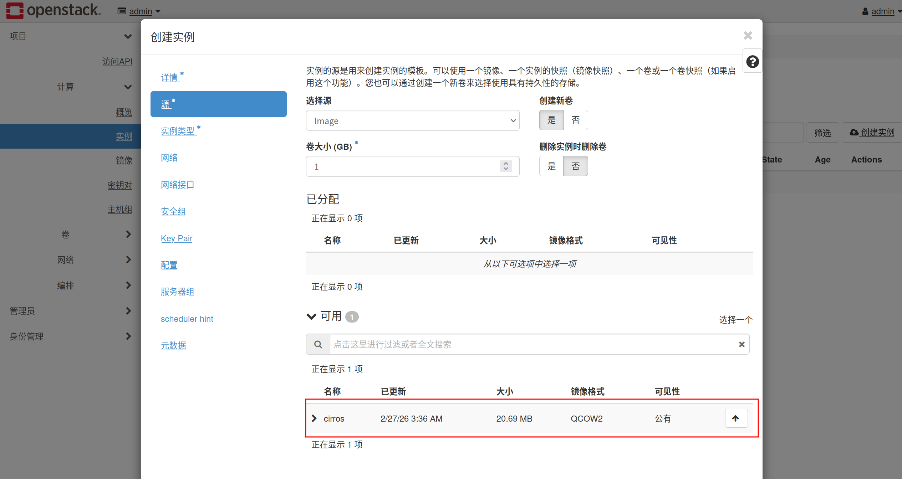
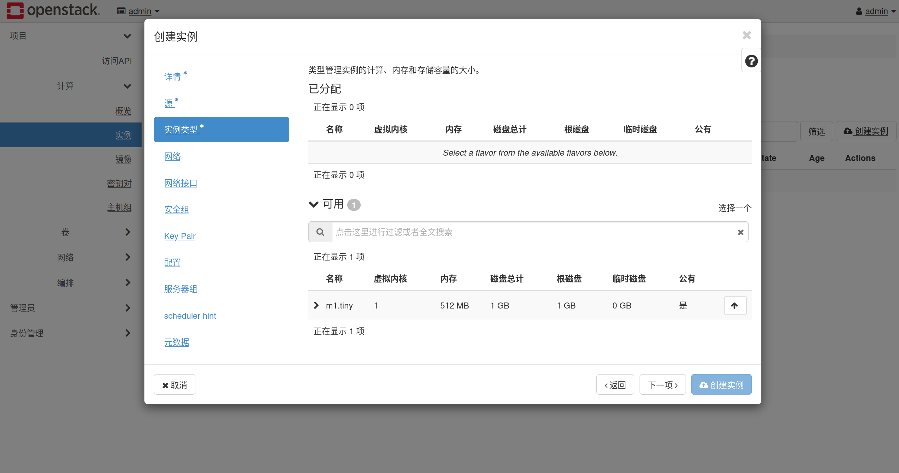
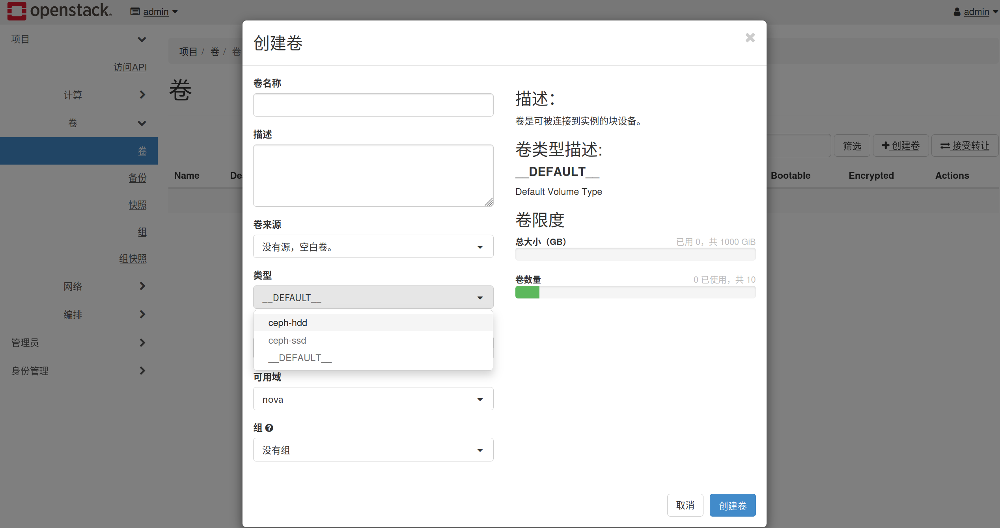
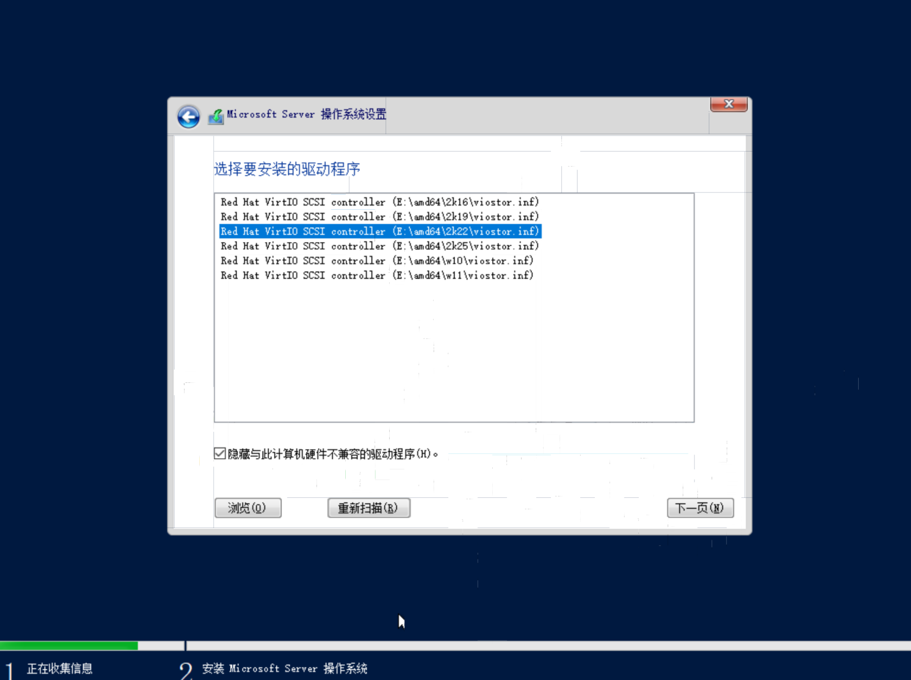

## 部署

### 前置条件

把一台 KVM 主机部署为 Openstack,当前 KVM 主机设置了网桥:

```bash
$ ip a
8: ens1: <BROADCAST,MULTICAST,UP,LOWER_UP> mtu 1500 qdisc mq master br0 state UP group default qlen 1000
    link/ether 90:e2:ba:8b:8c:ec brd ff:ff:ff:ff:ff:ff
    altname enp5s0
10: br0: <BROADCAST,MULTICAST,UP,LOWER_UP> mtu 1500 qdisc noqueue state UP group default qlen 1000
    link/ether 26:36:b0:44:1f:08 brd ff:ff:ff:ff:ff:ff
    inet 10.0.0.5/24 brd 10.0.0.255 scope global br0
       valid_lft forever preferred_lft forever
    inet6 fe80::2436:b0ff:fe44:1f08/64 scope link 
       valid_lft forever preferred_lft forever
```

虚拟机可以直接使用网桥来设置静态 IP 地址,网络配置文件如下:

```bash
$ cat /etc/netplan/01-br-config.yaml 
network:
  version: 2
  renderer: networkd
  ethernets:
    ens1:
      dhcp4: no
      
  bridges:
    br0:
      interfaces: [ens1]
      addresses:
        - 10.0.0.5/24
      routes:
        - to: default
          via: 10.0.0.1
      nameservers:
        addresses: [223.5.5.5,8.8.8.8]
```

我们需要把网桥换成 Open vSwitch (OVS) 网桥:

```bash
sudo apt update
sudo apt install openvswitch-switch -y
sudo systemctl enable --now openvswitch-switch
```

然后修改 netplan 的配置文件:

```bash
$ vim /etc/netplan/01-br-config.yaml

network:
  version: 2
  renderer: networkd
  ethernets:
    ens1:
      dhcp4: no

  bridges:
    br-ex:    # 名字必须是br-ex
      interfaces: [ens1]
      addresses:
        - 10.0.0.5/24
      routes:
        - to: default
          via: 10.0.0.1
      nameservers:
        addresses: [223.5.5.5,8.8.8.8]
      openvswitch: {}  # 表示这是一个OVS网桥
```

应用配置:

```bash
$ sudo netplan apply
```

再次查看一下 ip:

```bash
$ ip a
8: ens1: <BROADCAST,MULTICAST,UP,LOWER_UP> mtu 1500 qdisc mq master ovs-system state UP group default qlen 1000
    link/ether 90:e2:ba:8b:8c:ec brd ff:ff:ff:ff:ff:ff
    altname enp5s0
10: ovs-system: <BROADCAST,MULTICAST> mtu 1500 qdisc noop state DOWN group default qlen 1000
    link/ether 26:17:91:f9:cc:20 brd ff:ff:ff:ff:ff:ff
11: br-ex: <BROADCAST,MULTICAST,UP,LOWER_UP> mtu 1500 qdisc noqueue state UNKNOWN group default qlen 1000
    link/ether 90:e2:ba:8b:8c:ec brd ff:ff:ff:ff:ff:ff
    inet 10.0.0.5/24 brd 10.0.0.255 scope global br-ex
       valid_lft forever preferred_lft forever
    inet6 fe80::92e2:baff:fe8b:8cec/64 scope link 
       valid_lft forever preferred_lft forever
```

查看一下 openswitch 信息:

```bash
$ ovs-vsctl show
1f3c2721-4ca1-4865-91c5-7a02baadfbb7
    Bridge br-ex
        fail_mode: standalone
        Port ens1
            Interface ens1
        Port br-ex
            Interface br-ex
                type: internal
    ovs_version: "2.17.9"
```

安装依赖:

```bash
sudo apt install python3-dev libffi-dev gcc libssl-dev python3-venv -y

```

### 安装 kolla-ansible

```bash
python3 -m venv ~/kolla-venv

source ~/kolla-venv/bin/activate

pip install 'ansible>=8.0.0,<10.0.0'

pip install 'kolla-ansible>=19.0.0,<20.0.0' -i https://mirrors.aliyun.com/pypi/simple/
```

复制配置文件:

```bash
(kolla-venv) kvmuser@kvm:~$ sudo mkdir /etc/kolla
(kolla-venv) kvmuser@kvm:~$ sudo cp -r ~/kolla-venv/share/kolla-ansible/etc_examples/kolla/* /etc/kolla/
(kolla-venv) kvmuser@kvm:~$ cp ~/kolla-venv/share/kolla-ansible/ansible/inventory/all-in-one .

```

打印出版本号意味着安装成功:

```bash
(kolla-venv) kvmuser@kvm:~$ kolla-ansible --version
kolla-ansible 19.7.0
```

### 配置 ceph

我的 ceph 现在只有两个用于虚拟机存储设备的 poll,这两个 poll 分别应用了 `hdd_rule` 和 `ssd_rule`

在 Ceph 主机上创建新的 poll 用于 OpenStack 组件:

创建镜像池 (Glance)

```bash
[root@ceph1 ~]# ceph osd pool create images 32 replicated ssd_rule
pool 'images' created
[root@ceph1 ~]# rbd pool init images
```

虚拟计算池 (Nova)

```bash
[root@ceph1 ~]# ceph osd pool create vms 32 replicated ssd_rule
pool 'vms' created
[root@ceph1 ~]# rbd pool init vms
```

数据卷池 (Cinder)

```bash
[root@ceph1 ~]# ceph osd pool create volumes-ssd 32 replicated ssd_rule
pool 'volumes-ssd' created
[root@ceph1 ~]# rbd pool init volumes-ssd

[root@ceph1 ~]# ceph osd pool create volumes-hdd 32 replicated hdd_rule
pool 'volumes-hdd' created
[root@ceph1 ~]# rbd pool init volumes-hdd
```

备份池:

```bash
[root@ceph1 ~]# ceph osd pool create backups 32 replicated hdd_rule
pool 'backups' created
[root@ceph1 ~]# rbd pool init backups
```

创建两个账户并配置权限:

```bash
# Glance 账号
ceph auth get-or-create client.glance mon 'profile rbd' osd 'profile rbd pool=images' > ceph.client.glance.keyring

# Cinder 账号 (注意要包含所有的 volume 变体和 images/vms 用于克隆)
ceph auth get-or-create client.cinder mon 'profile rbd' osd 'profile rbd pool=volumes-ssd, profile rbd pool=volumes-hdd, profile rbd pool=vms, profile rbd pool=images' > ceph.client.cinder.keyring
```

> Nova 借用 Cinder 的密钥即可

将生成的两个密钥复制到 OpenStack 主机上

### 配置 kolla

下面的操作需要在 kolla-venv 环境下运行:

创建各组件配置文件目录:

```bash
(kolla-venv) kvmuser@kvm:~$ mkdir -p /etc/kolla/config/glance
(kolla-venv) kvmuser@kvm:~$ mkdir -p /etc/kolla/config/nova
(kolla-venv) kvmuser@kvm:~$ mkdir -p /etc/kolla/config/cinder/cinder-volume
(kolla-venv) kvmuser@kvm:~$ mkdir -p /etc/kolla/config/cinder/cinder-backup
```

复制配置文件和密钥到各组件目录:

```bash
(kolla-venv) kvmuser@kvm:~/kolla-ansible$ cp ceph.conf /etc/kolla/config/glance/
(kolla-venv) kvmuser@kvm:~/kolla-ansible$ cp ceph.conf /etc/kolla/config/nova/
(kolla-venv) kvmuser@kvm:~/kolla-ansible$ cp ceph.conf /etc/kolla/config/cinder/

(kolla-venv) kvmuser@kvm:~/kolla-ansible$ cp ceph.client.glance.keyring /etc/kolla/config/glance/
(kolla-venv) kvmuser@kvm:~/kolla-ansible$ cp ceph.client.cinder.keyring /etc/kolla/config/nova/
(kolla-venv) kvmuser@kvm:~/kolla-ansible$ cp ceph.client.cinder.keyring /etc/kolla/config/cinder/cinder-volume/
(kolla-venv) kvmuser@kvm:~/kolla-ansible$ cp ceph.client.cinder.keyring /etc/kolla/config/cinder/cinder-backup/
(kolla-venv) kvmuser@kvm:~/kolla-ansible$ cp ceph.client.cinder-backup.keyring /etc/kolla/config/cinder/cinder-backup/
```

修改 `global.conf` 文件:

```bash
# ================= 底层环境配置 =================
kolla_base_distro: "ubuntu"
kolla_install_type: "source"

# ================= 网络配置 (极度关键) =================
# 管理网和 API 流量走的接口（填你的网桥）
network_interface: "br-ex"

# 虚拟机出公网的物理出口（必须填你被网桥接管的物理网卡名）
neutron_external_interface: "ens1"

# OpenStack API 的虚拟 IP (VIP)。
# 【注意】这里强烈建议填一个你网段里**没有被使用**的 IP
# Kolla 会启动 HAProxy 绑定这个 IP，以后你登录 Dashboard 就用这个 IP。
kolla_internal_vip_address: "42.51.26.6"

# ================= 核心服务开关 =================
enable_nova: "yes"
enable_neutron: "yes"
enable_horizon: "yes"
enable_cinder: "yes"

# ================= 对接外部 Ceph 配置 =================
# 关闭 Kolla 自己部署 Ceph 的功能，因为你已经有了
enable_ceph: "no"

# 告诉 OpenStack 使用外部的 Ceph 集群作为后端
glance_backend_ceph: "yes"
cinder_backend_ceph: "yes"
nova_backend_ceph: "yes"

ceph_glance_pool_name: "images"
ceph_cinder_pool_name: "volumes-ssd"
ceph_nova_pool_name: "vms"

# dokcer registry
docker_registry: "docker镜像网站"
```

编辑 `/etc/kolla/config/cinder.conf` 以使用多个后端存储

```bash
vim /etc/kolla/config/cinder.conf

[DEFAULT]
# rbd-1 是 Kolla 自动生成的默认后端(SSD)，我们在这里加上自定义的 rbd-hdd
enabled_backends = rbd-1, rbd-hdd

[rbd-hdd]
volume_driver = cinder.volume.drivers.rbd.RBDDriver
volume_backend_name = rbd-hdd
rbd_pool = volumes-hdd
rbd_ceph_conf = /etc/ceph/ceph.conf
rbd_user = cinder
rbd_secret_uuid = {{ cinder_rbd_secret_uuid }}
```

下载 kolla 依赖:

```bash
kolla-ansible install-deps
```

初始化:

```bash
kolla-ansible bootstrap-servers -i ./all-in-one
```

生成密码:

```bash
kolla-genpwd
```

> 密码文件会存储在 `/etc/kolla/passwords.yml`

运行配置检查发现报错:

```bash
kolla-ansible prechecks -i ./all-in-one

...

TASK [nova-cell : Checking that host libvirt is not running] ***********************************************************
fatal: [localhost]: FAILED! => {"changed": false, "failed_when_result": true, "stat": {"atime": 1772011700.6427634, "attr_flags": "", "attributes": [], "block_size": 4096, "blocks": 0, "charset": "binary", "ctime": 1772011700.6467633, "dev": 25, "device_type": 0, "executable": false, "exists": true, "gid": 121, "gr_name": "libvirt", "inode": 1469, "isblk": false, "ischr": false, "isdir": false, "isfifo": false, "isgid": false, "islnk": false, "isreg": false, "issock": true, "isuid": false, "mimetype": "inode/socket", "mode": "0660", "mtime": 1772011700.6427634, "nlink": 1, "path": "/var/run/libvirt/libvirt-sock", "pw_name": "root", "readable": true, "rgrp": true, "roth": false, "rusr": true, "size": 0, "uid": 0, "version": null, "wgrp": true, "woth": false, "writeable": true, "wusr": true, "xgrp": false, "xoth": false, "xusr": false}}
```

这是因为 `libvirtd` 还在运行中,关闭即可:

```bash
sudo systemctl disable --now libvirtd.socket libvirtd-admin.socket libvirtd-ro.socket
sudo rm -rf /var/run/libvirt/libvirt-sock
```

再次运行,发现没有错误:

```bash
kolla-ansible prechecks -i ./all-in-one

...

PLAY RECAP *************************************************************************************************************
localhost                  : ok=106  changed=0    unreachable=0    failed=0    skipped=141  rescued=0    ignored=0   
```

先拉取一下镜像,避免直接部署没有错误输出

```bash
kolla-ansible pull -i ./all-in-one
```

拉取成功后部署:

```bash
kolla-ansible deploy -i ./all-in-one

PLAY RECAP *************************************************************************************************************
localhost                  : ok=375  changed=144  unreachable=0    failed=0    skipped=228  rescued=0    ignored=0   

```

### 使用 DashBoard

拉取管理员凭证:

```bash
kolla-ansible post-deploy -i ./all-in-one
```

运行完之后会生成一个 `/etc/kolla/admin-openrc.sh` 文件

获取 Dashboard 的登录密码:

```bash
cat /etc/kolla/passwords.yml | grep keystone_admin_password
```

此时直接通过虚拟 IP 访问 Dashboard 是无法访问的,使用 nocat 转发一下:

```bash
sudo apt install socat -y
nohup sudo socat TCP-LISTEN:8888,fork,reuseaddr TCP:42.51.26.6:80 > /dev/null 2>&1 &
```

然后访问 `http://42.51.26.5:8888` 即可

## 使用

使用 cli 可以快捷的运行命令,这些命令也可以通过 Web 操作,下载 openstack 的命令行工具 (在虚拟环境中):

```bash
pip install python-openstackclient
```

激活管理员环境变量:

```bash
source /etc/kolla/admin-openrc.sh
```

### 导入镜像

```bash
openstack image create "cirros"  --file cirros-0.6.3-x86_64-disk.img --disk-format qcow2 --container-format bare --public
```



### 创建实例类型

```bash
openstack flavor create --id 1 --vcpus 1 --ram 512 --disk 1 m1.tiny
```



### 配置存储

```bash
# 创建卷类型
openstack volume type create ceph-ssd
# 指向rbd-1
openstack volume type set --property volume_backend_name=rbd-1 ceph-ssd

openstack volume type create ceph-hdd
# 指向rbd-hdd,在cinder.conf配置的
openstack volume type set --property volume_backend_name=rbd-hdd ceph-hdd
```



### 创建网络

```bash
# 创建基础网络
openstack network create --share --external --provider-physical-network physnet1 --provider-network-type flat external-net

# 创建子网
openstack subnet create --network external-net \
  --allocation-pool start=42.51.26.10,end=42.51.26.20 \
  --dns-nameserver 8.8.8.8 --gateway 42.51.26.1 \
  --subnet-range 42.51.26.0/24 external-subnet
```

### 创建虚拟机

在 DashBoard 创建即可

## windows server

### 使用传统接口

```bash
openstack image create "Windows-Server-2022" \
  --file windowsserver2022_zh-cn.iso \
  --disk-format iso \
  --container-format bare \
  --public
```

制作安装光盘卷:

```bash
openstack volume create --type ceph-hdd --image Windows-Server-2022 --size 6 win-iso
```

创建系统卷

```bash
openstack volume create --type ceph-ssd --size 400 win-system
```

设置可引导和旧显卡

```bash
# 标记为可启动盘，防止 Nova 报错
openstack volume set --bootable win-system

# 强制要求 Nova 分配 e1000 老式千兆网卡
openstack volume set --image-property hw_vif_model=e1000 win-system
```

创建实例:

```bash
SYSTEM_DISK_ID=$(openstack volume show win-system -c id -f value)
ISO_VOL_ID=$(openstack volume show win-iso -c id -f value)

openstack server create \
  --flavor NAS \
  --network external-net \
  --block-device source_type=volume,uuid=$SYSTEM_DISK_ID,destination_type=volume,boot_index=0,disk_bus=sata \
  --block-device source_type=volume,uuid=$ISO_VOL_ID,destination_type=volume,boot_index=1,device_type=cdrom,disk_bus=ide \
  Win2022
```

### 使用 virtio

> 以下内容未经测试跑通
windows server 没有对 virtio 的支持,需要使用 `virtio-win`,从 [这个链接](https://fedorapeople.org/groups/virt/virtio-win/direct-downloads/archive-virtio/) 下载,然后也制作成镜像:

```bash
$ openstack image create "Virtio-Win"   --file virtio-win-0.1.271.iso   --disk-format iso   --container-format bare   --public
```

修改一下属性,主要是把这个镜像的 `virtio` 换成 `IDE`,否则安装程序还是识别不到:

```bash
openstack image set --property hw_disk_bus=ide --property hw_cdrom_bus=ide "Virtio-Win"
```

设置一下实例类型,我这里:

```bash
$ openstack flavor create "NAS" --vcpus 4 --ram 8192 --disk 400
+----------------------------+--------------------------------------+
| Field                      | Value                                |
+----------------------------+--------------------------------------+
| OS-FLV-DISABLED:disabled   | False                                |
| OS-FLV-EXT-DATA:ephemeral  | 0                                    |
| description                | None                                 |
| disk                       | 400                                  |
| id                         | 83415c6c-3140-4377-9727-97b0fb08c6e2 |
| name                       | NAS                                  |
| os-flavor-access:is_public | True                                 |
| properties                 |                                      |
| ram                        | 8192                                 |
| rxtx_factor                | 1.0                                  |
| swap                       | 0                                    |
| vcpus                      | 4                                    |
+----------------------------+--------------------------------------+
```

#### 使用 KVM

参考 [这个指南](https://docs.openstack.org/image-guide/create-images-manually-example-windows-image.html):

可以使用 kvm 创建一个镜像然后使用这个镜像在 openstack 中创建实例

运行:

```bash
virt-install --connect qemu:///system \
  --name windows-server-2022 --ram 2048 --vcpus 2 \
  --network network=default,model=virtio \
  --disk path=win2022.qcow2,format=qcow2,device=disk,bus=virtio \
  --cdrom ./windowsserver2022_zh-cn.iso \
  --disk ./virtio-win-0.1.271.iso,device=cdrom \
  --vnc --os-type windows --os-variant win2k22 
```

一开始看不到磁盘,加载完驱动之后就能看到磁盘了:




运行 `virtio-win-guest-tools.exe` 安装其他驱动程序:


随后从 [这个链接](https://cloudbase.it/downloads/CloudbaseInitSetup_Stable_x64.msi) 下载 `CloudbaseInitSetup_Stable_x64.msi` 并运行:


必须勾选 `Shutdown when Sysprep terminates`


系统运行脚本之后系统会自动关机,此时 `win2022.qcow2` 就会变成纯净的模板,清除了 Windows 的 SID 和计算机名等专属信息,关机之后不能再次开机,直接上传镜像到服务器.

在服务器上先把它制作成镜像:

```bash
openstack image create "Windows-Server-2022" \
  --file win2022.qcow2 \
  --disk-format qcow2 \
  --container-format bare \
  --public
```

等待时间较长,可以另外一个终端查看其状态:

```bash
root@kvm:~# source /etc/kolla/admin-openrc.sh
root@kvm:~# source /home/kvmuser/kolla-venv/bin/activate
(kolla-venv) root@kvm:~# openstack image show "Windows-Server-2022"
+------------------+--------------------------------------------------------------------------------------+
| Field            | Value                                                                                |
+------------------+--------------------------------------------------------------------------------------+
| container_format | bare                                                                                 |
| created_at       | 2026-03-02T08:14:35Z                                                                 |
| disk_format      | qcow2                                                                                |
| file             | /v2/images/d5323f3f-02ac-407a-8c72-42e259be7df3/file                                 |
| id               | d5323f3f-02ac-407a-8c72-42e259be7df3                                                 |
| min_disk         | 0                                                                                    |
| min_ram          | 0                                                                                    |
| name             | Windows-Server-2022                                                                  |
| owner            | d1a73b9c325b4fe696d2400c63c21a65                                                     |
| properties       | os_hidden='False', owner_specified.openstack.md5='',                                 |
|                  | owner_specified.openstack.object='images/Windows-Server-2022',                       |
|                  | owner_specified.openstack.sha256=''                                                  |
| protected        | False                                                                                |
| schema           | /v2/schemas/image                                                                    |
| status           | saving                                                                               |
| tags             |                                                                                      |
| updated_at       | 2026-03-02T08:14:35Z                                                                 |
| visibility       | public                                                                               |
+------------------+--------------------------------------------------------------------------------------+
```

观察到 `saving` 状态证明镜像正在制作中,耐心等待即可

然后创建卷,卷大小按照实际需要即可:

```bash
openstack volume create \
  --type ceph-ssd \
  --size 50 \
  --image Windows-Server-2022 \
  win2022
```

创建实例:

```bash
openstack server create --flavor NAS --network external-net --volume win2022 --password "Admin123." Win2022
```

## 排错

### No valid host was found

检查 `nova-computer` 的状态:

```bash
$ openstack compute service list
+--------------+--------------+------+----------+---------+-------+--------------+
| ID           | Binary       | Host | Zone     | Status  | State | Updated At   |
+--------------+--------------+------+----------+---------+-------+--------------+
| e41c0b8c-    | nova-        | kvm  | internal | enabled | up    | 2026-02-     |
| c7e8-479f-   | scheduler    |      |          |         |       | 27T06:31:23. |
| b699-        |              |      |          |         |       | 000000       |
| 043ff0c8e267 |              |      |          |         |       |              |
| 0716fadd-    | nova-        | kvm  | internal | enabled | up    | 2026-02-     |
| 4014-452a-   | conductor    |      |          |         |       | 27T06:31:27. |
| 9dbc-        |              |      |          |         |       | 000000       |
| 2ece4f2e2389 |              |      |          |         |       |              |
| f0d0b57e-    | nova-compute | kvm  | nova     | enabled | down  | 2026-02-     |
| 13c3-47fe-   |              |      |          |         |       | 27T02:46:22. |
| 9360-        |              |      |          |         |       | 000000       |
| 087cc028f6ac |              |      |          |         |       |              |
+--------------+--------------+------+----------+---------+-------+--------------+
```

可以看到 `nova-computer` 处于 `down` 状态,检查一下 `nova-computer` 的容器状态:

```bash
$ sudo docker ps -a | grep nova
8d162f364043   qzvrp6muagrm7z-quay.xuanyuan.run/openstack.kolla/nova-compute:2024.2-ubuntu-noble                "dumb-init --single-…"   22 hours ago   Up 9 seconds (healthy)               nova_compute
679daed4b9a4   qzvrp6muagrm7z-quay.xuanyuan.run/openstack.kolla/nova-libvirt:2024.2-ubuntu-noble                "dumb-init --single-…"   22 hours ago   Exited (1) 3 seconds ago             nova_libvirt
e07184e6c568   qzvrp6muagrm7z-quay.xuanyuan.run/openstack.kolla/nova-ssh:2024.2-ubuntu-noble                    "dumb-init --single-…"   22 hours ago   Up 4 hours (healthy)                 nova_ssh
3fee97963e1f   qzvrp6muagrm7z-quay.xuanyuan.run/openstack.kolla/nova-novncproxy:2024.2-ubuntu-noble             "dumb-init --single-…"   22 hours ago   Up 4 hours (healthy)                 nova_novncproxy
a4c4bd41e73e   qzvrp6muagrm7z-quay.xuanyuan.run/openstack.kolla/nova-conductor:2024.2-ubuntu-noble              "dumb-init --single-…"   22 hours ago   Up 4 hours (healthy)                 nova_conductor
d543d902dbf0   qzvrp6muagrm7z-quay.xuanyuan.run/openstack.kolla/nova-api:2024.2-ubuntu-noble                    "dumb-init --single-…"   22 hours ago   Up 4 hours (healthy)                 nova_api
3f53ef7f1762   qzvrp6muagrm7z-quay.xuanyuan.run/openstack.kolla/nova-scheduler:2024.2-ubuntu-noble              "dumb-init --single-…"   22 hours ago   Up 4 hours (healthy)                 nova_scheduler
```

可以看到 `nova-computer` 的存活时间很短,可能是在不断重启,`nova-libvirt` 则是彻底挂掉了

检查一下 docker log:

```bash
$ sudo docker logs --tail 50 nova_compute

INFO:__main__:Setting permission for /var/lib/nova/.cache/python-entrypoints/b12447694cd7b2662f6b69c41ca15b0049d92f465eccef07c51970cecccdc9fe
++ cat /run_command
+ CMD=nova-compute
+ ARGS=
+ sudo kolla_copy_cacerts
+ sudo kolla_install_projects
+ [[ ! -n '' ]]
+ . kolla_extend_start
++ [[ ! -d /var/log/kolla/nova ]]
+++ stat -c %a /var/log/kolla/nova
++ [[ 2755 != \7\5\5 ]]
++ chmod 755 /var/log/kolla/nova
++ . /usr/local/bin/kolla_nova_extend_start
+++ [[ ! -d /var/lib/nova/instances ]]
+ echo 'Running command: '\''nova-compute'\'''
+ exec nova-compute
Running command: 'nova-compute'
3 RLock(s) were not greened, to fix this error make sure you run eventlet.monkey_patch() before importing any other modules.
```

这些是正常的日志,没有错误信息,检查一下 `/var/log/kolla/nova/nova-computer.log`:

```bash
$ sudo cat /var/log/kolla/nova/nova-compute.log
...
2026-02-27 06:43:04.248 8 ERROR oslo_service.service nova.exception.HypervisorUnavailable: Connection to the hypervisor is broken on host
2026-02-27 06:43:04.248 8 ERROR oslo_service.service 
2026-02-27 06:43:04.260 8 INFO nova.virt.libvirt.driver [None req-0c0dfee1-7086-455b-bd37-8f88b29a660d - - - - - -] Connection event '0' reason 'Failed to connect to libvirt: unable to connect to server at '42.51.26.5:16509': Connection refused'
...
```

可以看到是由于连接 `libvirt` 被拒绝导致的不断重启

检查一下 `nova-libvirtd` 的日志文件:

```bash
$ sudo cat /var/log/kolla/libvirt/libvirtd.log |  tail -n 100

2026-02-27 06:43:05.187+0000: 953769: error : virPidFileAcquirePathFull:409 : Failed to acquire pid file '/run/libvirtd.pid': Resource temporarily unavailable
```

`Failed to acquire pid file '/run/libvirtd.pid'`,意思是无法获取进程锁,代表这个文件正在被使用,联想到之前这台机器部署过 kvm,可能是 `libvirtd`service 还在运行:

```bash
$ sudo systemctl status libvirtd
● libvirtd.service - Virtualization daemon
     Loaded: loaded (/lib/systemd/system/libvirtd.service; disabled; vendor prese>
     Active: active (running) since Fri 2026-02-27 02:54:20 UTC; 3h 48min ago
TriggeredBy: ● libvirtd-ro.socket
             ● libvirtd-admin.socket
             ● libvirtd.socket
       Docs: man:libvirtd(8)
             https://libvirt.org
   Main PID: 1296 (libvirtd)
      Tasks: 21 (limit: 32768)
     Memory: 77.4M
        CPU: 3.610s
     CGroup: /system.slice/libvirtd.service
             ├─1296 /usr/sbin/libvirtd
             ├─1538 /usr/sbin/dnsmasq --conf-file=/var/lib/libvirt/dnsmasq/defaul>
             └─1540 /usr/sbin/dnsmasq --conf-file=/var/lib/libvirt/dnsmasq/defaul>
```

把它停止并停用即可:

```bash
sudo systemctl stop libvirtd libvirtd.socket
sudo systemctl disable libvirtd libvirtd.socket
```

检查一下发现恢复正常:

```bash
$ sudo docker ps -a | grep nova
8d162f364043   qzvrp6muagrm7z-quay.xuanyuan.run/openstack.kolla/nova-compute:2024.2-ubuntu-noble                "dumb-init --single-…"   23 hours ago   Up 25 minutes (healthy)             nova_compute
679daed4b9a4   qzvrp6muagrm7z-quay.xuanyuan.run/openstack.kolla/nova-libvirt:2024.2-ubuntu-noble                "dumb-init --single-…"   23 hours ago   Up 25 minutes (healthy)             nova_libvirt
e07184e6c568   qzvrp6muagrm7z-quay.xuanyuan.run/openstack.kolla/nova-ssh:2024.2-ubuntu-noble                    "dumb-init --single-…"   23 hours ago   Up 4 hours (healthy)                nova_ssh
3fee97963e1f   qzvrp6muagrm7z-quay.xuanyuan.run/openstack.kolla/nova-novncproxy:2024.2-ubuntu-noble             "dumb-init --single-…"   23 hours ago   Up 4 hours (healthy)                nova_novncproxy
a4c4bd41e73e   qzvrp6muagrm7z-quay.xuanyuan.run/openstack.kolla/nova-conductor:2024.2-ubuntu-noble              "dumb-init --single-…"   23 hours ago   Up 4 hours (healthy)                nova_conductor
d543d902dbf0   qzvrp6muagrm7z-quay.xuanyuan.run/openstack.kolla/nova-api:2024.2-ubuntu-noble                    "dumb-init --single-…"   23 hours ago   Up 4 hours (healthy)                nova_api
3f53ef7f1762   qzvrp6muagrm7z-quay.xuanyuan.run/openstack.kolla/nova-scheduler:2024.2-ubuntu-noble              "dumb-init --single-…"   23 hours ago   Up 4 hours (healthy)                nova_scheduler

$ openstack compute service list
+--------------+--------------+------+----------+---------+-------+--------------+
| ID           | Binary       | Host | Zone     | Status  | State | Updated At   |
+--------------+--------------+------+----------+---------+-------+--------------+
| e41c0b8c-    | nova-        | kvm  | internal | enabled | up    | 2026-02-     |
| c7e8-479f-   | scheduler    |      |          |         |       | 27T07:08:43. |
| b699-        |              |      |          |         |       | 000000       |
| 043ff0c8e267 |              |      |          |         |       |              |
| 0716fadd-    | nova-        | kvm  | internal | enabled | up    | 2026-02-     |
| 4014-452a-   | conductor    |      |          |         |       | 27T07:08:47. |
| 9dbc-        |              |      |          |         |       | 000000       |
| 2ece4f2e2389 |              |      |          |         |       |              |
| f0d0b57e-    | nova-compute | kvm  | nova     | enabled | up    | 2026-02-     |
| 13c3-47fe-   |              |      |          |         |       | 27T07:08:46. |
| 9360-        |              |      |          |         |       | 000000       |
| 087cc028f6ac |              |      |          |         |       |              |
+--------------+--------------+------+----------+---------+-------+--------------+
```
