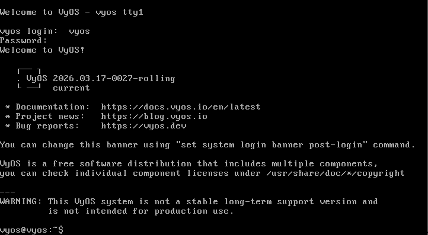
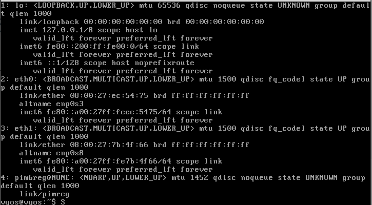

## Windows  

Windows 下载 iso 镜像后制作安装介质,可以使用 Ventoy 集成多个 PE 系统或系统镜像  
Ventoy 是一个用于制作可启动 U 盘的开源工具。它的独特之处在于允许用户将 ISO、WIM、IMG、VHD(x)、EFI 等多种类型的系统镜像文件直接拷贝到 U 盘中直接使用，而无需进行额外的格式化或分区操作。用户可以一次性拷贝多个不同类型的镜像文件到同一个启动盘中，Ventoy 会在启动时提供一个菜单供用户选择。  
参考:  

- [使用Ventoy集成多PE打造强大U盘](https://blog.talen.top/posts/a595b813/index.html)  
- [UEFI模式安全启动操作说明](https://www.ventoy.net/cn/doc_secure.html)  

### 修改远程桌面端口

参考 [官方文档](https://learn.microsoft.com/zh-cn/windows-server/remote/remote-desktop-services/remotepc/change-listening-port?tabs=powershell)

管理员身份打开 PowellShell

查看端口:

```bash
Get-ItemProperty -Path 'HKLM:\SYSTEM\CurrentControlSet\Control\Terminal Server\WinStations\RDP-Tcp' -name 'PortNumber'
```

更改端口:

```bash
$portValue = 1234

Set-ItemProperty -Path 'HKLM:\SYSTEM\CurrentControlSet\Control\Terminal Server\WinStations\RDP-Tcp' -name 'PortNumber' -Value $portValue
```

> 端口使用纯数字

添加防火墙规则,注意如果网络不是公开网络,需要使用 `Any`:

```bash
New-NetFirewallRule -DisplayName 'RDPPORTLatest-TCP-In' -Profile Any -Direction Inbound -Action Allow -Protocol TCP -LocalPort $portValue
New-NetFirewallRule -DisplayName 'RDPPORTLatest-UDP-In' -Profile Any -Direction Inbound -Action Allow -Protocol UDP -LocalPort $portValue
```

## Linux  

### centos 7.9  

#### 修改网络配置

参考 [Centos79网络配置](网络配置.md#Centos79)

#### 开放 root 登录  

编辑 `/etc/ssh/sshd_config` 文件,取消下面两行的注释  

```bash  
PermitRootLogin yes  
PasswordAuthentication yes  
```  

#### 更换阿里云 yum 源  

```bash  
# 备份  
sudo mkdir -p /etc/yum.repos.d/backup  
sudo mv /etc/yum.repos.d/CentOS-*.repo /etc/yum.repos.d/backup/  
# 基础源  
sudo curl -o /etc/yum.repos.d/CentOS-Base.repo https://mirrors.aliyun.com/repo/Centos-7.repo  
# EPEL扩展源  
sudo curl -o /etc/yum.repos.d/epel.repo https://mirrors.aliyun.com/repo/epel-7.repo  
# 清理旧缓存,生成新缓存
sudo yum clean all
sudo yum makecache fast
# 验证是否生效  
sudo yum repolist  
```  

### Ubuntu22.04  

#### 修改网络配置  

参考 [Ubuntu2204网络配置](网络配置.md#Ubuntu2204)

#### 修改软件源  

修改下列文件中的源地址:  

```bash  
vim /etc/apt/sources.list  
deb https://mirrors.aliyun.com/ubuntu/ jammy main restricted universe multiverse  
deb-src https://mirrors.aliyun.com/ubuntu/ jammy main restricted universe multiverse  
deb https://mirrors.aliyun.com/ubuntu/ jammy-security main restricted universe multiverse  
deb-src https://mirrors.aliyun.com/ubuntu/ jammy-security main restricted universe multiverse  
deb https://mirrors.aliyun.com/ubuntu/ jammy-updates main restricted universe multiverse  
deb-src https://mirrors.aliyun.com/ubuntu/ jammy-updates main restricted universe multiverse  
# deb https://mirrors.aliyun.com/ubuntu/ jammy-proposed main restricted universe multiverse  
# deb-src https://mirrors.aliyun.com/ubuntu/ jammy-proposed main restricted universe multiverse  
deb https://mirrors.aliyun.com/ubuntu/ jammy-backports main restricted universe multiverse  
deb-src https://mirrors.aliyun.com/ubuntu/ jammy-backports main restricted universe multiverse  
```  

可以从 [Ubuntu镜像源](https://developer.aliyun.com/mirror/ubuntu) 找到各个版本的源

更新软件包

```bash
sudo apt update
```

### Vyos

安装的镜像名称是 `vyos-2026.03.17-0027-rolling-generic-amd64.iso`,分配了两张网卡 (一个公网,一个内网):

启动之后选择 `KVM console`,另外一个 `Serial console` 是用于通过 console 线连接时使用的 (部署在路由器上)

启动之后使用用户 `vyos` 登录,密码也是 `vyos`



先运行 `install image` 安装系统

`console` 依旧选择 `kvm`,选择磁盘之后输入 `y` 确认删除所有数据,其它选项保持默认

安装之后运行 `root` 重启系统,加载时拔出 u 盘

进入新系统之后

运行 `ip a` 检查一下网卡名称:



```
2: eth0: <BROADCAST,MULTICAST,UP,LOWER_UP> mtu 1500 qdisc fq_codel state UP group default qlen 1000
    link/ether 08:00:27:ec:54:75 brd ff:ff:ff:ff:ff:ff
    altname enp0s3
3: eth1: <BROADCAST,MULTICAST,UP,LOWER_UP> mtu 1500 qdisc fq_codel state UP group default qlen 1000
    link/ether 08:00:27:7b:4f:66 brd ff:ff:ff:ff:ff:ff
    altname enp0s8
```

首先进入配置模式:

```
vyos@vyos$ configure
vyos@vyos#
```

进入配置模式的标志是命令提示符由 `$` 改为 `#`

接下来配置网络:

```
# 配置公网接口
set interfaces ethernet eth1 address '192.168.88.61/24'
set interfaces ethernet eth1 description 'WAN'

# 配置内网接口
set interfaces ethernet eth0 address '192.168.56.3/24'
set interfaces ethernet eth0 description 'LAN'
```

配置网关:

```
set protocols static route 0.0.0.0/0 next-hop '192.168.88.1'
```

配置 DNS:

```
set system name-server '8.8.8.8'
```

配置 ssh:

```
set service ssh port '22'
```

应用并保存:

```
commit
save
```

### 错误

#### Squashfs Error: Failed to Read Block

该错误大概率是系统 u 盘问题:

- USB 接口/集线器 损坏/接触不良
- ISO 下载损坏或 USB 写入不完整
- 低质量/有故障的 USB 闪存驱动器
- 内存故障（通常仅在多个 USB + 多个 ISO 仍然失败后）

如果发生在安装系统过程中 [参考](https://www.techstoreon.com/pages/squashfs-error-failed-to-read-block):

- 换个 usb 插口
- 重新制作系统 u 盘
- 重新下载镜像/换一个镜像
- 换一个 u 盘

在安装完系统后未关机就拔出 u 盘时也可能会产生,这通常会导致无害的错误,直接重启即可进入新系统即可.[参考](https://forum.vyos.io/t/squashfs-error-new-install/15518)
